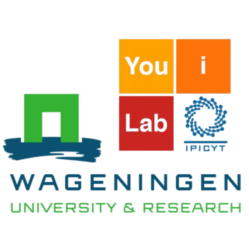

# Curso de Inteligencia Artificial

Panorama de la IA para estudiantes de nivel medio-superior en San Luis Potosí.

**Sitio web:** [www.curso-ia-slp.com](http://www.curso-ia-slp.com)

## Estructura

**15 sesiones de 30–45 minutos** | Modalidad en línea — asíncrona con 3 sesiones en vivo vía Zoom | Sin evaluaciones formales

| Bloque                                        | Sesiones | Temas                                                                                                  |
| --------------------------------------------- | -------- | ------------------------------------------------------------------------------------------------------ |
| **1: Fundamentos + Ética**             | 1–6     | Qué es la IA, cómo aprenden las máquinas, algoritmos, IA generativa, ética, sesión en vivo IPICYT |
| **2: Herramientas Prácticas**          | 7–11    | IA para lenguaje, creatividad, organización, tutor académico, sesión en vivo PIT Policy México      |
| **3: Creación, Aplicaciones y Futuro** | 12–15   | Programación con IA, robótica, IA en medicina y sociedad, sesión en vivo Boston College              |

## Sesiones en vivo

| Sesión | Fecha          | Invitado                                                      |
| ------- | -------------- | ------------------------------------------------------------- |
| S6      | 9 junio 2026   | IPICYT — IA en México: investigación y aplicaciones reales |
| S11     | 14 julio 2026  | PIT Policy México — IA, política pública y ciudadanía       |
| S15     | 11 agosto 2026 | Boston College — IA en la educación global                  |

## Cronograma

Mayo–agosto 2026, una sesión por semana.

## Herramientas cubiertas

- **Chat / texto:** ChatGPT, Claude, Gemini, Perplexity
- **Imágenes:** DALL-E, Adobe Firefly, Midjourney
- **Creatividad:** Suno AI, Blob Opera, Google Magenta, AutoDraw, Quick Draw!
- **Matemáticas y ciencias:** Wolfram Alpha, Desmos
- **Idiomas:** DeepL, Grammarly, ELSA Speak, Duolingo
- **Productividad:** Notion AI, Otter.ai, Gamma AI
- **Programación:** Google Colab, Python, Hugging Face, Kaggle
- **Investigación:** Consensus, Elicit, Perplexity

## Principios pedagógicos

- Intuición primero — analogías del mundo real, sin prerrequisitos de programación
- Balance teoría-práctica con herramientas de uso inmediato
- Ética integrada en todas las sesiones relevantes
- Cada sesión asíncrona es autocontenida
- Ejemplos y aplicaciones relevantes para SLP y México

## Estructura del repositorio

```
curso_IA/
├── _quarto.yml        # configuración del sitio web
├── assets/            # logos y media reutilizable del sitio
├── index.qmd          # landing page
├── relics/            # material histórico archivado
├── syllabus.qmd       # programa completo del curso
└── sesiones/
    ├── sesion-01.qmd
    ├── sesion-02.qmd
    └── ...            # una sesión por archivo
```


Versión 2.0 — Marzo 2026
# curso_IA_MS_1
