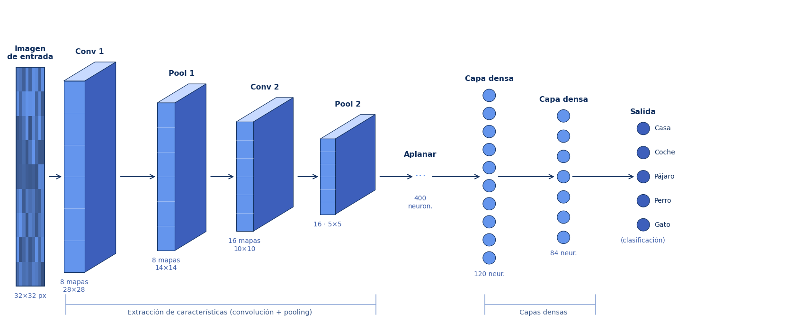
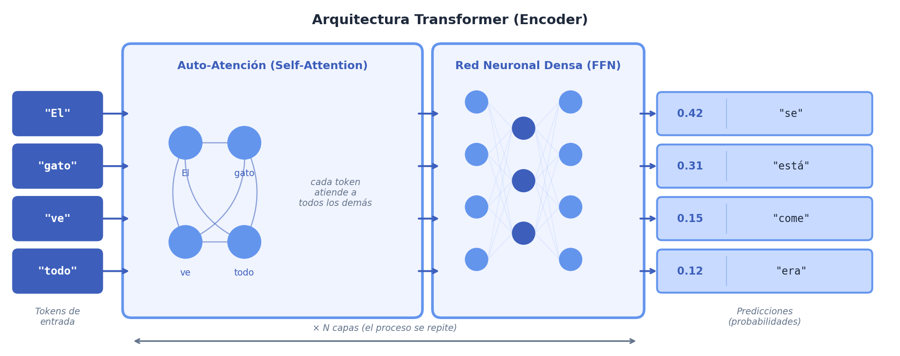

```{=html}
<div class="sesion-banner">
  <div>
    <span class="sesion-block-pill">Bloque 1 · Fundamentos + Ética</span>
  </div>
  <div class="sesion-progress-wrap">
    <div class="sesion-progress-bar">
      <div class="sesion-progress-fill sesion-progress-fill-3"></div>
    </div>
    <span class="sesion-progress-label">3 de 15</span>
  </div>
  <div class="sesion-meta">
    <span class="sesion-meta-chip"><svg aria-hidden="true" width="13" height="13" viewBox="0 0 24 24" fill="none" stroke="currentColor" stroke-width="2" stroke-linecap="round" stroke-linejoin="round"><rect x="3" y="4" width="18" height="18" rx="2" ry="2"/><line x1="16" y1="2" x2="16" y2="6"/><line x1="8" y1="2" x2="8" y2="6"/><line x1="3" y1="10" x2="21" y2="10"/></svg> 19 de mayo de 2026</span>
    <span class="sesion-meta-chip"><svg aria-hidden="true" width="13" height="13" viewBox="0 0 24 24" fill="none" stroke="currentColor" stroke-width="2" stroke-linecap="round" stroke-linejoin="round"><circle cx="12" cy="12" r="10"/><polyline points="12 6 12 12 16 14"/></svg> 45 minutos</span>
    <a href="../syllabus.html">Ver programa completo →</a>
  </div>
</div>
```

```{=html}
<link rel="stylesheet" href="../styles/sessions/sesion-03.css">
<script type="module" src="../interactives/sesion-03.js"></script>
```

## Introducción a la IA

```{=html}
<div class="video-placeholder">
  <span class="vp-icon">▶</span>
  <p class="vp-title">Video de la sesión</p>
  <p>En desarrollo.</p>
</div>
```

---

```{=html}
<p class="capsule-complement-note">Los videos y el texto de esta sesión son complementarios. Los videos amplían el contexto histórico y conceptual; el texto va a los mecanismos y te pone a interactuar con ellos. Encontrarás ideas en los videos que el texto no repite exactamente. ¡Disfruta de esta dinámica!</p>
```

---

### Introducción

En esta sesión nos enfocaremos en darte un panorama global de los algoritmos más conocidos de la inteligencia artificial, y te ofreceremos una guía para saber cuándo debes usar cada uno de ellos, y *por qué*. 

¿Por qué es importante aprender sobre distintos algoritmos? Empecemos con una analogía: cuando un carpintero va a la obra, lleva consigo una caja con múltiples herramientas. Del mismo modo, un médico recurre a distintos análisis según la sintomatología del paciente y el tipo de información que necesita obtener. Con la inteligencia artificial ocurre algo similar: existen muchos algoritmos y métodos, y cada uno resulta especialmente útil para ciertos tipos de problemas.

En esta sesión nos enfocaremos en 6 ejemplos representativos de modelos, algoritmos y arquitecturas de aprendizaje automático, con el objetivo de ofrecerte una visión general de cómo se organizan y para qué sirve cada uno.

Antes de elegir un método, es fundamental reconocer la naturaleza del desafío. Algunos sirven para predecir números, otros para clasificar imágenes o descubrir grupos en datos sin etiquetas. Entender qué tipo de problema tienes delante es lo que marca la diferencia al trabajar con IA.

```{=html}
<figure class="search-anim-figure">
  <div class="search-anim-scene">
    <div class="search-anim-bar" role="presentation">
      <div class="search-anim-icon" aria-hidden="true">
        <svg viewBox="0 0 24 24" fill="none" stroke="#6495ED" stroke-width="2.2" stroke-linecap="round" stroke-linejoin="round">
          <circle cx="11" cy="11" r="7"/>
          <line x1="17" y1="17" x2="22" y2="22"/>
        </svg>
      </div>
      <div class="search-anim-input" aria-label="Barra de búsqueda animada">
        <span id="search-typed"></span><span class="search-caret" aria-hidden="true"></span>
      </div>
    </div>
    <div class="search-hand" id="search-hand" aria-hidden="true">
      
    </div>
  </div>
  <figcaption class="search-anim-caption">La IA tiene muchas herramientas&#x2014; aprendamos a usarlas poco a poco.</figcaption>
</figure>
```


---

### ¿Por qué no existe un solo algoritmo para todo?

En inteligencia artificial, la elección del método influye directamente en el tipo de resultado que podemos obtener. Algunos algoritmos están pensados para prever valores, otros para reconocer patrones, otros para reunir datos con rasgos similares en grupos. Cada uno responde mejor a ciertos problemas y presenta limitaciones en otros.

Por eso, conocer distintas clases de algoritmos no consiste solo memorizar sus nombres. También implica entender qué hace cada uno, qué tipo de datos necesita y qué clase de respuesta puede ofrecer. Esa diferencia es importante porque, en la práctica, un método adecuado puede simplificar el análisis, mientras que uno poco apropiado puede volverlo más difícil o menos fiable.

Pensemos, por ejemplo, en la regresión lineal. Este método es útil cuando se quiere estimar una cantidad continua, como el precio de una vivienda o la evolución de una variable económica. En cambio, si el objetivo es separar correos entre “spam” y “no spam”, lo adecuado es un enfoque de clasificación. Y si lo que buscamos es descubrir grupos dentro de un conjunto de datos sin etiquetas, entonces tiene más sentido recurrir a técnicas de agrupamiento, como K-Means.

También hay casos en los que algunos modelos resultan desproporcionados para el tipo de tarea a resolver. Un transformer puede ser una opción potente para procesar texto, pero no siempre es la elección más sensata cuando se trata de problemas sencillos, estructurados y con pocos datos. En esos casos, un modelo más simple puede ofrecer resultados igual de buenos, con menos costo de entrenamiento, menos complejidad y mayor facilidad de interpretación.

A lo largo de esta sesión revisaremos precisamente eso: qué tipo de problemas resuelve mejor cada enfoque y qué criterios ayudan a elegir entre ellos. Comprender esa relación entre problema y método es la base para trabajar con inteligencia artificial de forma más rigurosa y más eficaz.

---

### Un mapa de métodos

Antes de elegir un algoritmo, conviene detenerse un momento y mirar el problema con calma. En inteligencia artificial, la selección del método depende sobre todo de dos cosas: si los datos ya tienen respuestas correctas y qué tipo de resultado queremos obtener.

Esta distinción puede parecer simple, pero en realidad organiza gran parte del campo. No es lo mismo trabajar con ejemplos ya clasificados que con datos sin etiquetar, ni es igual predecir una cantidad continua que identificar una categoría, descubrir grupos ocultos o decidir una acción dentro de un entorno.

  Por eso, una buena forma de orientarse es empezar con dos preguntas básicas:
```{=html}
<div class="two-question-grid">
  <article class="two-question-card">
    <span class="two-question-num">01</span>
    <h4>¿Tus datos ya tienen respuestas correctas etiqutadas?</h4>
    <p>Si alguien ya etiquetó los ejemplos con la respuesta correcta, estás en el mundo del aprendizaje supervisado.</p>
  </article>
  <article class="two-question-card">
    <span class="two-question-num">02</span>
    <h4>¿Qué forma tiene la salida que necesitas obtener?</h4>
    <p>Puede ser un número, una categoría, un grupo emergente o una acción dentro de un entorno.</p>
  </article>
</div>
```

**Pregunta 1: ¿Tienes respuestas correctas etiquetadas en tus datos?**

- **Sí**, alguien ya etiquetó los ejemplos con la respuesta correcta. Eso se llama **aprendizaje supervisado**.
- **No**, los datos no tienen etiqueta o el sistema aprende actuando en un entorno. Puede ser aprendizaje **no supervisado** o **por refuerzo**.

**Pregunta 2: ¿Qué forma tiene la salida?**

- ¿Un número continuo? → **Regresión**
- ¿Una categoría? → depende de si trabajas con texto, imágenes o datos estructurados
- ¿Grupos emergentes? → **Clustering**
- ¿Una acción que cambia dependiendo del entorno? → **Refuerzo**

```{=html}
<figure class="flowchart-figure">
  <svg viewBox="0 0 1060 490" xmlns="http://www.w3.org/2000/svg" class="flowchart-svg" role="img" aria-label="Mapa de decisión para elegir un algoritmo de inteligencia artificial según si hay etiquetas, el tipo de salida y el tipo de datos">
    <defs>
      <marker id="fc2-arr" markerWidth="9" markerHeight="9" refX="7.5" refY="4.5" orient="auto">
        <path d="M1,1.5 L8,4.5 L1,7.5 Z" fill="#6495ED"/>
      </marker>
    </defs>

    <!-- Lavender dotted background -->
    <rect x="0" y="0" width="1060" height="490" rx="16" fill="white"/>

    <!-- ORTHOGONAL CONNECTORS (drawn first, behind nodes) -->
    <path fill="none" stroke="#6495ED" stroke-width="2" stroke-linecap="round" stroke-linejoin="round" marker-end="url(#fc2-arr)" d="M530,82 L530,117 L230,117 L230,152"/>
    <path fill="none" stroke="#6495ED" stroke-width="2" stroke-linecap="round" stroke-linejoin="round" marker-end="url(#fc2-arr)" d="M530,82 L530,117 L830,117 L830,152"/>
    <path fill="none" stroke="#6495ED" stroke-width="2" stroke-linecap="round" stroke-linejoin="round" marker-end="url(#fc2-arr)" d="M230,204 L230,240 L100,240 L100,276"/>
    <path fill="none" stroke="#6495ED" stroke-width="2" stroke-linecap="round" stroke-linejoin="round" marker-end="url(#fc2-arr)" d="M230,204 L230,240 L360,240 L360,276"/>
    <path fill="none" stroke="#6495ED" stroke-width="2" stroke-linecap="round" stroke-linejoin="round" marker-end="url(#fc2-arr)" d="M830,204 L830,240 L730,240 L730,276"/>
    <path fill="none" stroke="#6495ED" stroke-width="2" stroke-linecap="round" stroke-linejoin="round" marker-end="url(#fc2-arr)" d="M830,204 L830,240 L930,240 L930,276"/>
    <path fill="none" stroke="#6495ED" stroke-width="2" stroke-linecap="round" stroke-linejoin="round" marker-end="url(#fc2-arr)" d="M360,328 L360,362 L190,362 L190,393"/>
    <path fill="none" stroke="#6495ED" stroke-width="2" stroke-linecap="round" stroke-linejoin="round" marker-end="url(#fc2-arr)" d="M360,328 L360,393"/>
    <path fill="none" stroke="#6495ED" stroke-width="2" stroke-linecap="round" stroke-linejoin="round" marker-end="url(#fc2-arr)" d="M360,328 L360,362 L530,362 L530,393"/>

    <!-- BRANCH LABELS -->
    <rect x="362" y="108" width="36" height="18" rx="9" fill="#ddeaf9" stroke="#6495ED" stroke-width="1"/>
    <text x="380" y="121" text-anchor="middle" font-size="11" fill="#1a4a8c">Sí</text>
    <rect x="662" y="108" width="36" height="18" rx="9" fill="#ddeaf9" stroke="#6495ED" stroke-width="1"/>
    <text x="680" y="121" text-anchor="middle" font-size="11" fill="#1a4a8c">No</text>
    <rect x="136" y="231" width="58" height="18" rx="9" fill="#ddeaf9" stroke="#6495ED" stroke-width="1"/>
    <text x="165" y="244" text-anchor="middle" font-size="10" fill="#1a4a8c">número</text>
    <rect x="262" y="231" width="66" height="18" rx="9" fill="#ddeaf9" stroke="#6495ED" stroke-width="1"/>
    <text x="295" y="244" text-anchor="middle" font-size="10" fill="#1a4a8c">categoría</text>
    <rect x="753" y="231" width="54" height="18" rx="9" fill="#ddeaf9" stroke="#6495ED" stroke-width="1"/>
    <text x="780" y="244" text-anchor="middle" font-size="10" fill="#1a4a8c">grupos</text>
    <rect x="842" y="231" width="76" height="18" rx="9" fill="#ddeaf9" stroke="#6495ED" stroke-width="1"/>
    <text x="880" y="244" text-anchor="middle" font-size="10" fill="#1a4a8c">actuando</text>
    <rect x="258" y="353" width="34" height="18" rx="9" fill="#ddeaf9" stroke="#6495ED" stroke-width="1"/>
    <text x="275" y="366" text-anchor="middle" font-size="9" fill="#1a4a8c">texto</text>
    <rect x="335" y="353" width="50" height="18" rx="9" fill="#ddeaf9" stroke="#6495ED" stroke-width="1"/>
    <text x="360" y="366" text-anchor="middle" font-size="9" fill="#1a4a8c">imágenes</text>
    <rect x="406" y="353" width="78" height="18" rx="9" fill="#ddeaf9" stroke="#6495ED" stroke-width="1"/>
    <text x="445" y="366" text-anchor="middle" font-size="9" fill="#1a4a8c">datos estruc.</text>

    <!-- SOLID OFFSET SHADOWS (+6px right, +6px down) -->
    <rect x="411" y="36" width="250" height="52" rx="13" fill="#6495ED"/>
    <rect x="111" y="158" width="250" height="52" rx="13" fill="#6495ED"/>
    <rect x="711" y="158" width="250" height="52" rx="13" fill="#6495ED"/>
    <rect x="241" y="282" width="250" height="52" rx="13" fill="#6495ED"/>
    <rect x="26" y="282" width="160" height="44" rx="22" fill="#6495ED"/>
    <rect x="656" y="282" width="160" height="44" rx="22" fill="#6495ED"/>
    <rect x="856" y="282" width="160" height="44" rx="22" fill="#6495ED"/>
    <rect x="116" y="399" width="160" height="44" rx="22" fill="#6495ED"/>
    <rect x="286" y="399" width="160" height="44" rx="22" fill="#6495ED"/>
    <rect x="456" y="399" width="160" height="44" rx="22" fill="#6495ED"/>

    <!-- QUESTION NODES (white fill + periwinkle border) -->
    <rect x="405" y="30" width="250" height="52" rx="13" fill="white" stroke="#6495ED" stroke-width="2.5"/>
    <text x="530" y="53" text-anchor="middle" font-size="12.5" font-weight="700" fill="#12305e">¿Tienes respuestas etiquetadas?</text>
    <text x="530" y="68" text-anchor="middle" font-size="10" fill="#3d5a8a">¿ya conoces la respuesta correcta?</text>

    <rect x="105" y="152" width="250" height="52" rx="13" fill="white" stroke="#6495ED" stroke-width="2.5"/>
    <text x="230" y="174" text-anchor="middle" font-size="12.5" font-weight="700" fill="#12305e">¿Qué salida necesitas?</text>
    <text x="230" y="190" text-anchor="middle" font-size="10" fill="#3d5a8a">número o categoría</text>

    <rect x="705" y="152" width="250" height="52" rx="13" fill="white" stroke="#6495ED" stroke-width="2.5"/>
    <text x="830" y="173" text-anchor="middle" font-size="11.5" font-weight="700" fill="#12305e">¿Buscas grupos o</text>
    <text x="830" y="188" text-anchor="middle" font-size="11.5" font-weight="700" fill="#12305e">aprendes actuando?</text>

    <rect x="235" y="276" width="250" height="52" rx="13" fill="white" stroke="#6495ED" stroke-width="2.5"/>
    <text x="360" y="298" text-anchor="middle" font-size="12.5" font-weight="700" fill="#12305e">¿Qué tipo de datos?</text>
    <text x="360" y="314" text-anchor="middle" font-size="10" fill="#3d5a8a">texto, imágenes o datos estructurados</text>

    <!-- LEAF NODES (full pill: rx = 22 = h/2) -->
    <rect x="20" y="276" width="160" height="44" rx="22" fill="white" stroke="#6495ED" stroke-width="2.5"/>
    <text x="100" y="303" text-anchor="middle" font-size="12" font-weight="600" fill="#12305e">📈 Regresión</text>

    <rect x="650" y="276" width="160" height="44" rx="22" fill="white" stroke="#6495ED" stroke-width="2.5"/>
    <text x="730" y="303" text-anchor="middle" font-size="12" font-weight="600" fill="#12305e">🔵 K-Means</text>

    <rect x="850" y="276" width="160" height="44" rx="22" fill="white" stroke="#6495ED" stroke-width="2.5"/>
    <text x="930" y="303" text-anchor="middle" font-size="12" font-weight="600" fill="#12305e">🎮 Refuerzo</text>

    <rect x="110" y="393" width="160" height="44" rx="22" fill="white" stroke="#6495ED" stroke-width="2.5"/>
    <text x="190" y="420" text-anchor="middle" font-size="12" font-weight="600" fill="#12305e">💬 Transformers</text>

    <rect x="280" y="393" width="160" height="44" rx="22" fill="white" stroke="#6495ED" stroke-width="2.5"/>
    <text x="360" y="420" text-anchor="middle" font-size="12" font-weight="600" fill="#12305e">👁 CNN</text>

    <rect x="450" y="393" width="160" height="44" rx="22" fill="white" stroke="#6495ED" stroke-width="2.5"/>
    <text x="530" y="420" text-anchor="middle" font-size="11.5" font-weight="600" fill="#12305e">🌳 Árbol decisión</text>
  </svg>
</figure>
```
Este esquema no pretende tener la respuesta a todos los problemas. Su función es ayudarte a reconocer el punto de partida correcto, porque elegir bien el tipo de problema es el primer paso para escoger el método adecuado.

```{=html}
<div class="worked-example">
  <p class="worked-example-label">Ejemplo paso a paso</p>
  <div class="worked-example-steps">
    <div class="worked-step">
      <span class="worked-step-num">Problema</span>
      <p>"Quiero predecir cuánto tardará un pedido de UberEats."</p>
    </div>
    <div class="worked-step">
      <span class="worked-step-num">Pregunta 1</span>
      <p><strong>¿Tienes respuestas etiquetadas?</strong> Sí — un historial de tiempos de entrega de UberEats de los últimos años.</p>
    </div>
    <div class="worked-step">
      <span class="worked-step-num">Pregunta 2</span>
      <p><strong>¿Qué forma tiene la salida?</strong> Un número continuo (minutos).</p>
    </div>
    <div class="worked-step worked-step-result">
      <span class="worked-step-num">Algoritmo</span>
      <p><strong>Regresión lineal.</strong> Predice un número a partir de datos etiquetados.</p>
    </div>
  </div>
</div>
```

---

### 6 modelos, algoritmos y arquitecturas de aprendizaje automático

Ahora sí, pasemos de la orientación general a los casos concretos. En las siguientes páginas recorreremos los seis métodos del mapa anterior para entender qué problema aborda cada uno, qué tipo de salida produce y qué límites conviene tener presentes al aplicarlo.

#### Regresión lineal {.unnumbered}

La regresión lineal parte de una pregunta sencilla: si contamos con ejemplos previos y conocemos su resultado, ¿podemos encontrar una recta que los resuma razonablemente bien y usarla después para predecir nuevos casos? Este método no memoriza cada dato por separado, sino que aprende los parámetros que definen esa relación y los utiliza para generalizar.

```{=html}
<div class="family-quickfacts">
  <div class="family-quickfacts-head">
    <span class="family-icon">📈</span>
    <div>
      <h4 class="family-title">Cuando la salida es un número continuo</h4>
    </div>
  </div>
  <div class="family-facts-grid">
    <article class="family-fact">
      <span class="family-fact-label">¿Para qué sirve?</span>
      <p>Predecir un valor continuo a partir de datos variables de entrada.</p>
    </article>
    <article class="family-fact">
      <span class="family-fact-label">¿Dónde lo ves?</span>
      <p>Tiempo de llegada en Uber, vistas estimadas de un video, consumo eléctrico esperado.</p>
    </article>
    <article class="family-fact">
      <span class="family-fact-label">¿Cuál es su limitación?</span>
      <p>Funciona mejor cuando el patrón observado se parece a una recta. Si el patrón de la relación entre los datos de entrada es curvo, la recta se queda corta.</p>
    </article>
  </div>
</div>
```

---

#### Árbol de decisión — el juego de las 20 preguntas {.unnumbered}

¿Alguna vez jugaste a “Adivina el personaje”? Una persona piensa en alguien y tú intentas descubrir quién es haciendo preguntas que solo admiten respuesta de sí o no: “¿Es hombre?”, “¿Tiene más de 40 años?”, “¿Es famoso?”. Con preguntas bien elegidas, cada respuesta te acerca un poco más a la solución.

Un árbol de decisión funciona de manera parecida, pero con datos. A partir del conjunto de entrenamiento, el algoritmo busca cuál es la primera pregunta que más ayuda a separar los ejemplos en grupos distintos. Después elige otra pregunta para refinar aún más esa separación, y continúa así hasta llegar a una clasificación final.

**Ejemplo:** si quisiéramos construir un clasificador de spam, el árbol podría aprender reglas como estas:

1. ¿Contiene la frase "haz clic aquí para ganar"? → sí, probablemente es spam
2. ¿El remitente está en tus contactos? → sí, es menos probablemente que sea spam
3. ¿El asunto tiene más de 3 signos de exclamación? → sí, la probabilidad de que sea spam aumenta

Nadie programa esas reglas una por una. El árbol las aprende a partir de correos ya etiquetados, y usa esa experiencia para clasificar mensajes nuevos.

```{=html}
<figure class="decision-tree-figure">
  <svg viewBox="0 0 700 375" xmlns="http://www.w3.org/2000/svg" class="decision-tree-svg" role="img" aria-label="Árbol de decisión para clasificar spam en tres preguntas secuenciales de sí o no">
    <defs>
      <marker id="dt2-arr" markerWidth="9" markerHeight="9" refX="7.5" refY="4.5" orient="auto">
        <path d="M1,1.5 L8,4.5 L1,7.5 Z" fill="#6495ED"/>
      </marker>
    </defs>

    <!-- Background -->
    <rect width="700" height="375" rx="16" fill="white"/>

    <!-- ORTHOGONAL CONNECTORS -->
    <g fill="none" stroke="#6495ED" stroke-width="2" stroke-linecap="round" stroke-linejoin="round" marker-end="url(#dt2-arr)">
      <path d="M340,64 L340,88 L90,88 L90,112"/>
      <path d="M340,64 L340,88 L450,88 L450,112"/>
      <path d="M450,162 L450,186 L238,186 L238,210"/>
      <path d="M450,162 L450,186 L510,186 L510,210"/>
      <path d="M510,260 L510,284 L408,284 L408,308"/>
      <path d="M510,260 L510,284 L578,284 L578,308"/>
    </g>

    <!-- BRANCH LABELS -->
    <rect x="213" y="79"  width="34" height="18" rx="9" fill="#ddeaf9" stroke="#6495ED" stroke-width="1"/>
    <text x="230" y="92"  text-anchor="middle" font-size="11" fill="#1a4a8c">Sí</text>
    <rect x="378" y="79"  width="34" height="18" rx="9" fill="#ddeaf9" stroke="#6495ED" stroke-width="1"/>
    <text x="395" y="92"  text-anchor="middle" font-size="11" fill="#1a4a8c">No</text>
    <rect x="326" y="177" width="34" height="18" rx="9" fill="#ddeaf9" stroke="#6495ED" stroke-width="1"/>
    <text x="343" y="190" text-anchor="middle" font-size="11" fill="#1a4a8c">Sí</text>
    <rect x="462" y="177" width="34" height="18" rx="9" fill="#ddeaf9" stroke="#6495ED" stroke-width="1"/>
    <text x="479" y="190" text-anchor="middle" font-size="11" fill="#1a4a8c">No</text>
    <rect x="440" y="275" width="34" height="18" rx="9" fill="#ddeaf9" stroke="#6495ED" stroke-width="1"/>
    <text x="457" y="288" text-anchor="middle" font-size="11" fill="#1a4a8c">Sí</text>
    <rect x="526" y="275" width="34" height="18" rx="9" fill="#ddeaf9" stroke="#6495ED" stroke-width="1"/>
    <text x="543" y="288" text-anchor="middle" font-size="11" fill="#1a4a8c">No</text>

    <!-- OFFSET SHADOWS (+6px right, +6px down) -->
    <rect x="236" y="20"  width="220" height="50" rx="12" fill="#6495ED"/>
    <rect x="346" y="118" width="220" height="50" rx="12" fill="#6495ED"/>
    <rect x="406" y="216" width="220" height="50" rx="12" fill="#6495ED"/>
    <rect x="28"  y="118" width="136" height="44" rx="22" fill="#6495ED"/>
    <rect x="176" y="216" width="136" height="44" rx="22" fill="#6495ED"/>
    <rect x="346" y="314" width="136" height="44" rx="22" fill="#6495ED"/>
    <rect x="516" y="314" width="136" height="44" rx="22" fill="#6495ED"/>

    <!-- QUESTION NODES -->
    <rect x="230" y="14"  width="220" height="50" rx="12" fill="white" stroke="#6495ED" stroke-width="2.5"/>
    <text x="340" y="32"  text-anchor="middle" font-size="12" font-weight="700" fill="#12305e">¿Contiene frases de spam?</text>
    <text x="340" y="49"  text-anchor="middle" font-size="9.5" fill="#3d5a8a">ej. «haz clic para ganar»</text>

    <rect x="340" y="112" width="220" height="50" rx="12" fill="white" stroke="#6495ED" stroke-width="2.5"/>
    <text x="450" y="141" text-anchor="middle" font-size="12" font-weight="700" fill="#12305e">¿Remitente en contactos?</text>

    <rect x="400" y="210" width="220" height="50" rx="12" fill="white" stroke="#6495ED" stroke-width="2.5"/>
    <text x="510" y="239" text-anchor="middle" font-size="12" font-weight="700" fill="#12305e">¿Más de 3 signos «!»?</text>

    <!-- LEAF NODES (pill shape) -->
    <rect x="22"  y="112" width="136" height="44" rx="22" fill="white" stroke="#6495ED" stroke-width="2.5"/>
    <text x="90"  y="138" text-anchor="middle" font-size="13"  font-weight="700" fill="#dc2626">🚨 Spam</text>

    <rect x="170" y="210" width="136" height="44" rx="22" fill="white" stroke="#6495ED" stroke-width="2.5"/>
    <text x="238" y="236" text-anchor="middle" font-size="11.5" font-weight="700" fill="#16a34a">✅ No es spam</text>

    <rect x="340" y="308" width="136" height="44" rx="22" fill="white" stroke="#6495ED" stroke-width="2.5"/>
    <text x="408" y="334" text-anchor="middle" font-size="13"  font-weight="700" fill="#dc2626">🚨 Spam</text>

    <rect x="510" y="308" width="136" height="44" rx="22" fill="white" stroke="#6495ED" stroke-width="2.5"/>
    <text x="578" y="334" text-anchor="middle" font-size="11.5" font-weight="600" fill="#475569">🤔 Revisar</text>
  </svg>
  <figcaption class="decision-tree-caption">El árbol aprendió estas preguntas solo. Nadie escribió las reglas a mano.</figcaption>
</figure>
```

```{=html}
<div class="family-quickfacts">
  <div class="family-quickfacts-head">
    <span class="family-icon">🌳</span>
    <div>
      <h4 class="family-title">Cuando quieres clasificar datos estructurados</h4>
    </div>
  </div>
  <div class="family-facts-grid">
    <article class="family-fact">
      <span class="family-fact-label">¿Para qué sirve?</span>
      <p>Clasificaciones con datos estructurados en forma de tabla: filas, columnas y variables claras.</p>
    </article>
    <article class="family-fact">
      <span class="family-fact-label">¿Dónde lo ves?</span>
      <p>Filtros de spam, decisiones de crédito, triage básico, detección de fraude simple.</p>
    </article>
    <article class="family-fact">
      <span class="family-fact-label">¿Cuál es su limitación?</span>
      <p>Puede sobreajustarse y fallar cuando los datos nuevos son muy distintos a los del entrenamiento.</p>
    </article>
  </div>
</div>
```

---

#### K-Means {.unnumbered}

El clustering (agrupamiento) surge cuando tenemos muchos ejemplos, como canciones, compras o registros de pacientes, pero nadie los ha etiquetado. En ese escenario no buscamos una respuesta previa, sino descubrir si existen agrupaciones naturales a partir de las similitudes entre los elementos. K-Means aborda este problema colocando varios centros provisionales dentro del conjunto de datos, como si marcara puntos de referencia iniciales. A partir de ahí, calcula qué centro está más cerca de cada observación y le asigna esa observación a ese grupo. Después vuelve a calcular la posición de cada centro, esta vez usando el promedio de los puntos que quedaron asignados a él. Con los centros ya recalibrados, repite el mismo proceso: reasigna los puntos, recalcula los centros y vuelve a comparar. La idea es ir corrigiendo poco a poco la ubicación de esos centros hasta que los grupos apenas cambian y la partición final se vuelve estable.

```{=html}
<div class="family-quickfacts">
  <div class="family-quickfacts-head">
    <span class="family-icon">🔵</span>
    <div>
      <h4 class="family-title">Cuando quieres descubrir agrupaciones a partir de datos sin etiquetas</h4>
    </div>
  </div>
  <div class="family-facts-grid">
    <article class="family-fact">
      <span class="family-fact-label">¿Para qué sirve?</span>
      <p>Encontrar una estructura natural en datos sin respuestas predefinidas.</p>
    </article>
    <article class="family-fact">
      <span class="family-fact-label">¿Dónde lo ves?</span>
      <p>Segmentación de usuarios, agrupación de canciones, organización de noticias o clientes similares.</p>
    </article>
    <article class="family-fact">
      <span class="family-fact-label">¿Cuál es su límite?</span>
      <p>Tú decides cuántos grupos quieres (`k`). Si eliges mal ese número, los grupos dejan de tener sentido.</p>
    </article>
  </div>
</div>
```

```{=html}
<div class="demo-wrap" data-autoplay>
  <div class="demo-shell demo-tone-unsupervised" id="km-shell">
    <div class="demo-shell-head">
      <div class="demo-shell-copy">
        <p class="demo-eyebrow">Aprendizaje no supervisado</p>
        <h4 class="demo-title">K-Means: agrupar canciones sin etiquetas</h4>
        <p class="demo-copy">Observa cómo el algoritmo toma una nube de canciones, propone centros iniciales y reorganiza grupos hasta encontrar una estructura estable.</p>
      </div>
    </div>

    <div class="demo-stage">
      <div class="demo-stage-preview">
        <div class="demo-preview-card">
          <div class="demo-preview-visual">
            <div class="demo-plot-frame demo-plot-frame-preview">
              <div class="km-cluster-tags">
                <span class="km-cluster-tag">Puntos sin etiqueta</span>
                <span class="km-cluster-tag">Centros iniciales</span>
                <span class="km-cluster-tag">Grupos emergentes</span>
              </div>
            </div>
          </div>
          <p class="demo-preview-title">Vista previa del clustering</p>
          <p class="demo-preview-copy">Primero solo hay canciones como puntos en una nube. Después el algoritmo propone centros y reorganiza los grupos hasta estabilizarlos.</p>
        </div>
      </div>

      <div class="demo-stage-live">
        <div class="demo-plot-frame" id="km-plot"></div>
        <div id="km-tags" class="km-cluster-tags km-cluster-tags-live"></div>
      </div>
    </div>

    <div class="demo-insights">
      <div class="demo-insight">
        <h5>Qué estás viendo</h5>
        <p id="km-seeing"></p>
      </div>
      <div class="demo-insight">
        <h5>Qué significa</h5>
        <p id="km-meaning"></p>
      </div>
    </div>

    <div class="demo-footer">
      <p id="km-status" class="demo-status"></p>
      <div class="demo-actions">
        <button id="km-start" class="demo-btn demo-btn-primary">Ver animación</button>
        <button id="km-reset" class="btn-restart" disabled>Reiniciar</button>
      </div>
    </div>
  </div>
</div>
```

---

#### Redes neuronales convolucionales (CNN)  {.unnumbered}

Al mirar una fotografía de un gato, normalmente no procesamos toda la imagen de golpe. Vamos reconociendo primero elementos sencillos, como bordes y contornos, y después otros más complejos, como texturas, formas y objetos completos. Las redes neuronales convolucionales siguen una lógica similar: sus capas aprenden a detectar rasgos visuales cada vez más complejos, desde detalles básicos hasta patrones que permiten identificar lo que aparece en la imagen.

{.cnn-diagram fig-alt="Arquitectura de una Red Neuronal Convolucional: imagen de entrada, capas convolucionales y de pooling para extracción de características, y capas densas para clasificación"}

```{=html}
<div class="family-quickfacts">
  <div class="family-quickfacts-head">
    <span class="family-icon">👁</span>
    <div>
      <h4 class="family-title">Cuando el problema  es visual</h4>
    </div>
  </div>
  <div class="family-facts-grid">
    <article class="family-fact">
      <span class="family-fact-label">¿Para qué sirve?</span>
      <p>Clasificar o detectar patrones en imágenes y video.</p>
    </article>
    <article class="family-fact">
      <span class="family-fact-label">¿Dónde lo ves?</span>
      <p>Face ID, filtros de Instagram, moderación de contenido, asistentes de diagnóstico por imagen.</p>
    </article>
    <article class="family-fact">
      <span class="family-fact-label">¿Cuál es su limitación?</span>
      <p>Necesita enormes cantidades de imágenes etiquetadas y mucho capacidad computacional. También puede fallar ante distorsiones inesperadas.</p>
    </article>
  </div>
</div>
```

---

#### Transformers — el cerebro detrás de ChatGPT {.unnumbered}


>¿No habíamos dicho que ChatGPT usa redes neuronales?
>Sí. Los transformers son una arquitectura de red neuronal que mantiene las ideas de pesos, neuronas y entrenamiento por retropropagación (backpropagation) que viste en la sesión 2. La diferencia está en la forma en que organiza la información y en el mecanismo que usa para procesar secuencias completas.

{.transformer-diagram fig-alt="Arquitectura de un Transformer Encoder: tokens de entrada, bloque de auto-atención donde cada token atiende a todos los demás, red neuronal densa FFN, y predicciones de salida. El proceso se repite N veces."}

Cuando alguien te manda un mensaje como “¿ya llegaste?”, entiendes que esa frase depende de un contexto previo, de un destino implícito y de una intención concreta. Un transformer intenta hacer algo parecido con el texto: procesa la secuencia completa y estima qué palabras son más relevantes para interpretar cada una de ellas. Ese mecanismo se llama **atención.**

En lugar de leer una oración solo de izquierda a derecha, el modelo compara palabras entre sí y aprende relaciones que pueden estar muy separadas dentro del texto. Por eso puede traducir, resumir, completar frases o responder preguntas con más contexto que muchos modelos anteriores.

```{=html}
<div class="family-quickfacts">
  <div class="family-quickfacts-head">
    <span class="family-icon">💬</span>
    <div>
      <h4 class="family-title">Cuando el contexto de una secuencia importa</h4>
    </div>
  </div>
  <div class="family-facts-grid">
    <article class="family-fact">
      <span class="family-fact-label">¿Para qué sirve?</span>
      <p>Traducción, generación de texto, resumen, chatbots, asistentes de código y otras tareas de lenguaje.</p>
    </article>
    <article class="family-fact">
      <span class="family-fact-label">¿Dónde lo ves?</span>
      <p>ChatGPT, Google Translate, Copilot, asistentes que completan frases o redactan respuestas.</p>
    </article>
    <article class="family-fact">
      <span class="family-fact-label">¿Cuál es su limitación?</span>
      <p>Es costoso de entrenar, puede alucinar y hereda sesgos del texto con el que aprendió.</p>
    </article>
  </div>
</div>
```

---

#### Aprendizaje por refuerzo  {.unnumbered}

El aprendizaje por refuerzo aborda un tipo de problema diferente: ¿qué ocurre cuando no contamos con datos etiquetados, pero sí podemos dejar que un sistema actúe, observe el resultado de sus acciones y aprenda a corregirse? Aquí el objetivo no es predecir un valor ni asignar una categoría, sino aprender a tomar decisiones paso a paso. Un agente actúa sobre un entorno, recibe una recompensa o una penalización según lo que hizo, y poco a poco ajusta su forma de actuar para obtener mejores resultados.

```{=html}
<div class="family-quickfacts">
  <div class="family-quickfacts-head">
    <span class="family-icon">🎮</span>
    <div>
      <h4 class="family-title">Cuando la IA aprende actuando</h4>
    </div>
  </div>
  <div class="family-facts-grid">
    <article class="family-fact">
      <span class="family-fact-label">¿Para qué sirve?</span>
      <p>Problemas donde no hay respuestas etiquetadas, pero sí un entorno para probar acciones y observar consecuencias.</p>
    </article>
    <article class="family-fact">
      <span class="family-fact-label">¿Dónde lo ves?</span>
      <p>Videojuegos, robótica, control industrial, optimización de rutas y simuladores complejos.</p>
    </article>
    <article class="family-fact">
      <span class="family-fact-label">¿Cuál es su limitación?</span>
      <p>Necesita millones de intentos y, casi siempre, un simulador seguro. Pasar de una simulación al mundo real sigue siendo difícil.</p>
    </article>
  </div>
</div>
```

```{=html}
<div class="demo-wrap" data-autoplay>
  <div class="demo-shell demo-tone-rl" id="rl-shell">
    <div class="demo-shell-head">
      <div class="demo-shell-copy">
        <p class="demo-eyebrow">Aprendizaje por refuerzo</p>
        <h4 class="demo-title">Mario aprende a saltar</h4>
        <p class="demo-copy">Un agente aprende a jugar Mario repitiendo acciones y observando cuáles le resultan y cuáles no.</p>
      </div>
    </div>

    <div class="demo-stage">
      <div class="demo-stage-preview">
        <div class="demo-preview-card">
          <div class="demo-preview-visual">
            <div class="rl-panel rl-panel-preview">
              <h5>La mecánica</h5>
              <div class="rl-metrics">
                <div class="rl-metric"><span class="rl-metric-label">Estado</span><span class="rl-metric-value">Agente + hueco + meta</span></div>
                <div class="rl-metric"><span class="rl-metric-label">Acción</span><span class="rl-metric-value">Correr o saltar</span></div>
                <div class="rl-metric"><span class="rl-metric-label">Recompensa</span><span class="rl-metric-value">Positiva o negativa</span></div>
              </div>
            </div>
          </div>
          <p class="demo-preview-title">Vista previa del ciclo de refuerzo</p>
          <p class="demo-preview-copy">Verás tres intentos. Lo importante no es solo si cruza o no, sino cómo la recompensa modifica la política del agente.</p>
        </div>
      </div>

      <div class="demo-stage-live">
        <div class="rl-layout">
          <div class="demo-plot-frame rl-canvas-frame">
            <canvas id="rl-canvas" class="rl-canvas" width="460" height="240"></canvas>
          </div>
          <div class="rl-panel">
            <h5>Panel del agente</h5>
            <div class="rl-metrics">
              <div class="rl-metric">
                <span class="rl-metric-label">Intento</span>
                <span id="rl-attempt-value" class="rl-metric-value"></span>
              </div>
              <div class="rl-metric">
                <span class="rl-metric-label">Estado actual</span>
                <span id="rl-state-value" class="rl-metric-value"></span>
              </div>
              <div class="rl-metric">
                <span class="rl-metric-label">Acción</span>
                <span id="rl-action-value" class="rl-metric-value"></span>
              </div>
              <div class="rl-metric">
                <span class="rl-metric-label">Recompensa</span>
                <span id="rl-reward-value" class="rl-metric-value"></span>
              </div>
              <div class="rl-metric">
                <span class="rl-metric-label">Puntos acumulados</span>
                <span id="rl-total-value" class="rl-metric-value"></span>
              </div>
              <div class="rl-metric">
                <span class="rl-metric-label">Política</span>
                <span id="rl-policy-value" class="rl-metric-value"></span>
              </div>
            </div>
          </div>
        </div>
      </div>
    </div>

    <div class="demo-insights">
      <div class="demo-insight">
        <h5>Qué estás viendo</h5>
        <p id="rl-seeing"></p>
      </div>
      <div class="demo-insight">
        <h5>Qué significa</h5>
        <p id="rl-meaning"></p>
      </div>
    </div>

    <div class="demo-footer">
      <p id="rl-status" class="demo-status"></p>
      <div class="demo-actions">
        <button id="rl-start" class="demo-btn demo-btn-primary">Ver animación</button>
        <button id="rl-reset" class="btn-restart" disabled>Reiniciar</button>
      </div>
    </div>
  </div>
</div>
```

---

## Actividad

A continuación encontrarás seis problemas cotidianos. Para cada uno, selecciona el método o arquitectura que mejor encaja según el mapa de la sesión. Cuando hayas asignado todos, verifica tus respuestas.

```{=html}
<div class="demo-wrap">
  <div class="demo-shell demo-tone-ranking" id="match-shell">
    <div class="demo-shell-head">
      <div class="demo-shell-copy">
        <p class="demo-eyebrow">Actividad — mapa de métodos</p>
        <h4 class="demo-title">¿Qué método usarías para cada problema?</h4>
        <p class="demo-copy">Asigna un algoritmo a cada escenario. Recuerda las dos preguntas del mapa: ¿tienes respuestas etiquetadas? ¿qué tipo de salida necesitas?</p>
      </div>
    </div>

    <div class="demo-stage">
      <div class="demo-stage-preview">
        <div class="demo-preview-card">
          <div class="demo-preview-visual match-preview-visual">
            <div class="match-preview-grid">
              <div class="match-preview-pill match-preview-pill-didi">🚗 Uber</div>
              <div class="match-preview-pill match-preview-pill-spam">📧 Spam</div>
              <div class="match-preview-pill match-preview-pill-spotify">🎵 Spotify</div>
              <div class="match-preview-pill match-preview-pill-video">📸 Video</div>
              <div class="match-preview-pill match-preview-pill-translate">🌐 Traducción</div>
              <div class="match-preview-pill match-preview-pill-bot">🎮 Bot</div>
            </div>
          </div>
          <p class="demo-preview-title">Vista previa de la actividad</p>
          <p class="demo-preview-copy">Seis problemas esperan tu clasificación. Abre la actividad para empezar.</p>
        </div>
      </div>

      <div class="demo-stage-live">
        <div id="match-cards" class="match-grid"></div>
      </div>
    </div>

    <div class="demo-insights">
      <div class="demo-insight">
        <h5>Qué estás viendo</h5>
        <p id="match-seeing">Seis problemas cotidianos. Tu tarea es asignar el algoritmo de IA más apropiado a cada uno.</p>
      </div>
      <div class="demo-insight">
        <h5>Qué significa</h5>
        <p id="match-meaning">El objetivo es aprender a identificar qué tipo de problema se resuelve mejor con qué tipo de método.</p>
      </div>
    </div>

    <div class="demo-footer">
      <p id="match-status" class="demo-status">Asigna un método a cada problema para continuar.</p>
      <div class="demo-actions">
        <button id="match-verify" class="demo-btn demo-btn-primary" disabled>Verificar respuestas</button>
        <button id="match-reset" class="btn-restart" disabled>Reiniciar</button>
      </div>
    </div>
  </div>
</div>
```

---

```{=html}
<div class="reflexion-prompt-pre">
  <span class="reflexion-icon">💭</span>
  <p>Antes de ver la tabla comparativa: ¿cuál sería la primera pregunta que harías antes de elegir un modelo de IA para un problema que encuentres en tu día a día?</p>
</div>
```

### Tabla comparativa

Aquí tienes un resumen de la sesión.

```{=html}
<div class="tabla-comparativa-wrap">
  <table class="tabla-comparativa">
    <thead>
      <tr>
        <th>Método</th>
        <th>Tipo de problema</th>
        <th>Analogía</th>
        <th>App que la usa</th>
        <th>Limitación</th>
      </tr>
    </thead>
    <tbody>
      <tr>
        <td><strong>Regresión lineal</strong></td>
        <td>Predecir un número continuo</td>
        <td>Estimar algo con una recta</td>
        <td>Uber, Google Maps</td>
        <td>Solo captura relaciones lineales simples</td>
      </tr>
      <tr>
        <td><strong>Árbol de decisión</strong></td>
        <td>Clasificar con datos estructurados</td>
        <td>Juego de preguntas de sí o no</td>
        <td>Spam, riesgo, triage</td>
        <td>Puede sobreajustarse y fallar fuera de distribución</td>
      </tr>
      <tr>
        <td><strong>K-Means</strong></td>
        <td>Agrupar sin etiquetas</td>
        <td>Buscar zonas parecidas en una nube de puntos</td>
        <td>Spotify, Netflix, segmentación de mercado</td>
        <td>Tú eliges cuántos grupos quieres</td>
      </tr>
      <tr>
        <td><strong>CNN</strong></td>
        <td>Clasificar imágenes o video</td>
        <td>Capas que ven bordes → formas → objetos</td>
        <td>Face ID, filtros, moderación</td>
        <td>Necesita muchos datos visuales etiquetados</td>
      </tr>
      <tr>
        <td><strong>Transformer</strong></td>
        <td>Entender o generar secuencias</td>
        <td>Autocompletado que sí usa contexto</td>
        <td>ChatGPT, Google Translate, Copilot</td>
        <td>Es costoso y puede alucinar</td>
      </tr>
      <tr>
        <td><strong>Refuerzo</strong></td>
        <td>Aprender a actuar por ensayo y error</td>
        <td>Practicar hasta que la recompensa mejore</td>
        <td>Videojuegos, robótica, control y optimización</td>
        <td>Necesita simulación y muchísimos intentos</td>
      </tr>
    </tbody>
  </table>
</div>
```

---

### Para reflexionar

```{=html}
<span class="reflexion-kicker">Reflexión · 5 min</span>
<h3 class="reflexion-heading">Actividad de reflexión</h3>
<ol class="reflexion-list">
  <li class="reflexion-item">
    <span class="reflexion-num" aria-hidden="true">01</span>
    <p class="reflexion-q"><strong>Elige una app que usas todos los días.</strong> ¿Qué tipo de problema resuelve su IA? Usa el mapa de las dos preguntas para ubicarla.</p>
  </li>
  <li class="reflexion-item">
    <span class="reflexion-num" aria-hidden="true">02</span>
    <p class="reflexion-q"><strong>Piensa en un problema que quisieras resolver con IA.</strong> Puede ser algo de tu escuela, tu hobby o tu comunidad. ¿Qué método usarías? ¿Qué datos necesitarías?</p>
  </li>
  <li class="reflexion-item">
    <span class="reflexion-num" aria-hidden="true">03</span>
    <p class="reflexion-q"><strong>Las limitaciones importan.</strong> Si tuvieras que explicarle a alguien por qué un transformer no es la solución a todo, ¿qué le dirías?</p>
  </li>
  <li class="reflexion-item">
    <span class="reflexion-num" aria-hidden="true">04</span>
    <p class="reflexion-q"><strong>Condénsalo en una regla.</strong> Si tuvieras que resumir esta sesión en una frase práctica, ¿cuál sería?</p>
  </li>
</ol>
<p class="reflexion-close">No hay respuestas correctas o incorrectas. Lo importante es que el mapa empiece a formar parte de tu manera de pensar sobre la IA.</p>
```

---

### La idea central de esta sesión

```{=html}
<div class="central-idea">
  <span class="central-idea-label">Idea central · Sesión 3</span>
  <p class="central-idea-text">El algoritmo correcto no es el más complejo ni el más famoso. Es el que mejor encaja con el tipo de problema, la forma de la salida y los datos disponibles. La clave está en aprender a formular la pregunta adecuada para elegir la mejor herramienta.</p>
</div>
```

---

### Recursos para explorar más sobre el tema

```{=html}
<ul class="resource-list">
  <li class="resource-list-item">
    <a class="resource-list-link" href="https://r2d3.us/visual-intro-to-machine-learning-part-1/" target="_blank" rel="noopener">R2D3 — Visual intro to machine learning <svg aria-hidden="true" width="12" height="12" viewBox="0 0 24 24" fill="none" stroke="currentColor" stroke-width="2.5" stroke-linecap="round" stroke-linejoin="round"><path d="M18 13v6a2 2 0 0 1-2 2H5a2 2 0 0 1-2-2V8a2 2 0 0 1 2-2h6"/><polyline points="15 3 21 3 21 9"/><line x1="10" y1="14" x2="21" y2="3"/></svg></a>
    <p class="resource-list-desc">Scrollytelling visual para entender cómo un árbol de decisión construye sus preguntas paso a paso.</p>
  </li>
  <li class="resource-list-item">
    <a class="resource-list-link" href="https://mlu-explain.github.io/" target="_blank" rel="noopener">MLU-Explain <svg aria-hidden="true" width="12" height="12" viewBox="0 0 24 24" fill="none" stroke="currentColor" stroke-width="2.5" stroke-linecap="round" stroke-linejoin="round"><path d="M18 13v6a2 2 0 0 1-2 2H5a2 2 0 0 1-2-2V8a2 2 0 0 1 2-2h6"/><polyline points="15 3 21 3 21 9"/><line x1="10" y1="14" x2="21" y2="3"/></svg></a>
    <p class="resource-list-desc">Colección de ensayos visuales sobre algoritmos clave de machine learning.</p>
  </li>
  <li class="resource-list-item">
    <a class="resource-list-link" href="https://poloclub.github.io/transformer-explainer/" target="_blank" rel="noopener">Transformer Explainer <svg aria-hidden="true" width="12" height="12" viewBox="0 0 24 24" fill="none" stroke="currentColor" stroke-width="2.5" stroke-linecap="round" stroke-linejoin="round"><path d="M18 13v6a2 2 0 0 1-2 2H5a2 2 0 0 1-2-2V8a2 2 0 0 1 2-2h6"/><polyline points="15 3 21 3 21 9"/><line x1="10" y1="14" x2="21" y2="3"/></svg></a>
    <p class="resource-list-desc">GPT-2 en vivo en tu navegador para observar atención, contexto y predicción de tokens.</p>
  </li>
  <li class="resource-list-item">
    <a class="resource-list-link" href="https://www.naftaliharris.com/blog/visualizing-k-means-clustering/" target="_blank" rel="noopener">Visualizing K-Means <svg aria-hidden="true" width="12" height="12" viewBox="0 0 24 24" fill="none" stroke="currentColor" stroke-width="2.5" stroke-linecap="round" stroke-linejoin="round"><path d="M18 13v6a2 2 0 0 1-2 2H5a2 2 0 0 1-2-2V8a2 2 0 0 1 2-2h6"/><polyline points="15 3 21 3 21 9"/><line x1="10" y1="14" x2="21" y2="3"/></svg></a>
    <p class="resource-list-desc">Demo interactiva para ver cómo el clustering mueve centros y reagrupa puntos paso a paso.</p>
  </li>
  <li class="resource-list-item">
    <a class="resource-list-link" href="https://playground.tensorflow.org/" target="_blank" rel="noopener">TensorFlow Playground <svg aria-hidden="true" width="12" height="12" viewBox="0 0 24 24" fill="none" stroke="currentColor" stroke-width="2.5" stroke-linecap="round" stroke-linejoin="round"><path d="M18 13v6a2 2 0 0 1-2 2H5a2 2 0 0 1-2-2V8a2 2 0 0 1 2-2h6"/><polyline points="15 3 21 3 21 9"/><line x1="10" y1="14" x2="21" y2="3"/></svg></a>
    <p class="resource-list-desc">Experimenta con redes neuronales y observa cómo cambian sus fronteras de decisión.</p>
  </li>
  <li class="resource-list-item">
    <a class="resource-list-link" href="https://www.elementsofai.com/es" target="_blank" rel="noopener">Elements of AI <svg aria-hidden="true" width="12" height="12" viewBox="0 0 24 24" fill="none" stroke="currentColor" stroke-width="2.5" stroke-linecap="round" stroke-linejoin="round"><path d="M18 13v6a2 2 0 0 1-2 2H5a2 2 0 0 1-2-2V8a2 2 0 0 1 2-2h6"/><polyline points="15 3 21 3 21 9"/><line x1="10" y1="14" x2="21" y2="3"/></svg></a>
    <p class="resource-list-desc">Curso introductorio gratuito en español con contexto amplio sobre varios de los métodos que viste aquí.</p>
  </li>
</ul>
```

---

```{=html}
<nav class="sesion-nav">
  <a href="sesion-02.html" class="sesion-nav-btn prev">
    <span class="nav-label">← Anterior</span>
    <span class="nav-title">S2: Redes neuronales — ¿Cómo "piensa" la IA?</span>
  </a>
  <div class="sesion-nav-center">
    <div class="sesion-nav-dots">
      <span class="sesion-nav-dot published" title="Sesión 1"></span>
      <span class="sesion-nav-dot published" title="Sesión 2"></span>
      <span class="sesion-nav-dot active" title="Sesión 3"></span>
      <span class="sesion-nav-dot" title="Sesión 4"></span>
      <span class="sesion-nav-dot" title="Sesión 5"></span>
      <span class="sesion-nav-dot" title="Sesión 6"></span>
      <span class="sesion-nav-dot" title="Sesión 7"></span>
      <span class="sesion-nav-dot" title="Sesión 8"></span>
      <span class="sesion-nav-dot" title="Sesión 9"></span>
      <span class="sesion-nav-dot" title="Sesión 10"></span>
      <span class="sesion-nav-dot" title="Sesión 11"></span>
      <span class="sesion-nav-dot" title="Sesión 12"></span>
      <span class="sesion-nav-dot" title="Sesión 13"></span>
      <span class="sesion-nav-dot" title="Sesión 14"></span>
      <span class="sesion-nav-dot" title="Sesión 15"></span>
    </div>
    <span class="sesion-nav-progress">Sesión 3 de 15</span>
  </div>
  <a href="sesion-04.html" class="sesion-nav-btn next">
    <span class="nav-label">Siguiente →</span>
    <span class="nav-title">S4: IA Generativa</span>
  </a>
</nav>
```
