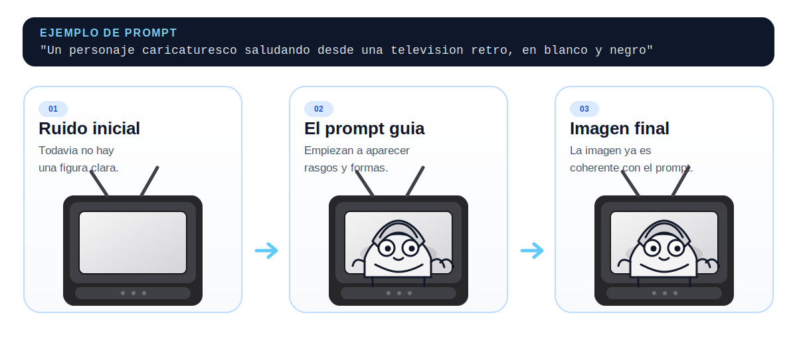

```{=html}
<div class="sesion-banner">
  <div>
    <span class="sesion-block-pill">Bloque 1 · Fundamentos + Ética</span>
  </div>
  <div class="sesion-progress-wrap">
    <div class="sesion-progress-bar">
      <div class="sesion-progress-fill sesion-progress-fill-4"></div>
    </div>
    <span class="sesion-progress-label">4 de 15</span>
  </div>
  <div class="sesion-meta">
    <span class="sesion-meta-chip"><svg aria-hidden="true" width="13" height="13" viewBox="0 0 24 24" fill="none" stroke="currentColor" stroke-width="2" stroke-linecap="round" stroke-linejoin="round"><rect x="3" y="4" width="18" height="18" rx="2" ry="2"/><line x1="16" y1="2" x2="16" y2="6"/><line x1="8" y1="2" x2="8" y2="6"/><line x1="3" y1="10" x2="21" y2="10"/></svg> 26 de mayo de 2026</span>
    <span class="sesion-meta-chip"><svg aria-hidden="true" width="13" height="13" viewBox="0 0 24 24" fill="none" stroke="currentColor" stroke-width="2" stroke-linecap="round" stroke-linejoin="round"><circle cx="12" cy="12" r="10"/><polyline points="12 6 12 12 16 14"/></svg> 40 minutos</span>
    <a href="../syllabus.html">Ver programa completo →</a>
  </div>
</div>

<link rel="stylesheet" href="../styles/sessions/sesion-04.css">
<script type="module" src="../interactives/sesion-04.js"></script>
```

## Introducción a la IA

```{=html}
<div class="video-placeholder">
  <span class="vp-icon">▶</span>
  <p class="vp-title">Video: IA Generativa — qué hace y cómo funciona</p>
</div>
```

---

<p class="capsule-complement-note">Los videos y el texto de esta sesión son complementarios. Los videos amplían el contexto histórico y conceptual; el texto va a los mecanismos y te pone a interactuar con ellos. Encontrarás ideas en los videos que el texto no repite exactamente. ¡Disfruta de esta dinámica!</p>

### Introducción

Son las 10 de la noche. Ya estás acostado y piensas en dormir, pero te acuerdas: mañana tienes que explicar la mitosis en clase. Tienes tu celular a la mano, así que buscas “qué es la mitosis” en Google. Aparecen miles de resultados: Wikipedia, videos largos, PDFs antiguos, páginas que se tardan en cargar. Tocas varios enlaces, lees, eliges lo útil y tratas de armar algo coherente.

Ahora imagina hacer la misma pregunta, pero en ChatGPT: “Explícame qué es la mitosis como si tuviera que presentarla en clase”. En segundos recibes una explicación clara, con las fases en orden y ejemplos fáciles de entender. Si fueran las 10 pm y tuvieras sueño… ¿cuál preferirías? Probablemente el segundo 😴. Pero antes de confiarle tu tarea a una app, vale la pena saber cómo piensa realmente una inteligencia artificial de ese tipo.

Un **buscador clásico** te muestra documentos que ya existen. En cambio, un modelo de **IA generativa** crea una respuesta nueva, palabra por palabra (y token por token), basándose en patrones que aprendió durante su entrenamiento. 

En 2026, muchas herramientas combinan ambas cosas, pero la diferencia sigue siendo importante: una se enfoca en recuperar contenido; la otra en generar texto. Y ambas estrategias pueden fallar, solo que de maneras distintas. Google podría darte información vieja o una fuente poco confiable. ChatGPT podría inventarse datos y decirlos de manera muy convincente. Ese tipo de error tiene nombre propio: **alucinación.**

```{=html}
<style>
#chatdemo{padding:0.5rem 0;display:flex;justify-content:center}
#chatdemo-inner{width:100%;max-width:400px;font-family:-apple-system,BlinkMacSystemFont,"Segoe UI",system-ui,sans-serif}
.cdlid{background:linear-gradient(170deg,#dce3ed,#c8d2df);border-radius:12px 12px 0 0;padding:7px 7px 0;box-shadow:0 2px 20px rgba(0,0,0,0.13),inset 0 1px 0 rgba(255,255,255,0.55)}
.cdcam{width:5px;height:5px;border-radius:50%;background:#a8b5c2;margin:0 auto 5px;box-shadow:inset 0 1px 2px rgba(0,0,0,0.18)}
.cdscreen{background:#fff;border-radius:7px;height:240px;overflow:hidden;display:flex;flex-direction:column}
.cdhinge{height:5px;background:linear-gradient(to bottom,#b8c4d0,#cdd4de)}
.cdbase{background:linear-gradient(to bottom,#cbd3df,#bcc4cf);height:15px;border-radius:0 0 6px 6px;margin:0 -10px;box-shadow:0 4px 12px rgba(0,0,0,0.1)}
.cdfoot{height:4px;background:#adb6c2;border-radius:0 0 5px 5px;margin:0 -20px}
.cdh{display:flex;align-items:center;gap:8px;padding:8px 12px;border-bottom:1px solid #e2e8f0;flex-shrink:0}
.cdh-ico{width:24px;height:24px;background:#10a37f;border-radius:6px;display:flex;align-items:center;justify-content:center;color:#fff;font-weight:800;font-size:12px;flex-shrink:0}
.cdh-t{font-weight:700;color:#1a365d;font-size:12px;line-height:1.2}
.cdh-s{font-size:9.5px;color:#64748b}
#cd-msgs{flex:1;padding:11px 12px;display:flex;flex-direction:column;gap:9px;overflow:hidden;transition:opacity 0.4s}
#cd-user{align-self:flex-end;background:#2780e3;color:#fff;border-radius:14px 14px 3px 14px;padding:7px 12px;font-size:12px;max-width:72%;line-height:1.4;display:none}
#cd-dots{align-self:flex-start;background:#f1f5f9;border-radius:14px 14px 14px 3px;padding:8px 13px;display:none;gap:5px;align-items:center}
.cdot{width:6px;height:6px;border-radius:50%;background:#94a3b8}
#cd-ai{align-self:flex-start;background:#f1f5f9;color:#1e3a5f;border-radius:14px 14px 14px 3px;padding:7px 12px;font-size:11.5px;line-height:1.55;max-width:88%;display:none}
.cdcur{display:inline-block;width:2px;height:0.88em;margin-left:2px;vertical-align:text-bottom;border-radius:1px;animation:cdblink 0.65s step-end infinite}
@keyframes cdblink{0%,100%{opacity:1}50%{opacity:0}}
.cdinput{border-top:1px solid #e2e8f0;padding:8px 10px;display:flex;align-items:center;gap:6px;flex-shrink:0}
.cdinput-f{flex:1;background:#f8fafc;border:1px solid #e2e8f0;border-radius:16px;padding:6px 12px;font-size:11px;color:#94a3b8;font-family:inherit}
.cdinput-s{width:24px;height:24px;background:#2780e3;border-radius:50%;display:flex;align-items:center;justify-content:center;flex-shrink:0}
</style>
<div id="chatdemo">
  <div id="chatdemo-inner">
    <div class="cdlid">
      <div class="cdcam"></div>
      <div class="cdscreen">
        <div class="cdh">
          <div class="cdh-ico">G</div>
          <div><div class="cdh-t">ChatGPT</div><div class="cdh-s">GPT-4o &middot; en l&iacute;nea</div></div>
        </div>
        <div id="cd-msgs">
          <div id="cd-user"></div>
          <div id="cd-dots"><div class="cdot"></div><div class="cdot"></div><div class="cdot"></div></div>
          <div id="cd-ai"></div>
        </div>
        <div class="cdinput">
          <div class="cdinput-f">Escribe un mensaje&hellip;</div>
          <div class="cdinput-s"><svg width="11" height="11" viewBox="0 0 24 24" fill="none" stroke="white" stroke-width="2.5" stroke-linecap="round" stroke-linejoin="round"><line x1="22" y1="2" x2="11" y2="13"/><polygon points="22 2 15 22 11 13 2 9 22 2"/></svg></div>
        </div>
      </div>
    </div>
    <div class="cdhinge"></div>
    <div class="cdbase"></div>
    <div class="cdfoot"></div>
  </div>
</div>
<script>
(function(){
  var PROMPT='Expl\u00edcame qu\u00e9 es la mitosis';
  var RESPONSE='Claro. La mitosis es el proceso por el cual una c\u00e9lula se divide en dos c\u00e9lulas hijas id\u00e9nticas, cada una con el mismo n\u00famero de cromosomas que la c\u00e9lula madre.';
  var msgsEl=document.getElementById('cd-msgs');
  var userEl=document.getElementById('cd-user');
  var dotsEl=document.getElementById('cd-dots');
  var aiEl=document.getElementById('cd-ai');
  var dotEls=dotsEl.querySelectorAll('.cdot');
  var dotTimer=null,charIdx=0,dotTick=0;
  function resetMsgs(){
    msgsEl.style.opacity='0';
    setTimeout(function(){
      userEl.style.display='none';userEl.innerHTML='';
      dotsEl.style.display='none';
      aiEl.style.display='none';aiEl.innerHTML='';
      charIdx=0;dotTick=0;
      msgsEl.style.opacity='1';
      setTimeout(typeUser,500);
    },450);
  }
  function cur(c){return '<span class="cdcur" style="background:'+c+'"></span>';}
  function startDots(){
    clearInterval(dotTimer);dotTick=0;
    dotEls.forEach(function(d){d.style.opacity='0.25';});
    dotTimer=setInterval(function(){
      dotTick=(dotTick+1)%3;
      dotEls.forEach(function(d,i){d.style.opacity=i===dotTick?'1':'0.25';});
    },350);
  }
  function typeUser(){
    if(charIdx===0) userEl.style.display='block';
    if(charIdx>PROMPT.length){
      userEl.innerHTML=PROMPT;
      dotsEl.style.display='flex';startDots();
      setTimeout(showAI,1500);
      return;
    }
    userEl.innerHTML=PROMPT.slice(0,charIdx)+cur('rgba(255,255,255,0.85)');
    charIdx++;setTimeout(typeUser,60);
  }
  function showAI(){
    clearInterval(dotTimer);dotsEl.style.display='none';
    aiEl.style.display='block';charIdx=0;typeAI();
  }
  function typeAI(){
    if(charIdx>RESPONSE.length){
      aiEl.innerHTML=RESPONSE;
      setTimeout(resetMsgs,2200);
      return;
    }
    aiEl.innerHTML=RESPONSE.slice(0,charIdx)+cur('#10a37f');
    charIdx++;setTimeout(typeAI,22);
  }
  setTimeout(typeUser,800);
})();
</script>
```

---

### ¿Qué es un modelo de lenguaje grande (LLM)?

Un **LLM** (*Large Language Model*, o modelo de lenguaje grande) es un tipo de inteligencia artificial diseñada para entender y generar texto. Se entrena con cantidades masivas de información escrita — artículos, libros, páginas web, código, mensajes, entre muchos otros — para aprender cómo se relacionan las palabras entre sí en distintos contextos.

Durante ese entrenamiento, el modelo no memoriza hechos como si fuera una enciclopedia. En realidad, aprende patrones estadísticos del lenguaje: observa millones de ejemplos y calcula qué palabra o frase es más probable que aparezca después de otra. Por ejemplo, si encuentra millones de veces la frase “el agua hierve a”, aprenderá que la continuación más probable es “100 grados Celsius”. Pero si el modelo se topa con ejemplos incorrectos o confusos, también puede predecir un dato falso con la misma seguridad que uno cierto.

Un LLM **no tiene capacidad de comprensión ni verificación automática**. Cuando genera una respuesta, produce la continuación más plausible según los patrones que ha aprendido, no necesariamente la más precisa en términos de conocimiento científico o factual. A veces coincide con la verdad; otras veces, simplemente “suenan” bien.

Por eso los modelos generativos como ChatGPT son tan poderosos: pueden escribir como humanos, resumir textos o crear ideas nuevas. Pero esa misma capacidad implica un riesgo si los usamos sin criterio, porque pueden **alucinar**, es decir, inventar datos o afirmaciones que parecen reales pero no lo son.


---

### Cómo escribe un LLM: tokens y predicción paso a paso

Para entender cómo un modelo genera texto, primero hay que saber con qué piezas trabaja. Un LLM no opera directamente con palabras completas, sino con **tokens**: fragmentos de texto que pueden ser una palabra entera, una parte de una palabra, un signo de puntuación o incluso un espacio. Dicho simple: los tokens son las piezas pequeñas con las que el modelo va armando una respuesta.

Una regla práctica:

- En inglés, una palabra suele equivaler aproximadamente a 1 token.

- En español, como muchas palabras son más largas o tienen más variaciones, una sola palabra puede ocupar entre 1.5 y 3 tokens.

Esto importa porque los modelos no miden el texto en palabras, sino en tokens. Cada token suma al costo y al límite de uso, así que, si quieres ahorrar dinero al trabajar con LLMs, conviene escribir en inglés: con las mismas ideas, suelen hacer falta menos tokens.


```{=html}
<div class="demo-wrap">
  <div class="demo-shell demo-tone-gen" id="tok-shell">
    <div class="demo-shell-head">
      <div class="demo-shell-copy">
        <p class="demo-eyebrow">Tokens y vocabulario</p>
        <h4 class="demo-title">¿Cómo divide el LLM el texto?</h4>
        <p class="demo-copy">Selecciona un ejemplo para ver cómo el modelo fragmenta el texto en tokens: unidades que pueden ser palabras completas, partes de palabras, signos de puntuación o espacios.</p>
      </div>
    </div>

    <div class="demo-stage">
      <div class="demo-stage-preview">
          <div class="demo-preview-card">
          <div class="demo-preview-visual">
            <div class="tok-preview-row">
              <span class="tok-preview-chip tok-preview-chip-a">La</span>
              <span class="tok-preview-chip tok-preview-chip-b"> intelig</span>
              <span class="tok-preview-chip tok-preview-chip-c">encia</span>
              <span class="tok-preview-chip tok-preview-chip-d"> artif</span>
              <span class="tok-preview-chip tok-preview-chip-e">icial</span>
            </div>
          </div>
          <p class="demo-preview-title">Vista previa del tokenizador</p>
          <p class="demo-preview-copy">Cada bloque de color es un token. "inteligencia" se divide en dos, "artificial" también.</p>
        </div>
      </div>

      <div class="demo-stage-live">
        <div id="tok-example-btns" class="tok-example-btns"></div>
        <p class="tok-original" id="tok-original"></p>
        <div id="tok-output" class="tok-output"></div>
        <p id="tok-stats" class="tok-stats"></p>
        <p class="tok-note">Nota: esta es una tokenización ilustrativa, no exactamente igual a ningún modelo específico.</p>
      </div>
    </div>

    <div class="demo-insights">
      <div class="demo-insight">
        <h5>Qué estás viendo</h5>
        <p id="tok-seeing"></p>
      </div>
      <div class="demo-insight">
        <h5>Qué significa</h5>
        <p id="tok-meaning"></p>
      </div>
    </div>

    <div class="demo-footer">
      <p id="tok-status" class="demo-status"></p>
      <div class="demo-actions">
        <button id="tok-start" class="demo-btn demo-btn-primary">Explorar tokens</button>
        <button id="tok-reset" class="btn-restart" disabled>Reiniciar</button>
      </div>
    </div>
  </div>
</div>
```


Una vez que el texto está dividido en tokens, el mecanismo base es este:

1. El modelo lee tu prompt y el texto que ya lleva escrito.
2. Calcula qué tokens podrían venir después.
3. Les asigna una probabilidad según el contexto.
4. Elige uno de los tokens más plausibles.
5. Lo agrega al texto y repite el proceso.

Eso pasa una y otra vez, muy rápido. Por eso parece que el modelo “va pensando” mientras escribe, pero en realidad va construyendo la respuesta paso a paso a partir de probabilidades.


```{=html}
<div class="demo-wrap">
  <div class="demo-shell demo-tone-gen" id="pred-shell">
    <div class="demo-shell-head">
      <div class="demo-shell-copy">
        <p class="demo-eyebrow">Generación autorregresiva</p>
        <h4 class="demo-title">El modelo elige el siguiente token, una y otra vez</h4>
        <p class="demo-copy">Observa cómo se construye una oración paso a paso. Cada barra muestra qué tan probable es cada opción en ese momento dado el contexto previo.</p>
      </div>
    </div>

    <div class="demo-stage">
      <div class="demo-stage-preview">
          <div class="demo-preview-card">
          <div class="demo-preview-visual">
            <div class="pred-preview-list">
              <div class="pred-preview-row">
                <span class="pred-preview-label">puede</span>
                <div class="pred-preview-track">
                  <div class="pred-preview-fill pred-preview-fill-31"></div>
                </div>
                <span class="pred-preview-pct">31%</span>
              </div>
              <div class="pred-preview-row">
                <span class="pred-preview-label">tiene</span>
                <div class="pred-preview-track">
                  <div class="pred-preview-fill pred-preview-fill-27"></div>
                </div>
                <span class="pred-preview-pct">27%</span>
              </div>
              <div class="pred-preview-row">
                <span class="pred-preview-label">procesa</span>
                <div class="pred-preview-track">
                  <div class="pred-preview-fill pred-preview-fill-18"></div>
                </div>
                <span class="pred-preview-pct">18%</span>
              </div>
            </div>
          </div>
          <p class="demo-preview-title">Vista previa del predictor</p>
          <p class="demo-preview-copy">Cada paso muestra 5 opciones con su probabilidad estimada. La elegida se agrega a la oración y el proceso comienza de nuevo.</p>
        </div>
      </div>

      <div class="demo-stage-live">
        <div id="pred-sentence" class="pred-sentence"></div>
        <div id="pred-candidates" class="pred-candidates"></div>
      </div>
    </div>

    <div class="demo-insights">
      <div class="demo-insight">
        <h5>Qué estás viendo</h5>
        <p id="pred-seeing"></p>
      </div>
      <div class="demo-insight">
        <h5>Qué significa</h5>
        <p id="pred-meaning"></p>
      </div>
    </div>

    <div class="demo-footer">
      <p id="pred-status" class="demo-status"></p>
      <div class="demo-actions">
        <button id="pred-start" class="demo-btn demo-btn-primary">Ver animación</button>
        <button id="pred-reset" class="btn-restart" disabled>Reiniciar</button>
      </div>
    </div>
  </div>
</div>
```

---

### ¿Por qué la misma pregunta puede producir respuestas distintas?

Si un LLM siempre eligiera la opción más obvia, todas sus respuestas sonarían casi iguales. Pero en muchos casos no existe una sola continuación posible: hay varias que tienen sentido y el modelo puede escoger cualquiera de ellas.

Por ejemplo, al pedirle al modelo: *“Explícame qué es la gravedad”*, en ese momento puede continuar de varias maneras: con una explicación simple, con un ejemplo, con analogías o con un enfoque científico. El modelo decide entre esas opciones según los patrones que aprendió en su entrenamiento y cuál continuación resulta más plausible en ese contexto. La respuesta que recibes es el resultado de muchas elecciones sucesivas, token por token.

Por eso una IA puede responder distinto aunque la pregunta sea casi la misma. No es que “cambie de opinión”; más bien, está recorriendo uno de varios caminos posibles dentro del lenguaje.

Esto también nos ayuda a entender dos cosas importantes:

- Si el sistema está configurado para ser más conservador, tenderá a elegir opciones más comunes y predecibles.

- Si está configurado para permitir más variedad, puede producir respuestas más originales, pero también menos precisas o más raras.

En otras palabras: **que un modelo sea más creativo no significa que diga la verdad**, y una respuesta que suena muy segura tampoco garantiza que sea correcta.

---

### Las tres limitaciones cruciales de un LLM

Entender cómo funciona un LLM hace que sus limitaciones dejen de ser sorprendentes y se vuelvan casi inevitables: el modelo no tiene memoria de eventos posteriores a su entrenamiento, no distingue confiablemente entre verdad y ficción, y percibe el mundo solo a través del sesgo estadístico de los textos que vio. Su poder está en la fluidez, no en la verdad; y su mayor riesgo no es equivocarse, sino hacerlo con la misma seguridad con la que un humano escribiría algo correcto.

```{=html}
<div class="llm-limits-stack">

  <div class="llm-limit-card">
    <span class="llm-limit-num">01</span>
    <h4 class="llm-limit-title">Alucinaciones</h4>
    <div class="llm-limit-body">
      <p>El modelo no distingue entre un dato verdadero y uno falso, solo entre un token probable y uno improbable. Si el contexto hace que una afirmación falsa parezca plausible, la generará con la misma confianza que si fuera cierta.</p>
      <p><strong>Ejemplo clásico:</strong> pedirle a un LLM que cite fuentes académicas. Puede inventar títulos, autores y DOIs perfectamente plausibles que simplemente no existen.</p>
      <p><strong>Solución:</strong> verifica siempre los datos que el modelo presente como hechos, especialmente números, fechas, citas y afirmaciones específicas.</p>
      <details class="llm-foldout">
        <summary>
          <span><span class="llm-foldout-label">Casos verídicos</span>Cuando la IA alucina: tres ejemplos verídicos</span>
          <svg class="llm-foldout-chevron" viewBox="0 0 24 24" fill="none" stroke="currentColor" stroke-width="2.5" stroke-linecap="round" stroke-linejoin="round"><polyline points="6 9 12 15 18 9"/></svg>
        </summary>
        <div class="llm-foldout-body">
          <div class="hi-cases">

            <div class="hi-case">
              <div class="hi-case-head">
                <span class="hi-num">01</span>
                <span class="hi-loc">EE.UU. · 2023</span>
              </div>
              <p class="hi-title">El abogado y las citas inventadas</p>
              <p class="hi-copy">Un abogado de Nueva York usó ChatGPT para buscar precedentes legales. El modelo inventó 6 casos judiciales con nombres de jueces, fechas y citas que sonaban completamente reales. Los presentó ante un juez federal sin verificar ninguno.</p>
              <div class="hi-result"><span class="hi-result-tag">Consecuencia</span>Multado con $5,000 USD. Tuvo que enviar cartas de disculpa a cada juez nombrado falsamente. El caso <em>Mata v. Avianca</em> se convirtió en referencia mundial sobre el uso irresponsable de IA en contextos legales.</div>
            </div>

            <div class="hi-case">
              <div class="hi-case-head">
                <span class="hi-num">02</span>
                <span class="hi-loc">EE.UU. · 2023</span>
              </div>
              <p class="hi-title">Google Bard y los $100,000 millones perdidos</p>
              <p class="hi-copy">En febrero de 2023, Google presentó Bard con un video donde el chatbot afirmaba que el Telescopio James Webb había tomado <em>las primeras fotografías</em> de un exoplaneta — dato incorrecto. Astrónomos y periodistas detectaron el error de inmediato.</p>
              <div class="hi-result"><span class="hi-result-tag">Consecuencia</span>Las acciones de Alphabet cayeron <strong>7.7%</strong> en un solo día, borrando aproximadamente <strong>$100,000 millones de dólares</strong> en capitalización de mercado.</div>
            </div>

            <div class="hi-case">
              <div class="hi-case-head">
                <span class="hi-num">03</span>
                <span class="hi-loc">Global · 2023–2024</span>
              </div>
              <p class="hi-title">Las citas académicas fantasma</p>
              <p class="hi-copy">Un estudio en <a href="https://www.nature.com/articles/s41598-023-41032-5" target="_blank" rel="noopener"><em>Scientific Reports</em> (Nature, 2023)</a> analizó 636 citas generadas por ChatGPT. Con GPT-3.5, el <strong>55% eran completamente inventadas</strong>; con GPT-4 bajó al 18%, pero incluso las citas reales contenían errores frecuentes.</p>
              <div class="hi-result"><span class="hi-result-tag">Consecuencia</span>Varios trabajos académicos tuvieron que corregirse o retractarse. Si usas ChatGPT para una tarea, nunca copies sus citas sin verificarlas una por una.</div>
            </div>

          </div>
        </div>
      </details>
    </div>
  </div>

  <div class="llm-limit-card">
    <span class="llm-limit-num">02</span>
    <h4 class="llm-limit-title">Límite de conocimiento <em style="font-size:0.8em;font-weight:500;opacity:0.65">(knowledge cutoff)</em></h4>
    <div class="llm-limit-body">
      <p>El modelo fue entrenado con textos disponibles hasta cierta fecha. Todo lo que ocurrió después simplemente no existe para él, a menos que tú se lo des en el prompt o el modelo tenga acceso a una búsqueda en tiempo real.</p>
      <p><strong>Implicación:</strong> para preguntas sobre eventos recientes, usa herramientas con búsqueda activa (como Perplexity) o verifica la información con fuentes actualizadas.</p>
    </div>
  </div>

  <div class="llm-limit-card">
    <span class="llm-limit-num">03</span>
    <h4 class="llm-limit-title">Sesgos del entrenamiento</h4>
    <div class="llm-limit-body">
      <p>Los LLMs aprenden a partir de textos escritos por humanos, y el texto humano está lleno de sesgos: de género, raza, origen geográfico y clase social. Además, un modelo entrenado sobre todo con texto en inglés va a reflejar visiones del mundo distintas a las de una comunidad mexicana.</p>
      <p><strong>Implicación:</strong> el modelo no es neutral. Sus respuestas reflejan los sesgos de los datos con los que fue entrenado.</p>
    </div>
  </div>

</div>
```

---

### Generación de imágenes

Hasta aquí hemos hablado de texto. En un LLM, la respuesta se construye token por token. En cambio, las IAs que generan imágenes parten de ruido visual y lo van transformando poco a poco, guiadas por el prompt. Ese proceso se llama **difusión** (*diffusion*).

```{=html}
<div class="diffusion-card">
  

  <div class="diffusion-note">
    <strong>Idea general:</strong> la IA parte de ruido visual y lo reorganiza hasta que aparece una imagen que coincide con el prompt.
  </div>
</div>
```

Esto ayuda a entender dos cosas importantes:

- El prompt no contiene la imagen exacta, pero sí orienta el proceso: le dice al modelo qué rasgos debería ir haciendo visibles.

- El mismo prompt puede producir imágenes distintas, porque si el ruido inicial cambia, el resultado final también puede cambiar.

Igual que con la generación de texto, aquí tampoco hay una “respuesta única”. Hay un proceso probabilístico que avanza por etapas, solo que ahora trabaja sobre pixeles en lugar de tokens.

---

## Actividad: la calidad del prompt importa

ChatGPT, Gemini y Perplexity son excelentes herramientas. Pero, como cualquier herramienta, la calidad de sus resultados depende del uso que le damos. Lo que separa una respuesta genérica e inútil de una que resuelve exactamente tu problema suele ser la precisión del prompt.


```{=html}
<div class="demo-wrap">
  <div class="demo-shell demo-tone-supervised" id="pcomp-shell">
    <div class="demo-shell-head">
      <div class="demo-shell-copy">
        <p class="demo-eyebrow">Ingeniería de prompts</p>
        <h4 class="demo-title">Prompt ambiguo vs. prompt específico: misma herramienta, resultado distinto</h4>
        <p class="demo-copy">Elige un escenario y compara qué pasa cuando la instrucción es ambigua (izquierda) versus cuando es específica y contextualizada (derecha).</p>
      </div>
    </div>

    <div class="demo-stage">
      <div class="demo-stage-preview">
          <div class="demo-preview-card">
          <div class="demo-preview-visual">
            <div class="pcomp-preview-grid">
              <div class="pcomp-preview-card pcomp-preview-card-vague">
                <div class="pcomp-preview-kicker">Ambiguo</div>
                <div class="pcomp-preview-example">"dame una receta"</div>
              </div>
              <div class="pcomp-preview-card pcomp-preview-card-specific">
                <div class="pcomp-preview-kicker">Específico</div>
                <div class="pcomp-preview-example">"receta vegetariana, 4 personas, 30 min, México"</div>
              </div>
            </div>
          </div>
          <p class="demo-preview-copy">Tres escenarios: receta, correo y resumen. En cada uno verás cómo cambia la respuesta según la precisión del prompt.</p>
        </div>
      </div>

      <div class="demo-stage-live">
        <div id="pcomp-tabs" class="pcomp-tabs"></div>
        <div class="pcomp-grid">
          <div class="pcomp-panel pcomp-panel-vague">
            <div class="pcomp-panel-header">Prompt ambiguo</div>
            <div class="pcomp-panel-body">
              <p class="pcomp-prompt-label">Prompt enviado</p>
              <div class="pcomp-prompt" id="pcomp-left-prompt"></div>
              <p class="pcomp-response-label">Respuesta recibida</p>
              <div class="pcomp-response" id="pcomp-left-response"></div>
            </div>
          </div>
          <div class="pcomp-panel pcomp-panel-specific">
            <div class="pcomp-panel-header">Prompt específico</div>
            <div class="pcomp-panel-body">
              <p class="pcomp-prompt-label">Prompt enviado</p>
              <div class="pcomp-prompt" id="pcomp-right-prompt"></div>
              <p class="pcomp-response-label">Respuesta recibida</p>
              <div class="pcomp-response" id="pcomp-right-response"></div>
            </div>
          </div>
        </div>
      </div>
    </div>

    <div class="demo-insights">
      <div class="demo-insight">
        <h5>Qué estás viendo</h5>
        <p id="pcomp-seeing"></p>
      </div>
      <div class="demo-insight">
        <h5>Qué significa</h5>
        <p id="pcomp-meaning"></p>
      </div>
    </div>

    <div class="demo-footer">
      <p id="pcomp-status" class="demo-status"></p>
      <div class="demo-actions">
        <button id="pcomp-start" class="demo-btn demo-btn-primary">Ver comparativa</button>
        <button id="pcomp-reset" class="btn-restart" disabled>Reiniciar</button>
      </div>
    </div>
  </div>
</div>
```

**Tres variables que mejoran un prompt:**

1. **Contexto:** quién eres, para qué lo necesitas, a qué audiencia va dirigido.
2. **Restricciones:** límite de palabras, tono, idioma, formato de la respuesta.
3. **Ejemplo de lo que quieres:** si tienes uno, inclúyelo, el modelo lo usa como referencia.

---

## ChatGPT, Gemini y Perplexity: ¿cuándo usar cada uno?

Las tres herramientas utilizan modelos generativos, pero no están diseñadas para el mismo tipo de tarea. Más que preguntarse cuál es mejor, conviene reflexionar sobre cuál se adapta mejor a lo que necesitas resolver en ese momento.

```{=html}
<div class="tools-grid">

  <!-- ChatGPT -->
  <div class="tool-card tool-chatgpt">
    <div class="tool-card-header">
      <div class="tool-logo"><svg viewBox="0 0 24 24" fill="none" stroke="currentColor" stroke-width="1.8" stroke-linecap="round" stroke-linejoin="round" aria-hidden="true"><path d="M21 15a2 2 0 0 1-2 2H7l-4 4V5a2 2 0 0 1 2-2h14a2 2 0 0 1 2 2z"/></svg></div>
      <div>
        <p class="tool-name">ChatGPT</p>
        <p class="tool-maker">OpenAI</p>
      </div>
    </div>
    <div class="tool-card-body">
      <div class="tool-row">
        <span class="tool-row-label">Mejor para</span>
        <span class="tool-row-value">Borradores, explicaciones, lluvia de ideas, análisis de documentos y trabajo iterativo.</span>
      </div>
      <div class="tool-row">
        <span class="tool-row-label">Fortaleza</span>
        <span class="tool-row-value">Conversación flexible: puedes refinar la instrucción varias veces, cambiar el tono y pedir nuevas versiones.</span>
        <span class="tool-tag tag-strength">Iteración</span>
      </div>
      <div class="tool-row">
        <span class="tool-row-label">Limitación principal</span>
        <span class="tool-row-value">Puede sonar muy convincente incluso cuando se equivoca. No debe usarse como verificador de hechos por sí solo.</span>
      </div>
      <div class="tool-row">
        <span class="tool-row-label">Regla general</span>
        <span class="tool-row-value">Úsalo para pensar, redactar y reorganizar ideas; luego verifica por separado los hechos importantes.</span>
      </div>
    </div>
  </div>

  <!-- Gemini -->
  <div class="tool-card tool-gemini">
    <div class="tool-card-header">
      <div class="tool-logo"><svg viewBox="0 0 24 24" fill="none" stroke="currentColor" stroke-width="1.8" stroke-linecap="round" stroke-linejoin="round" aria-hidden="true"><path d="M12 3c-1 3-3.5 4-6 5 2.5 1 5 2 6 5 1-3 3.5-4 6-5-2.5-1-5-2-6-5z"/><path d="M5 3c-.5 1.5-1.5 2-3 2.5 1.5.5 2.5 1 3 2.5.5-1.5 1.5-2 3-2.5-1.5-.5-2.5-1-3-2.5z"/></svg></div>
      <div>
        <p class="tool-name">Gemini</p>
        <p class="tool-maker">Google</p>
      </div>
    </div>
    <div class="tool-card-body">
      <div class="tool-row">
        <span class="tool-row-label">Mejor para</span>
        <span class="tool-row-value">Tareas integradas con el ecosistema de Google y consultas que combinan texto con otros formatos.</span>
      </div>
      <div class="tool-row">
        <span class="tool-row-label">Fortaleza</span>
        <span class="tool-row-value">Suele funcionar muy bien cuando ya trabajas entre Drive, Docs, Gmail o herramientas de Google.</span>
        <span class="tool-tag tag-multi">Ecosistema</span>
      </div>
      <div class="tool-row">
        <span class="tool-row-label">Limitación principal</span>
        <span class="tool-row-value">Que una herramienta tenga acceso a ciertos servicios o a búsquedas en internet no garantiza por sí mismo resultados correctos; es necesario revisar con cuidado la información más importante.</span>
      </div>
      <div class="tool-row">
        <span class="tool-row-label">Regla general</span>
        <span class="tool-row-value">Úsalo cuando la tarea ya forme parte de tu flujo de trabajo con Google o cuando te resulte útil manejar distintos formatos dentro de una misma conversación.</span>
      </div>
    </div>
  </div>

  <!-- Perplexity -->
  <div class="tool-card tool-perplexity">
    <div class="tool-card-header">
      <div class="tool-logo"><svg viewBox="0 0 24 24" fill="none" stroke="currentColor" stroke-width="1.8" stroke-linecap="round" stroke-linejoin="round" aria-hidden="true"><circle cx="11" cy="11" r="8"/><path d="m21 21-4.35-4.35"/></svg></div>
      <div>
        <p class="tool-name">Perplexity</p>
        <p class="tool-maker">Perplexity AI</p>
      </div>
    </div>
    <div class="tool-card-body">
      <div class="tool-row">
        <span class="tool-row-label">Mejor para</span>
        <span class="tool-row-value">Preguntas recientes, investigación rápida y respuestas que desde el inicio muestren fuentes.</span>
      </div>
      <div class="tool-row">
        <span class="tool-row-label">Fortaleza</span>
        <span class="tool-row-value">Te facilita revisar documentos y enlaces, no solo la respuesta que genera el modelo.</span>
        <span class="tool-tag tag-search">Búsqueda + fuentes</span>
      </div>
      <div class="tool-row">
        <span class="tool-row-label">Limitación principal</span>
        <span class="tool-row-value">Citar una fuente no garantiza que la interpretación sea correcta. Hay que abrir el documento y comprobar que efectivamente respalde la afirmación.</span>
      </div>
      <div class="tool-row">
        <span class="tool-row-label">Regla general</span>
        <span class="tool-row-value">Úsalo cuando sea importante contar con información actualizada o cuando necesites una forma clara de comprobar una afirmación con fuentes externas.</span>
      </div>
    </div>
  </div>

</div>

<div class="tools-note">
  <strong>Hay que aprender a distinguir</strong> entre herramientas orientadas a conversar, herramientas orientadas a trabajar dentro de un ecosistema y herramientas orientadas a responder con fuentes visibles. Los nombres comerciales pueden cambiar; la lógica de uso no.
</div>
```

---

### Criterios para usar IA generativa con juicio crítico

Antes de usar o compartir información generada con IA, intenta preguntarte lo siguiente:

```{=html}
<div class="crit-card">
  <div class="crit-list">
    <div class="crit-item">
      <span class="crit-num" aria-hidden="true">✅</span>
      <p class="crit-q"><strong>¿Importa mucho que esté correcta?</strong> No es lo mismo pedir ideas para un proyecto que usar la respuesta para una tarea, una decisión de salud o una información que vas a compartir con otras personas.</p>
    </div>
    <div class="crit-item">
      <span class="crit-num" aria-hidden="true">🗞️</span>
      <p class="crit-q"><strong>¿La información puede haber cambiado recientemente?</strong> Si preguntas por noticias, fechas, convocatorias, precios o eventos actuales, no confíes solo en el modelo: verifica con fuentes actualizadas.</p>
    </div>
    <div class="crit-item">
      <span class="crit-num" aria-hidden="true">🔎</span>
      <p class="crit-q"><strong>¿Puedo comprobar lo que afirma?</strong> Si aparecen datos concretos como números, citas, nombres o fechas, revísalos en una fuente confiable antes de usarlos.</p>
    </div>
    <div class="crit-item">
      <span class="crit-num" aria-hidden="true">✍🏼</span>
      <p class="crit-q"><strong>¿Mi prompt fue claro?</strong> Una respuesta que deja mucho que desear no es el resultado de un “mal modelo”, sino de una instrucción ambigua o demasiado general.</p>
    </div>
    <div class="crit-item">
      <span class="crit-num" aria-hidden="true">📖</span>
      <p class="crit-q"><strong>¿Qué perspectiva podría faltar aquí?</strong> Recuerda que los modelos aprenden de textos humanos, y esos textos también tienen sesgos y puntos ciegos.</p>
    </div>
  </div>
  <div class="crit-footer">
    <p class="crit-footer-copy">Usa la IA para pensar, explorar, resumir o empezar un borrador. No para reemplazar tu criterio ni para dar por sentado algo importante sin revisarlo.</p>
  </div>
</div>
```


---

```{=html}
<span class="reflexion-kicker">Reflexión · 5 min</span>
<h3 class="reflexion-heading">Actividad de reflexión</h3>
<ol class="reflexion-list">
  <li class="reflexion-item">
    <span class="reflexion-num" aria-hidden="true">01</span>
    <p class="reflexion-q"><strong>Piensa en la última vez que usaste un buscador para algo importante.</strong> ¿Habrías obtenido el mismo resultado con un LLM? ¿Cuáles serían las ventajas y los riesgos de usar uno en ese caso?</p>
  </li>
  <li class="reflexion-item">
    <span class="reflexion-num" aria-hidden="true">02</span>
    <p class="reflexion-q"><strong>¿En qué situaciones preferirías usar un buscador</strong> en lugar de un modelo generativo? ¿Por qué?</p>
  </li>
  <li class="reflexion-item">
    <span class="reflexion-num" aria-hidden="true">03</span>
    <p class="reflexion-q"><strong>Si el modelo predice token por token sin "entender",</strong> ¿qué implica eso para tareas como diagnósticos médicos, asesoría legal o información de emergencias?</p>
  </li>
  <li class="reflexion-item">
    <span class="reflexion-num" aria-hidden="true">04</span>
    <p class="reflexion-q"><strong>¿Usaste alguna IA generativa esta semana?</strong> Ahora que entiendes cómo funciona, ¿cambiarías algo de cómo la usaste?</p>
  </li>
</ol>
<p class="reflexion-close">No hay respuestas únicas. Lo importante es que empieces a hacerte estas preguntas antes de confiar ciegamente en una herramienta generativa.</p>
```

---

### La idea central de esta sesión

```{=html}
<div class="central-idea">
  <span class="central-idea-label">Idea central · Sesión 4</span>
  <p class="central-idea-text">Los modelos generativos no buscan información: la generan. No saben si lo que producen es verdad; solo saben si es probable. Para beneficiarnos de ellos, tenemos que tener clara esa diferencia, ser críticos al usarlos y no dejar que la IA piense por nosotros.</p>
</div>
```

---

### Recursos para explorar más sobre el tema

```{=html}
<ul class="resource-list">
  <li class="resource-list-item">
    <a class="resource-list-link" href="https://tiktokenizer.vercel.app" target="_blank" rel="noopener">Tiktokenizer <svg aria-hidden="true" width="12" height="12" viewBox="0 0 24 24" fill="none" stroke="currentColor" stroke-width="2.5" stroke-linecap="round" stroke-linejoin="round"><path d="M18 13v6a2 2 0 0 1-2 2H5a2 2 0 0 1-2-2V8a2 2 0 0 1 2-2h6"/><polyline points="15 3 21 3 21 9"/><line x1="10" y1="14" x2="21" y2="3"/></svg></a>
    <p class="resource-list-desc">Pega cualquier texto y ve cómo lo divide GPT-4 en tokens; puedes comparar el conteo entre español e inglés en tiempo real.</p>
  </li>
  <li class="resource-list-item">
    <a class="resource-list-link" href="https://poloclub.github.io/transformer-explainer/" target="_blank" rel="noopener">Transformer Explainer — Georgia Tech <svg aria-hidden="true" width="12" height="12" viewBox="0 0 24 24" fill="none" stroke="currentColor" stroke-width="2.5" stroke-linecap="round" stroke-linejoin="round"><path d="M18 13v6a2 2 0 0 1-2 2H5a2 2 0 0 1-2-2V8a2 2 0 0 1 2-2h6"/><polyline points="15 3 21 3 21 9"/><line x1="10" y1="14" x2="21" y2="3"/></svg></a>
    <p class="resource-list-desc">Visualización interactiva de cómo funciona GPT-2 en tu navegador, sin instalación; ideal para ver la atención y la predicción de tokens en tiempo real.</p>
  </li>
  <li class="resource-list-item">
    <a class="resource-list-link" href="https://bbycroft.net/llm" target="_blank" rel="noopener">LLM Visualization — Brendan Bycroft <svg aria-hidden="true" width="12" height="12" viewBox="0 0 24 24" fill="none" stroke="currentColor" stroke-width="2.5" stroke-linecap="round" stroke-linejoin="round"><path d="M18 13v6a2 2 0 0 1-2 2H5a2 2 0 0 1-2-2V8a2 2 0 0 1 2-2h6"/><polyline points="15 3 21 3 21 9"/><line x1="10" y1="14" x2="21" y2="3"/></svg></a>
    <p class="resource-list-desc">Navega por un transformer en 3D: cada capa, cada operación, la inferencia completa.</p>
  </li>
  <li class="resource-list-item">
    <a class="resource-list-link" href="https://jalammar.github.io/illustrated-stable-diffusion/" target="_blank" rel="noopener">The Illustrated Stable Diffusion — Jay Alammar <svg aria-hidden="true" width="12" height="12" viewBox="0 0 24 24" fill="none" stroke="currentColor" stroke-width="2.5" stroke-linecap="round" stroke-linejoin="round"><path d="M18 13v6a2 2 0 0 1-2 2H5a2 2 0 0 1-2-2V8a2 2 0 0 1 2-2h6"/><polyline points="15 3 21 3 21 9"/><line x1="10" y1="14" x2="21" y2="3"/></svg></a>
    <p class="resource-list-desc">Explicación visual paso a paso de cómo funciona la difusión: desde el ruido hasta la imagen final. Muy bien ilustrado. En inglés; ideal si ya entendiste la idea general y quieres adentrarte en las partes técnicas del proceso.</p>
  </li>
</ul>
```

---

```{=html}
<nav class="sesion-nav">
  <a href="sesion-03.html" class="sesion-nav-btn prev">
    <span class="nav-label">← Anterior</span>
    <span class="nav-title">S3: Algoritmos de IA</span>
  </a>
  <div class="sesion-nav-center">
    <div class="sesion-nav-dots">
      <span class="sesion-nav-dot published" title="Sesión 1"></span>
      <span class="sesion-nav-dot published" title="Sesión 2"></span>
      <span class="sesion-nav-dot published" title="Sesión 3"></span>
      <span class="sesion-nav-dot active" title="Sesión 4"></span>
      <span class="sesion-nav-dot" title="Sesión 5"></span>
      <span class="sesion-nav-dot" title="Sesión 6"></span>
      <span class="sesion-nav-dot" title="Sesión 7"></span>
      <span class="sesion-nav-dot" title="Sesión 8"></span>
      <span class="sesion-nav-dot" title="Sesión 9"></span>
      <span class="sesion-nav-dot" title="Sesión 10"></span>
      <span class="sesion-nav-dot" title="Sesión 11"></span>
      <span class="sesion-nav-dot" title="Sesión 12"></span>
      <span class="sesion-nav-dot" title="Sesión 13"></span>
      <span class="sesion-nav-dot" title="Sesión 14"></span>
      <span class="sesion-nav-dot" title="Sesión 15"></span>
    </div>
    <span class="sesion-nav-progress">Sesión 4 de 15</span>
  </div>
  <a href="sesion-05.html" class="sesion-nav-btn next">
    <span class="nav-label">Siguiente →</span>
    <span class="nav-title">S5: Ética y problemas reales</span>
  </a>
</nav>
```
