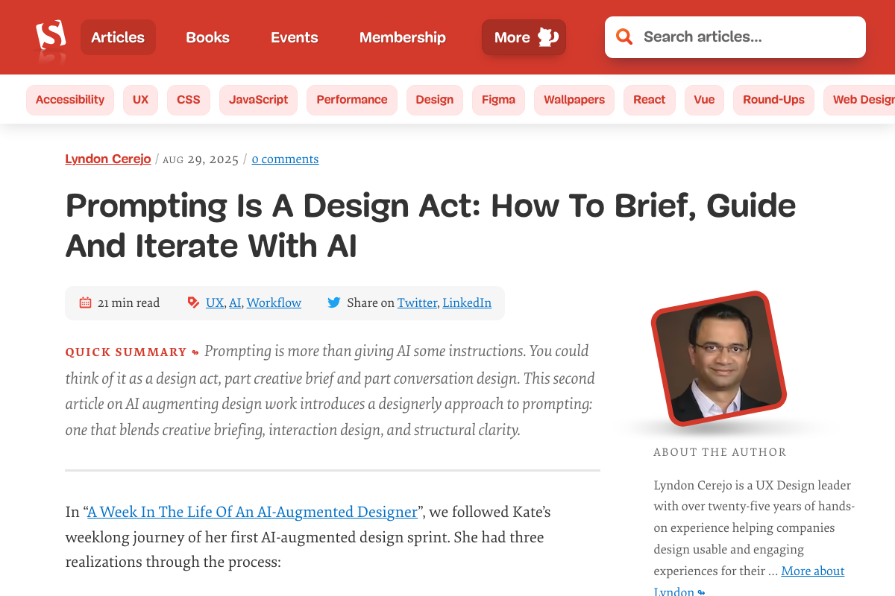
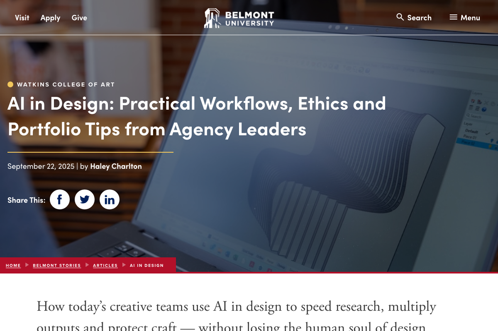
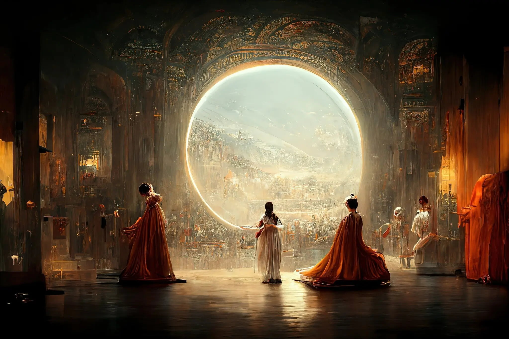

```{=html}
<div class="sesion-banner">
  <div>
    <span class="sesion-block-pill">Bloque 2 · Herramientas Prácticas</span>
  </div>
  <div class="sesion-progress-wrap">
    <div class="sesion-progress-bar">
      <div class="sesion-progress-fill sesion-progress-fill-8"></div>
    </div>
    <span class="sesion-progress-label">8 de 15</span>
  </div>
  <div class="sesion-meta">
    <span class="sesion-meta-chip"><svg aria-hidden="true" width="13" height="13" viewBox="0 0 24 24" fill="none" stroke="currentColor" stroke-width="2" stroke-linecap="round" stroke-linejoin="round"><rect x="3" y="4" width="18" height="18" rx="2" ry="2"/><line x1="16" y1="2" x2="16" y2="6"/><line x1="8" y1="2" x2="8" y2="6"/><line x1="3" y1="10" x2="21" y2="10"/></svg> 23 de junio de 2026</span>
    <span class="sesion-meta-chip"><svg aria-hidden="true" width="13" height="13" viewBox="0 0 24 24" fill="none" stroke="currentColor" stroke-width="2" stroke-linecap="round" stroke-linejoin="round"><circle cx="12" cy="12" r="10"/><polyline points="12 6 12 12 16 14"/></svg> 45 minutos</span>
    <a href="../syllabus.html">Ver programa completo →</a>
  </div>
</div>
```

```{=html}
<link rel="stylesheet" href="../styles/sessions/sesion-08.css">
<script type="module" src="../interactives/sesion-08.js"></script>
```

## Introducción a la IA

```{=html}
<div class="video-placeholder">
  <span class="vp-icon">▶</span>
  <p class="vp-title">Video: IA para Creatividad: Arte, Música y Diseño</p>
</div>
```

---

<p class="capsule-complement-note">Los videos y el texto de esta sesión son complementarios. Los videos amplían el contexto histórico y conceptual; el texto va a los mecanismos y te pone a interactuar con ellos. Encontrarás ideas en los videos que el texto no repite exactamente. ¡Disfruta de esta dinámica!</p>

### Introducción

En agosto de 2022, Jason Allen presentó una obra en la Feria Estatal de Colorado, E.E.U.,  en la categoría de arte digital emergente. La imagen se llamaba *Théâtre D'Opéra Spatial*: una escena de ópera de ciencia ficción, con personajes de espaldas mirando hacia una apertura luminosa, tonos dorados y una atmósfera casi cinematográfica. Ganó el primer lugar.

Cuando se supo que Allen la había creado con Midjourney, un modelo generativo de imágenes, la reacción fue inmediata. "El arte ha muerto", escribió alguien en redes. "Estamos a punto de ver el fin de la creatividad humana." Allen respondió que había pasado horas ajustando los prompts, iterando versiones, eligiendo entre cientos de variaciones y editando el resultado final. "¿Eso no es arte?", preguntó.

Ese debate aún no tiene respuesta definitiva. Lo que sí podemos hacer es entender qué está pasando técnicamente, qué herramientas existen hoy, y qué preguntas hacernos sobre el futuro de la creatividad en un mundo con IA.

**Cuando una IA genera algo que consideramos bello o expresivo, ¿quién o qué está siendo creativo?**

---

### El proceso creativo con IA

En esta sesión no solo nos preguntaremos *qué herramientas existen*, sino *en qué parte del proceso creativo nos puede apoyar la inteligencia artificial*. Nos enfocaremos en establecer un **objetivo**, diseñar un proceso iterativo de **selección** y desarrollar **criterio**.

```{=html}
<div class="creative-process-grid">
  <div class="creative-process-card">
    <span class="creative-process-step">1</span>
    <h5>Definir el objetivo</h5>
    <p>¿Qué pieza quieres crear, para quién, en qué contexto y con qué restricciones? </p>
  </div>
  <div class="creative-process-card">
    <span class="creative-process-step">2</span>
    <h5>Generar variantes</h5>
    <p>La IA puede producir rápidamente muchas opciones iniciales. Su valor no está en “acertar a la primera", sino en ampliar el espacio de posibilidades.</p>
  </div>
  <div class="creative-process-card">
    <span class="creative-process-step">3</span>
    <h5>Seleccionar con criterio</h5>
    <p>No todo lo que se ve "impresionante" es efectivo. El trabajo creativo consiste en distinguir entre lo vistoso, lo coherente y lo que realmente contribuye a cumplir el objetivo.</p>
  </div>
  <div class="creative-process-card">
    <span class="creative-process-step">4</span>
    <h5>Refinar</h5>
    <p>La siguiente versión no aparece por sí sola: alguien tiene que decidir qué corregir, qué conservar y qué eliminar. Iterar es el núcleo del proceso.</p>
  </div>
  <div class="creative-process-card">
    <span class="creative-process-step">5</span>
    <h5>Ser transparente sobre su uso</h5>
    <p>Si la pieza se presenta a un concurso, se publica o se comercializa, es necesario ser transparente sobre qué partes fueron generadas con IA, cuáles fueron editadas (con o sin IA) y qué decisiones tomó la persona autora.</p>
  </div>
</div>
```

Usar IA no elimina la creatividad; la desplaza hacia decisiones más estratégicas. Puede ayudarte a generar borradores o explorar estilos, pero el valor creativo sigue estando en definir un objetivo claro, filtrar lo genérico, reconocer lo que no funciona y elegir qué merece quedarse.


---

### Arte generativo: del objetivo a la iteración

La mejor manera de entender esto es dejar de pensar en prompts como fórmulas matemáticas y empezar a verlos como **borradores de dirección creativa**. Un buen resultado rara vez sale del primer intento. Lo normal es empezar con una idea general, ver qué falla y usar esa información para mejorar el producto.

#### **Laboratorio de iteración visual**

En este mini-laboratorio vamos a recorrer un proceso de creación con IA: elegir un objetivo, ver cómo cambia el resultado a lo largo de tres rondas de refinamiento y observar cómo una decisión humana mueve la pieza de una variante genérica a una propuesta más sólida.

```{=html}
<div class="demo-wrap">
  <div class="demo-shell demo-tone-creative" id="it-shell">
    <div class="demo-shell-head">
      <div class="demo-shell-copy">
        <p class="demo-eyebrow">Laboratorio interactivo</p>
        <h4 class="demo-title">Del objetivo a la iteración: cómo mejora una idea visual</h4>
        <p class="demo-copy">Sigue un caso concreto: un cartel para un festival de cine. Cada ronda muestra el prompt, el resultado y la decisión humana que genera la siguiente versión.</p>
      </div>
    </div>

    <div class="demo-stage">
      <div class="demo-stage-preview">
        <div class="demo-preview-card">
          <div class="demo-preview-visual">
            <div class="it-preview-stack">
              <span class="it-preview-frame">Objetivo</span>
              <span class="it-preview-arrow">→</span>
              <span class="it-preview-frame">Variantes</span>
              <span class="it-preview-arrow">→</span>
              <span class="it-preview-frame">Selección</span>
              <span class="it-preview-arrow">→</span>
              <span class="it-preview-frame">Refinamiento</span>
            </div>
          </div>
          <p class="demo-preview-copy">Un objetivo creativo, tres rondas de iteración. Inicia el laboratorio para seguir el proceso.</p>
        </div>
      </div>
      <div class="demo-stage-live">
        <!-- Populated by sesion-08.js initCreativeIteration() -->
      </div>
    </div>

    <div class="demo-insights">
      <div class="demo-insight">
        <h5>Qué estás viendo</h5>
        <p id="it-seeing">Inicia el laboratorio para explorar cómo una idea mejora a través de varias rondas.</p>
      </div>
      <div class="demo-insight">
        <h5>Qué significa</h5>
        <p id="it-meaning">El toque creativo al usar IA está en decidir qué problema quieres resolver y cómo ajustas la siguiente versión.</p>
      </div>
    </div>

    <div class="demo-footer">
      <div class="demo-actions">
        <button id="it-start" class="demo-btn demo-btn-primary">Iniciar demo</button>
        <button id="it-reset" class="btn-restart" disabled>Reiniciar</button>
      </div>
    </div>
  </div>
</div>
```

Una persona creativa no se distingue solo por imaginar una idea, sino por detectar cuándo algo todavía se siente genérico, confuso o falto de propósito o contexto. La IA acelera la producción de variantes; el criterio humano decide cuál merece ser presentada al mundo.

---

### Música generativa: dirigir no es lo mismo que componer

Con música generativa ocurre algo parecido. Pedirle a un modelo *“haz una canción triste"* tiende a producir cualquier cosa. Dirigir creativamente una pieza implica mucho más: decidir género, energía, textura, instrumentación, el tono de la voz, estructura y contexto. La IA puede generar material; la dirección artística sigue siendo una tarea humana.

```{=html}
<div class="music8-compare">
  <div class="music8-card">
    <span class="music8-kicker">1 · Prompt ambiguo</span>
    <h5>"Haz una canción triste"</h5>
    <p>El resultado puede sonar emotivo, pero también genérico. No queda claro para quién es, qué atmósfera buscas ni qué papel cumple la música.</p>
  </div>
  <div class="music8-card">
    <span class="music8-kicker">2 · Prompt dirigido</span>
    <h5>"Bolero lento con trompeta y voz íntima sobre extrañar una ciudad"</h5>
    <p>Aquí ya hay dirección: género, instrumentación, tono emocional y tema. El sistema tiene más información para acercarse a una intención concreta.</p>
  </div>
  <div class="music8-card">
    <span class="music8-kicker">3 · Decisión humana</span>
    <h5>Elegir, recortar, reescribir, descartar</h5>
    <p>La parte creativa no termina al generar un producto. Alguien tiene que decidir si el coro funciona, si la letra suena falsa, si la voz encaja y si la pieza sirve para el proyecto.</p>
  </div>
</div>
```

```{=html}
<div class="music8-players">
  <p class="music8-player-intro">Escucha la diferencia: el mismo tema con distintos niveles de dirección creativa.</p>
  <div class="music8-player-row">
    <div class="music8-player-card">
      <span class="music8-kicker">1 · Prompt ambiguo</span>
      <p class="music8-player-label">"Haz una canción triste"</p>
      <audio controls class="music8-audio">
        <source src="../assets/sesion-08/audio/01-prompt-ambiguo.mp3" type="audio/mpeg">
      </audio>
    </div>
    <div class="music8-player-card">
      <span class="music8-kicker">2 · Prompt dirigido</span>
      <p class="music8-player-label">"Bolero lento con trompeta y voz íntima sobre extrañar una ciudad"</p>
      <audio controls class="music8-audio">
        <source src="../assets/sesion-08/audio/02-prompt-dirigido.mp3" type="audio/mpeg">
      </audio>
    </div>
    <div class="music8-player-card">
      <span class="music8-kicker">3 · Con iteración</span>
      <p class="music8-player-label">"+ tempo (70bpm) · + trompeta con sordina · + ciudad lluviosa de noche · + sintetizador análogo · + contraste melancólico/bailable"</p>
      <audio controls class="music8-audio">
        <source src="../assets/sesion-08/audio/03-con-iteracion.mp3" type="audio/mpeg">
      </audio>
    </div>
  </div>
  <p class="music8-player-note">🎵 Pistas generadas con <a href="https://suno.com" target="_blank" rel="noopener">Suno</a>.</p>
</div>
```


---

### Diseño con IA: una pieza no es un sistema

Con el cartel y la canción ya aprendimos que iterar mejora el resultado. Sin embargo, el diseño plantea un reto adicional: un concepto no se materializa en una sola pieza, sino en un sistema de componentes interrelacionados que deben mantener coherencia y operar de forma integrada.

Volvamos al festival de cine. Supongamos que la tercera iteración del cartel ya resuelve bien como pieza visual. El siguiente paso para el equipo organizador es escalar ese concepto y aplicarlo de forma consistente a distintos formatos y puntos de contacto:

```{=html}
<div class="design8-grid">
  <div class="design8-card design8-story">
    <div class="design8-frame" aria-hidden="true">
      <div class="design8-frame-inner">
        <span class="design8-notch"></span>
        <div class="design8-screen">
          <div class="design8-mock-bar"></div>
          <div class="design8-mock-block"></div>
          <div class="design8-mock-bar short"></div>
        </div>
      </div>
    </div>
    <h5><strong>Story de Instagram</strong></h5>
    <p>Vertical, 9:16, se ve en 3 segundos. El título debe leerse sin zoom. No hay espacio para detalles. La pieza debe comunicar el mensaje en un vistazo.</p>
  </div>
  <div class="design8-card design8-banner">
    <div class="design8-frame" aria-hidden="true">
      <div class="design8-frame-inner">
        <span class="design8-browser-dots"><i></i><i></i><i></i></span>
        <div class="design8-screen">
          <div class="design8-mock-bar wide"></div>
          <div class="design8-mock-block wide"></div>
        </div>
      </div>
    </div>
    <h5><strong>Banner web</strong></h5>
    <p>Horizontal, 1200×400px. Comparte pantalla con menús y texto. El cartel original no cabe: hay que recortar, redistribuir y mantener la identidad sin la misma composición.</p>
  </div>
  <div class="design8-card design8-print">
    <div class="design8-frame" aria-hidden="true">
      <div class="design8-frame-inner">
        <div class="design8-screen">
          <div class="design8-mock-bar"></div>
          <div class="design8-mock-bar short"></div>
          <div class="design8-mock-bar"></div>
          <div class="design8-mock-bar short"></div>
          <div class="design8-mock-bar xshort"></div>
        </div>
      </div>
    </div>
    <h5><strong>Programa impreso</strong></h5>
    <p>Tamaño media carta, a dos tintas (por presupuesto). El concepto visual necesita sobrevivir sin color completo ni resolución de pantalla.</p>
  </div>
  <div class="design8-card design8-sign">
    <div class="design8-frame" aria-hidden="true">
      <div class="design8-frame-inner">
        <div class="design8-screen">
          <div class="design8-mock-block wide"></div>
          <div class="design8-mock-bar"></div>
        </div>
      </div>
      <span class="design8-sign-post"></span>
    </div>
    <h5><strong>Señalización en campus</strong></h5>
    <p>Se lee a 5 metros de distancia, bajo sol directo. Contraste alto obligatorio. La atmósfera del cartel importa menos que la legibilidad funcional.</p>
  </div>
</div>
```

La IA puede generar una imagen impactante para un formato específico. Pero adaptar un mismo concepto a múltiples formatos con restricciones distintas, sin perder coherencia ni legibilidad, es un problema de diseño que exige toma de decisiones humanas en cada paso: qué se recorta, qué se simplifica, qué se reconfigura y qué se descarta.

Ahí es donde se marca la diferencia entre diseño y generación de imágenes con IA: no se trata de producir una sola pieza atractiva, sino de lograr que un sistema completo de piezas funcione de manera consistente en distintos contextos, bajo restricciones variables y, muchas veces, contradictorias.

#### **IA para Diseño: perspectiva internacional**

A continuación presentamos dos referencias de agencias de diseño en E.U.A. que comparten cómo han integrado la IA en su proceso creativo. Los artículos nos muestran cómo los conceptos de esta sesión aparecen en el diseño profesional. La primera aterriza la idea de **iteración**: un buen prompt funciona como un brief creativo que se prueba, evalúa y mejora. La segunda amplía el foco hacia el **trabajo completo de investigación y diseño**: entender el problema, planear, conceptualizar, producir, distribuir y validar.

En conjunto, estos ejemplos evidencian que la IA no reemplaza el proceso de diseño. Si bien puede optimizar tiempos en fases específicas, el resultado sigue dependiendo de decisiones humanas: la definición del problema, la gestión de restricciones, la evaluación de alternativas y la validación del resultado final.

```{=html}
<div class="ref8-block">
  <a href="https://www.smashingmagazine.com/2025/08/prompting-design-act-brief-guide-iterate-ai/" target="_blank" rel="noopener" class="ref8-card">
    <div class="ref8-img-wrap">
      
    </div>
    <div class="ref8-body">
      <span class="ref8-source">Smashing Magazine · Lyndon Cerejo · Ago 2025</span>
      <h5 class="ref8-title">Prompting Is A Design Act: How To Brief, Guide And Iterate With AI</h5>
      <p class="ref8-summary">Escribir un buen prompt no se limita a formular instrucciones; es un ejercicio de definición equivalente a estructurar un brief. Implica establecer el rol de la IA, delimitar el contexto del encargo, explicitar las restricciones del proyecto y precisar el resultado esperado. Las capacidades que distinguen a un buen diseñador —criterio, empatía y capacidad de iteración— son las mismas que permiten construir prompts efectivos. En ese sentido, la destreza técnica en el uso de la herramienta es secundaria frente a la claridad sobre qué se busca obtener de ella.</p>
      <span class="ref8-link">Leer artículo →</span>
    </div>
  </a>
  <div class="ref8-flow">
    <span class="ref8-flow-intro">Concepto 1 · Iteración dirigida</span>
    <div class="ref8-flow-steps">
      <div class="ref8-flow-step ref8-step-human"><span class="ref8-flow-dot"></span>Objetivo</div>
      <span class="ref8-flow-arrow">→</span>
      <div class="ref8-flow-step ref8-step-human"><span class="ref8-flow-dot"></span>Contexto</div>
      <span class="ref8-flow-arrow">→</span>
      <div class="ref8-flow-step ref8-step-human"><span class="ref8-flow-dot"></span>Restricciones</div>
      <span class="ref8-flow-arrow">→</span>
      <div class="ref8-flow-step ref8-step-ai"><span class="ref8-flow-dot"></span>Resultado</div>
      <span class="ref8-flow-arrow">→</span>
      <div class="ref8-flow-step ref8-step-human"><span class="ref8-flow-dot"></span>Evaluar</div>
      <span class="ref8-flow-arrow">→</span>
      <div class="ref8-flow-step ref8-step-both"><span class="ref8-flow-dot"></span>Iterar</div>
    </div>
    <div class="ref8-flow-legend">
      <span class="ref8-legend-item ref8-step-human"><span class="ref8-flow-dot"></span>Decisión humana</span>
      <span class="ref8-legend-item ref8-step-ai"><span class="ref8-flow-dot"></span>IA genera</span>
      <span class="ref8-legend-item ref8-step-both"><span class="ref8-flow-dot"></span>Ambos</span>
    </div>
  </div>
</div>
```

```{=html}
<div class="ref8-block">
  <a href="https://www.belmont.edu/stories/articles/2025/ai-in-design.html" target="_blank" rel="noopener" class="ref8-card">
    <div class="ref8-img-wrap">
      
    </div>
    <div class="ref8-body">
      <span class="ref8-source">Belmont University · Watkins College of Art · Sep 2025</span>
      <h5 class="ref8-title">AI in Design: Practical Workflows, Ethics and Portfolio Tips from Agency Leaders</h5>
      <p class="ref8-summary">Un grupo de directores de agencias creativas en Estados Unidos ha documentado la incorporación de la IA en seis momentos clave del proceso de diseño: investigación, planeación, conceptualización, producción, distribución y validación. En cada una de estas etapas, la IA puede acelerar la ejecución; sin embargo, las decisiones de dirección, definir el problema, seleccionar la ruta y evaluar qué propuestas son viables, continúan siendo responsabilidad humana. El resultado es la consolidación de un nuevo perfil profesional: el diseñador como director creativo que articula y utiliza herramientas tecnológicas dentro de su proceso.</p>
      <span class="ref8-link">Leer artículo →</span>
    </div>
  </a>
  <div class="ref8-flow">
    <span class="ref8-flow-intro">Concepto 2 · Investigación y proceso de diseño</span>
    <div class="ref8-flow-steps">
      <div class="ref8-flow-step ref8-step-both"><span class="ref8-flow-dot"></span>Investigar</div>
      <span class="ref8-flow-arrow">→</span>
      <div class="ref8-flow-step ref8-step-human"><span class="ref8-flow-dot"></span>Planear</div>
      <span class="ref8-flow-arrow">→</span>
      <div class="ref8-flow-step ref8-step-human"><span class="ref8-flow-dot"></span>Conceptualizar</div>
      <span class="ref8-flow-arrow">→</span>
      <div class="ref8-flow-step ref8-step-ai"><span class="ref8-flow-dot"></span>Ejecutar</div>
      <span class="ref8-flow-arrow">→</span>
      <div class="ref8-flow-step ref8-step-ai"><span class="ref8-flow-dot"></span>Multiplicar</div>
      <span class="ref8-flow-arrow">→</span>
      <div class="ref8-flow-step ref8-step-human"><span class="ref8-flow-dot"></span>Validar</div>
    </div>
    <div class="ref8-flow-legend">
      <span class="ref8-legend-item ref8-step-human"><span class="ref8-flow-dot"></span>Decisión humana</span>
      <span class="ref8-legend-item ref8-step-ai"><span class="ref8-flow-dot"></span>IA acelera</span>
      <span class="ref8-legend-item ref8-step-both"><span class="ref8-flow-dot"></span>Ambos</span>
    </div>
  </div>
</div>
```

````{=html}
<!--
<hr>
<h2>Actividad: Explorador de herramientas creativas</h2>
<p>Ahora sí tiene sentido mirar herramientas concretas. Después de entender el proceso, el criterio de comparación cambia: no se trata solo de "cuál genera cosas bonitas", sino de en qué parte del flujo creativo ayuda cada una.</p>
<p>Explora cada categoría y presta atención a tres preguntas: para qué sirve cada herramienta, qué tipo de objetivo aprovecha mejor y qué tan útil es para idear, iterar o editar.</p>
<div class="demo-wrap">
  <div class="demo-shell demo-tone-creative" id="ct-shell">
    <div class="demo-shell-head">
      <div class="demo-shell-copy">
        <p class="demo-eyebrow">Actividad interactiva</p>
        <h4 class="demo-title">Herramientas creativas con IA: Imagen · Música · Diseño</h4>
        <p class="demo-copy">9 herramientas organizadas en 3 categorías. Cada ficha muestra para qué sirve, un ejemplo de prompt y las condiciones de acceso. Explora las categorías para comparar opciones.</p>
      </div>
    </div>
    <div class="demo-stage">
      <div class="demo-stage-preview">
        <div class="demo-preview-card">
          <div class="demo-preview-visual">
            <div class="pa-preview-parts">
              <span class="pa-preview-part">🎨 Imagen</span>
              <span class="pa-preview-part">🎵 Música</span>
              <span class="pa-preview-part">✏️ Diseño</span>
            </div>
          </div>
          <p class="demo-preview-copy">3 herramientas por categoría. Inicia el explorador para ver las fichas.</p>
        </div>
      </div>
      <div class="demo-stage-live"></div>
    </div>
    <div class="demo-insights">
      <div class="demo-insight">
        <h5>Qué estás viendo</h5>
        <p id="ct-seeing">Inicia el explorador para ver las herramientas por categoría.</p>
      </div>
      <div class="demo-insight">
        <h5>Qué significa</h5>
        <p id="ct-meaning">La barrera de entrada a la creación con IA es muy baja hoy. Lo que sigue siendo difícil es desarrollar criterio para saber cuándo un resultado es bueno.</p>
      </div>
    </div>
    <div class="demo-footer">
      <p id="ct-status" class="demo-status">Inicia el explorador para comparar herramientas creativas.</p>
      <div class="demo-actions">
        <button id="ct-start" class="demo-btn demo-btn-primary">Abrir explorador</button>
        <button id="ct-reset" class="btn-restart" disabled>Reiniciar</button>
      </div>
    </div>
  </div>
</div>
-->
````
---

### El caso Colorado: cuando la IA gana un concurso de arte

Volvamos al punto de partida. En 2022, Jason Allen no ocultó el uso de Midjourney; lo declaró explícitamente en su formulario de inscripción como “Jason Allen via Midjourney”. El concurso, en ese momento, no contemplaba lineamientos sobre el uso de IA. Su participación, por tanto, se ajustó a las reglas vigentes y resultó ganadora bajo ese marco.

```{=html}
<div class="colorado-case">
  <span class="colorado-kicker">📍 Caso de estudio · Colorado, agosto 2022</span>
  <p class="colorado-headline">Théâtre D'Opéra Spatial: el primer gran debate sobre autoría y arte generativo</p>
  <p class="colorado-body">Jason Allen pasó semanas generando imágenes con Midjourney, eligiendo entre cientos de variantes, ajustando prompts y refinando el resultado. La imagen final la imprimió en lienzo de alta calidad y la presentó en la categoría "Arte Digital Emergente" de la Colorado State Fair. El jurado, sin saber el origen, le otorgó el primer lugar.</p>
  <p class="colorado-body">Cuando Jason Allen publicó en Twitter que había ganado utilizando IA, la reacción fue inmediata e intensa. Diversos artistas digitales profesionales señalaron que el concurso debió haber establecido lineamientos explícitos sobre el uso de estas herramientas. Otros, en cambio, sostuvieron que Allen realizó un trabajo creativo legítimo al seleccionar, iterar y curar el resultado. La controversia derivó en una revisión de criterios en múltiples certámenes, que a partir de entonces comenzaron a incluir, o prohibir de forma explícita, el uso de IA en sus bases.</p>
  <p class="colorado-body">El caso no admite una respuesta única ni definitiva. Más bien, plantea un conjunto de preguntas abiertas que aún estamos en proceso de explorar y delimitar.</p>
</div>
```

```{=html}
<figure class="colorado-figure">
  
  <figcaption class="colorado-caption">
    <em>Théâtre D'Opéra Spatial</em> (2022) · Jason Allen via Midjourney.
    <a href="https://www.nytimes.com/2022/09/02/technology/ai-artificial-intelligence-artists.html" target="_blank" rel="noopener">Cobertura en The New York Times →</a>
  </figcaption>
</figure>
```

#### **Las perspectivas del debate**

El caso *Colorado* articula un debate recurrente en disciplinas como la escritura, la fotografía, la composición musical y el diseño. Cada postura se sostiene en argumentos legítimos:

```{=html}
<div class="stakeholder8-grid">
  <div class="stakeholder8-card">
    <div class="stakeholder8-header">
      <span class="stakeholder8-emoji">🎨</span>
      <p class="stakeholder8-role">Artista digital profesional</p>
    </div>
    <span class="stakeholder8-position">"Competencia desleal"</span>
    <p class="stakeholder8-arg">Pasé años desarrollando mi formación en diseño: afinando mi técnica, construyendo un lenguaje propio y dominando herramientas especializadas. En ese contexto, que una pieza generada a partir de un prompt compita bajo los mismos criterios desdibuja el sentido de la categoría. Los concursos deberían establecer divisiones diferenciadas según el proceso de producción.</p>
  </div>
  <div class="stakeholder8-card">
    <div class="stakeholder8-header">
      <span class="stakeholder8-emoji">💻</span>
      <p class="stakeholder8-role">Usuario de herramientas IA</p>
    </div>
    <span class="stakeholder8-position">"El prompt es el trabajo creativo"</span>
    <p class="stakeholder8-arg">Generé cientos de imágenes antes de seleccionar una. Cada decisión, qué solicitar, qué descartar y cómo ajustar el resultado, fue parte de mi proceso. Un fotógrafo no construye su cámara; un diseñador no desarrolla su propio software. La herramienta no determina el mérito.</p>
  </div>
  <div class="stakeholder8-card">
    <div class="stakeholder8-header">
      <span class="stakeholder8-emoji">⚖️</span>
      <p class="stakeholder8-role">Organizador de concurso</p>
    </div>
    <span class="stakeholder8-position">"Las reglas no anticiparon este escenario"</span>
    <p class="stakeholder8-arg">Nuestras bases establecen categorías en función de la técnica: óleo, acuarela, arte digital; no contemplaban una categoría específica para imágenes generadas con IA. Allen no ocultó el uso de la herramienta. Sin embargo, el marco normativo no estaba diseñado para este tipo de participación. A partir de este caso, actualizamos las bases para la siguiente edición.</p>
  </div>
  <div class="stakeholder8-card">
    <div class="stakeholder8-header">
      <span class="stakeholder8-emoji">📸</span>
      <p class="stakeholder8-role">Fotógrafo profesional</p>
    </div>
    <span class="stakeholder8-position">"Esto ya ocurrió antes con la fotografía"</span>
    <p class="stakeholder8-arg">En el siglo XIX, diversos pintores sostenían que la fotografía no podía considerarse arte, al argumentar que la intervención de la máquina desplazaba el trabajo creativo. Con el tiempo, la fotografía desarrolló un lenguaje propio, así como criterios estéticos y marcos de valoración específicos. Es probable que la IA generativa atraviese un proceso similar de legitimación y diferenciación disciplinar.</p>
  </div>
  <div class="stakeholder8-card">
    <div class="stakeholder8-header">
      <span class="stakeholder8-emoji">🏛️</span>
      <p class="stakeholder8-role">Institución cultural</p>
    </div>
    <span class="stakeholder8-position">"Necesitamos nuevas categorías, no prohibiciones"</span>
    <p class="stakeholder8-arg">Prohibir la IA de forma generalizada en concursos es equiparable a excluir los sintetizadores de la música. El foco de evaluación no debería centrarse en la herramienta utilizada, sino en las decisiones creativas que estructuran la obra. Ese es el criterio que debería someterse a evaluación.</p>
  </div>
  <div class="stakeholder8-card">
    <div class="stakeholder8-header">
      <span class="stakeholder8-emoji">🎓</span>
      <p class="stakeholder8-role">Estudiante de artes visuales</p>
    </div>
    <span class="stakeholder8-position">"¿Para qué aprendo técnica si la IA la reemplaza?"</span>
    <p class="stakeholder8-arg">Entiendo que la técnica siempre ha sido un medio, no un fin. Pero si el mercado empieza a privilegiar imágenes generadas con IA, ¿sigue valiendo la pena invertir años en aprender a dibujar o pintar? Es una pregunta que me preocupa genuinamente.</p>
  </div>
</div>
```

No existe una posición única o definitiva en este debate. Sin embargo, resulta fundamental analizar bajo qué condiciones, con qué niveles de transparencia y en qué contextos es legítimo incorporar IA generativa en la práctica creativa.

---

### Autoría y derechos de autor

El caso *Colorado* plantea también una cuestión jurídica que los tribunales en distintos países están abordando activamente: ¿a quién corresponde la titularidad de una imagen generada con IA?

```{=html}
<div class="copyright8-compare">
  <div class="cr8-col cr8-col-humano">
    <span class="cr8-col-kicker">🧑 Obra humana</span>
    <h5>Marco legal establecido</h5>
    <ul>
      <li>El artista o autor adquiere derechos de autor desde el momento en que la obra es creada</li>
      <li>Puede registrarla, licenciarla y recibir regalías por su uso</li>
      <li>La protección se extiende durante décadas después de la muerte del autor</li>
      <li>Aplica a pintura, fotografía, música, texto y diseño</li>
      <li>El uso de herramientas no elimina la autoría (un fotógrafo sigue siendo autor, incluso con una cámara automática)</li>
    </ul>
  </div>
  <div class="cr8-col cr8-col-ia">
    <span class="cr8-col-kicker">🤖 Obra generada con IA</span>
    <h5>Marco legal en construcción</h5>
    <ul>
      <li>En EE.UU., la Oficina de Derechos de Autor ha rechazado el registro de obras consideradas “meramente generadas por IA”</li>
      <li>Las obras con una “contribución humana suficiente” pueden ser elegibles para protección legal parcial</li>
      <li>El umbral de "contribución humana" aún no está claramente definido</li>
      <li>El uso de datos para entrenar modelos es objeto de litigios en curso</li>
      <li>México, la UE y otros países están desarrollando marcos regulatorios que todavía no se encuentran consolidados</li>
    </ul>
  </div>
</div>
```

La cuestión de los **datos de entrenamiento** resulta particularmente relevante: muchos modelos se entrenan con imágenes obtenidas de internet, una proporción significativa de ellas creadas por artistas que no otorgaron consentimiento explícito. Diversas demandas colectivas —incluida la de Getty Images contra Stability AI— sostienen que este uso podría constituir una infracción de derechos de autor a gran escala. Las resoluciones de estos casos serán determinantes para configurar el marco legal en los próximos años.

Para usos personales o educativos, estas implicaciones suelen ser menos inmediatas. Sin embargo, en contextos comerciales, como la venta de imágenes generadas, su uso en publicidad o su presentación en concursos, resulta recomendable revisar el marco legal aplicable en cada jurisdicción y asumir que se trata de un entorno regulatorio aún en evolución.

---

```{=html}
<span class="reflexion-kicker">Reflexión · 5 min</span>
<h3 class="reflexion-heading">Para reflexionar</h3>
<ol class="reflexion-list">
  <li class="reflexion-item">
    <span class="reflexion-num" aria-hidden="true">01</span>
    <p class="reflexion-q"><strong>¿Alguna vez intentaste crear algo y te trabaste?</strong> Piensa en un momento en que quisiste hacer una imagen, escribir una canción o diseñar algo y no sabías cómo empezar. ¿En qué parte del proceso te detuvo la falta de herramienta, y en cuál la falta de idea?</p>
  </li>
  <li class="reflexion-item">
    <span class="reflexion-num" aria-hidden="true">02</span>
    <p class="reflexion-q"><strong>La cámara y la IA generativa.</strong> En el siglo XIX, los pintores temían que la fotografía eliminara la pintura como oficio. ¿Qué similitudes ves con el debate actual sobre la IA generativa y los artistas? ¿En qué se diferencia la situación de hoy?</p>
  </li>
  <li class="reflexion-item">
    <span class="reflexion-num" aria-hidden="true">03</span>
    <p class="reflexion-q"><strong>Si organizaras un concurso de arte, ¿qué reglas escribirías?</strong> Después de leer el caso Colorado, imagina que debes redactar las bases de un concurso para estudiantes. ¿Permitirías el uso de IA? ¿Con qué condiciones o límites?</p>
  </li>
  <li class="reflexion-item">
    <span class="reflexion-num" aria-hidden="true">04</span>
    <p class="reflexion-q"><strong>Explícalo en dos oraciones.</strong> ¿Qué diferencia hay entre una "decisión creativa" y simplemente hacer clic en "generar"? Usa un ejemplo concreto de esta sesión.</p>
  </li>
</ol>
<p class="reflexion-close">No hay respuestas correctas o incorrectas. El objetivo es que empieces a ver la creatividad con IA con otros ojos.</p>
```

---

### La idea central de esta sesión

```{=html}
<div class="central-idea">
  <span class="central-idea-label">Idea central · Sesión 8</span>
  <p class="central-idea-text">La IA generativa ha ampliado de forma significativa el acceso a herramientas de creación visual, musical y de diseño. Sin embargo, esta *democratización* introduce preguntas aún no resueltas: en torno a la autoría, los derechos y el significado mismo de la creación, así como el valor de la producción humana en un contexto donde las máquinas pueden generar resultados formalmente equivalentes. El uso de estas herramientas con criterio exige no solo comprender su funcionamiento técnico, sino también reconocer y evaluar las implicaciones éticas asociadas a su aplicación.</p>
</div>
```

---

### Recursos para explorar más sobre el tema

```{=html}
<ul class="resource-list">
  <li class="resource-list-item">
    <a class="resource-list-link" href="https://www.midjourney.com/" target="_blank" rel="noopener">Midjourney <svg aria-hidden="true" width="12" height="12" viewBox="0 0 24 24" fill="none" stroke="currentColor" stroke-width="2.5" stroke-linecap="round" stroke-linejoin="round"><path d="M18 13v6a2 2 0 0 1-2 2H5a2 2 0 0 1-2-2V8a2 2 0 0 1 2-2h6"/><polyline points="15 3 21 3 21 9"/><line x1="10" y1="14" x2="21" y2="3"/></svg></a>
    <p class="resource-list-desc">Generación de imágenes artísticas vía Discord y web.</p>
  </li>
  <li class="resource-list-item">
    <a class="resource-list-link" href="https://firefly.adobe.com/" target="_blank" rel="noopener">Adobe Firefly <svg aria-hidden="true" width="12" height="12" viewBox="0 0 24 24" fill="none" stroke="currentColor" stroke-width="2.5" stroke-linecap="round" stroke-linejoin="round"><path d="M18 13v6a2 2 0 0 1-2 2H5a2 2 0 0 1-2-2V8a2 2 0 0 1 2-2h6"/><polyline points="15 3 21 3 21 9"/><line x1="10" y1="14" x2="21" y2="3"/></svg></a>
    <p class="resource-list-desc">Generación y edición de imágenes integrada en flujos de trabajo de diseño de Adobe.</p>
  </li>
  <li class="resource-list-item">
    <a class="resource-list-link" href="https://chatgpt.com/" target="_blank" rel="noopener">DALL·E 3 en ChatGPT <svg aria-hidden="true" width="12" height="12" viewBox="0 0 24 24" fill="none" stroke="currentColor" stroke-width="2.5" stroke-linecap="round" stroke-linejoin="round"><path d="M18 13v6a2 2 0 0 1-2 2H5a2 2 0 0 1-2-2V8a2 2 0 0 1 2-2h6"/><polyline points="15 3 21 3 21 9"/><line x1="10" y1="14" x2="21" y2="3"/></svg></a>
    <p class="resource-list-desc">Generación de imágenes integrada directamente en la interfaz de ChatGPT.</p>
  </li>
  <li class="resource-list-item">
    <a class="resource-list-link" href="https://suno.com/" target="_blank" rel="noopener">Suno <svg aria-hidden="true" width="12" height="12" viewBox="0 0 24 24" fill="none" stroke="currentColor" stroke-width="2.5" stroke-linecap="round" stroke-linejoin="round"><path d="M18 13v6a2 2 0 0 1-2 2H5a2 2 0 0 1-2-2V8a2 2 0 0 1 2-2h6"/><polyline points="15 3 21 3 21 9"/><line x1="10" y1="14" x2="21" y2="3"/></svg></a>
    <p class="resource-list-desc">Generación de canciones completas con letra, melodía y producción a partir de un prompt de texto.</p>
  </li>
  <li class="resource-list-item">
    <a class="resource-list-link" href="https://www.udio.com/" target="_blank" rel="noopener">Udio <svg aria-hidden="true" width="12" height="12" viewBox="0 0 24 24" fill="none" stroke="currentColor" stroke-width="2.5" stroke-linecap="round" stroke-linejoin="round"><path d="M18 13v6a2 2 0 0 1-2 2H5a2 2 0 0 1-2-2V8a2 2 0 0 1 2-2h6"/><polyline points="15 3 21 3 21 9"/><line x1="10" y1="14" x2="21" y2="3"/></svg></a>
    <p class="resource-list-desc">Composición musical generativa con mayor control de estilo e instrumentación.</p>
  </li>
  <li class="resource-list-item">
    <a class="resource-list-link" href="https://www.canva.com/ai-image-generator/" target="_blank" rel="noopener">Canva IA <svg aria-hidden="true" width="12" height="12" viewBox="0 0 24 24" fill="none" stroke="currentColor" stroke-width="2.5" stroke-linecap="round" stroke-linejoin="round"><path d="M18 13v6a2 2 0 0 1-2 2H5a2 2 0 0 1-2-2V8a2 2 0 0 1 2-2h6"/><polyline points="15 3 21 3 21 9"/><line x1="10" y1="14" x2="21" y2="3"/></svg></a>
    <p class="resource-list-desc">Diseño visual con generación de imágenes integrada, útil para estudiantes sin experiencia previa en diseño.</p>
  </li>
  <li class="resource-list-item">
    <a class="resource-list-link" href="https://help.runwayml.com/hc/en-us/articles/42460036199443-Text-to-Video-Prompting-Guide" target="_blank" rel="noopener">Runway: guía de prompting para video <svg aria-hidden="true" width="12" height="12" viewBox="0 0 24 24" fill="none" stroke="currentColor" stroke-width="2.5" stroke-linecap="round" stroke-linejoin="round"><path d="M18 13v6a2 2 0 0 1-2 2H5a2 2 0 0 1-2-2V8a2 2 0 0 1 2-2h6"/><polyline points="15 3 21 3 21 9"/><line x1="10" y1="14" x2="21" y2="3"/></svg></a>
    <p class="resource-list-desc">Útil para ver cómo cambian los prompts cuando, además de imagen, importa el movimiento.</p>
  </li>
  <li class="resource-list-item">
    <a class="resource-list-link" href="https://artsandculture.google.com/experiment/blob-opera/AAHWrq360NcGbw" target="_blank" rel="noopener">Blob Opera <svg aria-hidden="true" width="12" height="12" viewBox="0 0 24 24" fill="none" stroke="currentColor" stroke-width="2.5" stroke-linecap="round" stroke-linejoin="round"><path d="M18 13v6a2 2 0 0 1-2 2H5a2 2 0 0 1-2-2V8a2 2 0 0 1 2-2h6"/><polyline points="15 3 21 3 21 9"/><line x1="10" y1="14" x2="21" y2="3"/></svg></a>
    <p class="resource-list-desc">Experimento de Google Arts &amp; Culture para explorar armonía y juego vocal asistido por IA.</p>
  </li>
  <li class="resource-list-item">
    <a class="resource-list-link" href="https://www.smashingmagazine.com/2025/08/prompting-design-act-brief-guide-iterate-ai/" target="_blank" rel="noopener">Smashing Magazine: Prompting Is A Design Act <svg aria-hidden="true" width="12" height="12" viewBox="0 0 24 24" fill="none" stroke="currentColor" stroke-width="2.5" stroke-linecap="round" stroke-linejoin="round"><path d="M18 13v6a2 2 0 0 1-2 2H5a2 2 0 0 1-2-2V8a2 2 0 0 1 2-2h6"/><polyline points="15 3 21 3 21 9"/><line x1="10" y1="14" x2="21" y2="3"/></svg></a>
    <p class="resource-list-desc">Cómo las habilidades de diseño se transfieren directamente al trabajo con IA generativa (Lyndon Cerejo, 2025).</p>
  </li>
  <li class="resource-list-item">
    <a class="resource-list-link" href="https://www.belmont.edu/stories/articles/2025/ai-in-design.html" target="_blank" rel="noopener">Belmont University: AI in Design — Practical Workflows, Ethics and Portfolio Tips <svg aria-hidden="true" width="12" height="12" viewBox="0 0 24 24" fill="none" stroke="currentColor" stroke-width="2.5" stroke-linecap="round" stroke-linejoin="round"><path d="M18 13v6a2 2 0 0 1-2 2H5a2 2 0 0 1-2-2V8a2 2 0 0 1 2-2h6"/><polyline points="15 3 21 3 21 9"/><line x1="10" y1="14" x2="21" y2="3"/></svg></a>
    <p class="resource-list-desc">Perspectiva de directores de agencias creativas sobre el rol del diseñador en la era de la IA (2025).</p>
  </li>
  <li class="resource-list-item">
    <a class="resource-list-link" href="https://observatorio.tec.mx/edu-news/el-rol-de-la-ia-generativa-en-el-proceso-creativo/" target="_blank" rel="noopener">Observatorio Tec: el rol de la IA generativa en la creatividad <svg aria-hidden="true" width="12" height="12" viewBox="0 0 24 24" fill="none" stroke="currentColor" stroke-width="2.5" stroke-linecap="round" stroke-linejoin="round"><path d="M18 13v6a2 2 0 0 1-2 2H5a2 2 0 0 1-2-2V8a2 2 0 0 1 2-2h6"/><polyline points="15 3 21 3 21 9"/><line x1="10" y1="14" x2="21" y2="3"/></svg></a>
    <p class="resource-list-desc">Buena lectura para pensar la IA como apoyo dentro del proceso creativo, no como sustituto.</p>
  </li>
  <li class="resource-list-item">
    <a class="resource-list-link" href="https://www.copyright.gov/ai/" target="_blank" rel="noopener">U.S. Copyright Office: Copyright and Artificial Intelligence <svg aria-hidden="true" width="12" height="12" viewBox="0 0 24 24" fill="none" stroke="currentColor" stroke-width="2.5" stroke-linecap="round" stroke-linejoin="round"><path d="M18 13v6a2 2 0 0 1-2 2H5a2 2 0 0 1-2-2V8a2 2 0 0 1 2-2h6"/><polyline points="15 3 21 3 21 9"/><line x1="10" y1="14" x2="21" y2="3"/></svg></a>
    <p class="resource-list-desc">Posición oficial de EE.UU. sobre obras generadas con IA y el umbral de contribución humana.</p>
  </li>
  <li class="resource-list-item">
    <a class="resource-list-link" href="https://newsroom.gettyimages.com/en/getty-images/getty-images-statement" target="_blank" rel="noopener">Demanda de Getty Images contra Stability AI <svg aria-hidden="true" width="12" height="12" viewBox="0 0 24 24" fill="none" stroke="currentColor" stroke-width="2.5" stroke-linecap="round" stroke-linejoin="round"><path d="M18 13v6a2 2 0 0 1-2 2H5a2 2 0 0 1-2-2V8a2 2 0 0 1 2-2h6"/><polyline points="15 3 21 3 21 9"/><line x1="10" y1="14" x2="21" y2="3"/></svg></a>
    <p class="resource-list-desc">Comunicado sobre la demanda por uso de datos de entrenamiento, un caso clave para entender el debate legal.</p>
  </li>
</ul>
```

---

```{=html}
<nav class="sesion-nav">
  <a href="sesion-07.html" class="sesion-nav-btn prev">
    <span class="nav-label">← Anterior</span>
    <span class="nav-title">S7: Tutor de Lenguaje</span>
  </a>
  <div class="sesion-nav-center">
    <div class="sesion-nav-dots">
      <span class="sesion-nav-dot published" title="Sesión 1"></span>
      <span class="sesion-nav-dot published" title="Sesión 2"></span>
      <span class="sesion-nav-dot published" title="Sesión 3"></span>
      <span class="sesion-nav-dot published" title="Sesión 4"></span>
      <span class="sesion-nav-dot published" title="Sesión 5"></span>
      <span class="sesion-nav-dot published" title="Sesión 6"></span>
      <span class="sesion-nav-dot published" title="Sesión 7"></span>
      <span class="sesion-nav-dot active" title="Sesión 8"></span>
      <span class="sesion-nav-dot" title="Sesión 9"></span>
      <span class="sesion-nav-dot" title="Sesión 10"></span>
      <span class="sesion-nav-dot" title="Sesión 11"></span>
      <span class="sesion-nav-dot" title="Sesión 12"></span>
      <span class="sesion-nav-dot" title="Sesión 13"></span>
      <span class="sesion-nav-dot" title="Sesión 14"></span>
      <span class="sesion-nav-dot" title="Sesión 15"></span>
    </div>
    <span class="sesion-nav-progress">Sesión 8 de 15</span>
  </div>
  <a href="sesion-09.html" class="sesion-nav-btn next">
    <span class="nav-label">Siguiente →</span>
    <span class="nav-title">S9: IA para Organización</span>
  </a>
</nav>
```
