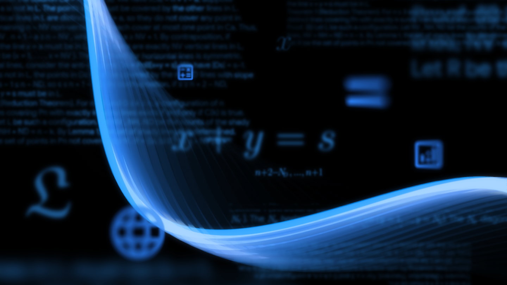

```{=html}
<div class="sesion-banner">
  <div>
    <span class="sesion-block-pill">Bloque 2 · Herramientas Prácticas</span>
  </div>
  <div class="sesion-progress-wrap">
    <div class="sesion-progress-bar">
      <div class="sesion-progress-fill sesion-progress-fill-10"></div>
    </div>
    <span class="sesion-progress-label">10 de 15</span>
  </div>
  <div class="sesion-meta">
    <span class="sesion-meta-chip">📅 7 de julio de 2026</span>
    <span class="sesion-meta-chip">⏱ 40 minutos</span>
    <a href="../syllabus.html">Ver programa completo →</a>
  </div>
</div>
```

```{=html}
<link rel="stylesheet" href="../styles/sessions/sesion-10.css">
```

## Video: IA para estudiar matemáticas

```{=html}
<div class="video-placeholder">
  <span class="vp-icon">▶</span>
  <p class="vp-title">Video: IA para estudiar matemáticas</p>
</div>
```

---

## Texto: IA para estudiar matemáticas

---

### Introducción

La discusión pública sobre la IA y las matemáticas casi siempre se va a los extremos: o dicen que la herramienta “resuelve cosas imposibles”, o que “ni siquiera puede hacer operaciones sencillas”. Y lo curioso es que las dos pueden ser verdad al mismo tiempo.

En enero de 2024, [AlphaGeometry](https://deepmind.google/blog/alphageometry-an-olympiad-level-ai-system-for-geometry/) resolvió **25 de 30** problemas de geometría de nivel olímpico. En julio de 2025, una versión avanzada de [Gemini Deep Think](https://deepmind.google/blog/advanced-version-of-gemini-with-deep-think-officially-achieves-gold-medal-standard-at-the-international-mathematical-olympiad/) alcanzó el nivel de medalla de oro en la Olimpiada Internacional de Matemáticas. Al mismo tiempo, investigaciones recientes muestran que los LLMs siguen teniendo fallas en aritmética, suma y manipulación simbólica cuando funcionan como asistentes de chat generales ([ACL 2023](https://aclanthology.org/2023.acl-long.516/), [EMNLP 2025](https://aclanthology.org/2025.emnlp-main.681/)).

Lo que esto revela es que "matemáticas" no es una sola habilidad. Un sistema de IA puede ser muy útil para **entender** conceptos, puede encontrar **demostraciones formales** en entornos especializados, y aun así cometer errores en un paso algebraico si lo usas como asistente de estudio cotidiano.

:::{.callout-important}
# La idea central de esta sesión
Para usar la IA como tutor en matemáticas, debemos abordar el tema desde tres enfoques distintos:

1. **Entender** un concepto o un procedimiento.
2. **Verificar** un resultado con una herramienta exacta.
3. **Practicar** hasta poder resolver sin ayuda.

El error más común es usar la misma herramienta para las tres cosas.
:::

---

### Dos noticias para arrancar

```{=html}
<div class="math-headlines">
  <article class="math-headline-card">
    <span class="math-headline-kicker">Enero de 2024</span>
    <h4>AlphaGeometry y la geometría olímpica</h4>
    <p>Google DeepMind publicó que AlphaGeometry resolvió 25 de 30 problemas de geometría de nivel olímpico, un desempeño cercano al de los mejores medallistas.</p>
    <p class="math-headline-source"><a href="https://deepmind.google/blog/alphageometry-an-olympiad-level-ai-system-for-geometry/">Fuente oficial</a></p>
    
  </article>
  <article class="math-headline-card">
    <span class="math-headline-kicker">Julio de 2025</span>
    <h4>Gemini Deep Think y la Olimpiada Internacional</h4>
    <p>DeepMind comunicó que una versión avanzada de Gemini alcanzó el nivel de medalla de oro en la Olimpiada Internacional de Matemáticas con 35 de 42 puntos.</p>
    <p class="math-headline-source"><a href="https://deepmind.google/blog/advanced-version-of-gemini-with-deep-think-officially-achieves-gold-medal-standard-at-the-international-mathematical-olympiad/">Fuente oficial</a></p>
    
  </article>
</div>
```

Estas noticias nos dejan en claro que: **hay distintos tipos de tareas matemáticas, y cada una pide una herramienta diferente**.

---

### Qué suele hacer bien un asistente de IA, y qué conviene verificar

```{=html}
<div class="math-split">
  <section class="math-split-card math-split-good">
    <span class="math-split-tag">Suele ayudar</span>
    <h4>Para entender</h4>
    <ul>
      <li>Explicar un procedimiento con palabras más sencillas.</li>
      <li>Dar un ejemplo resuelto y luego uno similar para practicar.</li>
      <li>Comparar métodos: factorización, fórmula general, completar el cuadrado.</li>
      <li>Relacionar una expresión algebraica con su gráfica y su descripción en palabras.</li>
      <li>Hacer preguntas para identificar en qué paso te atoraste.</li>
    </ul>
  </section>
  <section class="math-split-card math-split-risk">
    <span class="math-split-tag">Requiere verificación</span>
    <h4>Para obtener resultados exactos</h4>
    <ul>
      <li>Cálculo aritmético sin errores de signo o de orden.</li>
      <li>Manipulación simbólica extensa.</li>
      <li>Pasos intermedios en álgebra, integrales o derivadas.</li>
      <li>Demostraciones redactadas en lenguaje natural.</li>
      <li>Resultados finales que vas a entregar como correctos.</li>
    </ul>
  </section>
</div>
```

Las evaluaciones del desempeño de la IA en matemáticas apuntan en esa dirección. El artículo de [ACL 2023](https://aclanthology.org/2023.acl-long.516/) señala limitaciones importantes en aritmética y razonamiento simbólico. El estudio de [EMNLP 2025](https://aclanthology.org/2025.emnlp-main.681/) muestra que incluso tareas tan básicas como la suma siguen revelando fallas estructurales. Y una investigación en [PNAS 2024](https://pubmed.ncbi.nlm.nih.gov/38830100/) encontró que una conversación puede sentirse útil aunque la respuesta no sea completamente correcta.

---

### Taxonomía de herramientas y sus aplicaciones

```{=html}
<div class="math-tools-grid">
  <article class="math-tool-card">
    <span class="math-tool-icon">💬</span>
    <h4>ChatGPT, Gemini o Claude</h4>
    <p class="math-tool-best">Mejor para: explicación, pistas, comparación de métodos, preguntas de tutoría paso a paso.</p>
    <p class="math-tool-risk">Pueden cometer errores en pasos algebraicos; antes de entregar un resultado, verifica con una herramienta exacta.</p>
  </article>
  <article class="math-tool-card">
    <span class="math-tool-icon">🧮</span>
    <h4>Wolfram Alpha o Symbolab</h4>
    <p class="math-tool-best">Mejor para: verificar resultados, revisar pasos intermedios y confirmar si una manipulación algebraica cierra bien.</p>
    <p class="math-tool-risk">El procedimiento puede ser correcto aunque tú aún no lo entiendas; verifica que comprendes cada paso antes de seguir.</p>
  </article>
  <article class="math-tool-card">
    <span class="math-tool-icon">📈</span>
    <h4>Desmos</h4>
    <p class="math-tool-best">Mejor para: visualizar funciones, intersecciones, pendientes y el comportamiento general de una expresión.</p>
    <p class="math-tool-risk">Una gráfica ayuda a interpretar, pero no reemplaza la justificación matemática escrita.</p>
  </article>
  <article class="math-tool-card">
    <span class="math-tool-icon">📚</span>
    <h4>NotebookLM</h4>
    <p class="math-tool-best">Mejor para: estudiar un capítulo, ordenar tus apuntes, extraer definiciones y organizar preguntas de repaso.</p>
    <p class="math-tool-risk">Útil para entender y organizar conceptos; para cálculo exacto o verificar una derivada, usa otra herramienta.</p>
  </article>
</div>
```

---

### Tres estrategias de estudio

Antes de ver más ejemplos de instrucciones para la IA, vale la pena entender qué estrategias de estudio tienen respaldo en investigación educativa y cómo encajan con estas herramientas.

```{=html}
<div class="study-strategy-grid">
  <article class="study-strategy-card">
    <span class="study-strategy-num">1</span>
    <h4>Ejemplos resueltos + autoexplicación</h4>
    <p>Pide un ejemplo resuelto y luego explica con tus palabras por qué cada paso era necesario. La combinación mejora comprensión y transferencia.</p>
    <p class="study-strategy-use">Uso con IA: "Muéstrame un ejemplo de factorización. Luego hazme preguntas para que yo explique por qué funciona cada paso".</p>
    <p class="study-strategy-source"><a href="https://doi.org/10.1080/19345747.2023.2243254">Fuente</a></p>
  </article>
  <article class="study-strategy-card">
    <span class="study-strategy-num">2</span>
    <h4>Práctica de recuperación</h4>
    <p>Recordar un procedimiento sin ver la solución fortalece más que releer. Después comparas tu propuesta con una explicación o una herramienta exacta.</p>
    <p class="study-strategy-use">Uso con IA: "No me des la respuesta todavía. Hazme tres preguntas cortas para que recuerde el método de derivación".</p>
    <p class="study-strategy-source"><a href="https://link.springer.com/article/10.1007/s10763-025-10607-1">Fuente</a></p>
  </article>
  <article class="study-strategy-card">
    <span class="study-strategy-num">3</span>
    <h4>Práctica intercalada</h4>
    <p>Mezclar tipos de problema obliga a decidir qué método usar. En matemáticas eso suele ser más útil que repetir veinte veces el mismo formato.</p>
    <p class="study-strategy-use">Uso con IA: "Dame seis ejercicios mezclados: dos de factorización, dos de fórmula general y dos donde tenga que decidir cuál método conviene".</p>
    <p class="study-strategy-source"><a href="https://nces.ed.gov/use-work/awards/interleaved-mathematics-practice">Fuente</a></p>
  </article>
</div>
```

---

### Cuando la IA suena segura pero se equivoca

Así se ve una conversación con un asistente de IA al resolver $x^2 - 5x + 6 = 0$:

```{=html}
<div class="chat-window">
  <div class="chat-topbar">
    <div class="chat-dots"><span></span><span></span><span></span></div>
    <span class="chat-topbar-title">sanluisGPT</span>
  </div>

  <div class="chat-body">

    <!-- Turno 1: estudiante -->
    <div class="chat-msg chat-msg-user">
      <div class="chat-bubble chat-bubble-user">
        Necesito resolver x² − 5x + 6 = 0 para mi tarea de mañana. Explícame cada paso.
      </div>
    </div>

    <!-- Turno 2: IA (con error) -->
    <div class="chat-msg chat-msg-ai">
      <div class="chat-avatar">AI</div>
      <div class="chat-bubble chat-bubble-ai chat-bubble-error">
        <p>Para factorizar x² − 5x + 6 = 0, busco dos números que multiplicados den 6 y sumados den −5.</p>
        <p>Esos números son <strong>−2</strong> y <strong>3</strong>.</p>
        <p>La ecuación factorizada queda:</p>
        <p class="chat-math">(x − 2)(x + 3) = 0</p>
        <p>Las soluciones son <strong>x = 2</strong> y <strong>x = −3</strong>.</p>
      </div>
    </div>

    <!-- Turno 3: estudiante pide verificación -->
    <div class="chat-msg chat-msg-user">
      <div class="chat-bubble chat-bubble-user">
        Espera, ¿puedes verificar eso expandiendo la factorización?
      </div>
    </div>

    <!-- Turno 4: IA corrige -->
    <div class="chat-msg chat-msg-ai">
      <div class="chat-avatar">AI</div>
      <div class="chat-bubble chat-bubble-ai">
        <p>Si expando (x − 2)(x + 3) obtengo x² + x − 6, que no coincide con x² − 5x + 6. Cometí un error de signos.</p>
        <p>Los números correctos son <strong>−2</strong> y <strong>−3</strong>: (−2) × (−3) = 6 ✓ y (−2) + (−3) = −5 ✓.</p>
        <p>La factorización correcta es:</p>
        <p class="chat-math">(x − 2)(x − 3) = 0</p>
        <p>Las soluciones son <strong>x = 2</strong> y <strong>x = 3</strong>.</p>
      </div>
    </div>

  </div>

  <!-- Análisis -->
  <div class="chat-analysis">
    <span class="chat-analysis-tag">Qué pasó en esta conversación</span>
    <ul class="chat-analysis-list">
      <li>
        <span class="chat-analysis-icon">❌</span>
        <span>La primera respuesta sonaba ordenada y usaba lenguaje técnico correcto. Pero los números estaban mal: −2 × 3 = −6 (no 6) y −2 + 3 = 1 (no −5). Ninguna de las dos condiciones se cumplía.</span>
      </li>
      <li>
        <span class="chat-analysis-icon">✅</span>
        <span>El error se detectó con una pregunta sencilla: "¿puedes verificar expandiendo?" No hicieron falta conocimientos avanzados, solo pedir que se comprobara el resultado.</span>
      </li>
      <li>
        <span class="chat-analysis-icon">⚠️</span>
        <span>Sin esa pregunta, las soluciones incorrectas x = 2 y x = −3 habrían pasado como válidas. Una respuesta fluida no garantiza una respuesta correcta.</span>
      </li>
    </ul>

    <div class="chat-verify">
      <span class="chat-verify-tag">Cómo verificar cualquier factorización</span>
      <ul class="chat-verify-list">
        <li>Expande el resultado y compara con la ecuación original.</li>
        <li>Sustituye cada raíz en la ecuación original y verifica que el resultado sea cero.</li>
        <li>Escribe <code>solve x^2 - 5x + 6 = 0</code> en Wolfram Alpha o Symbolab.</li>
        <li>Grafica <code>y = x^2 - 5x + 6</code> en Desmos y observa dónde cruza el eje x.</li>
      </ul>
    </div>
  </div>
</div>
```

---

### Por qué los sistemas de olimpiada son distintos al asistente de estudio

AlphaGeometry o Gemini Deep Think operan en condiciones muy distintas a las del asistente de chat que abres para estudiar la noche antes de un examen. Trabajan en contextos acotados, con búsqueda más profunda, validación formal y arquitecturas especializadas para ese propósito.

Lo que debemos entender, entonces, es que cada herramienta de IA tiene condiciones en las que funciona bien y condiciones en las que falla; saber cuáles son esas condiciones define si estudias bien o si depositaste tu confianza en el lugar equivocado.

---

### Actividad: diagnostica una solución

Trabaja con un problema de tu curso o usa este:

$$f(x) = x^3 - 3x^2 - 9x + 5$$

La tarea es encontrar los **puntos críticos** de $f$ y determinar si cada uno es un máximo local, un mínimo local o ninguno de los dos.

Haz tres cosas y documenta el proceso:

1. Pide a un asistente de IA que encuentre $f'(x)$, iguale a cero y clasifique los puntos críticos usando el criterio de la segunda derivada. Copia la respuesta completa.
2. Repite el proceso tú a mano: calcula $f'(x)$, resuelve $f'(x) = 0$, calcula $f''(x)$ y aplica el criterio.
3. Verifica en Wolfram Alpha escribiendo `critical points of x^3 - 3x^2 - 9x + 5` y grafica en Desmos para confirmar visualmente dónde están los máximos y mínimos.

Lo que documentes no es solo la respuesta, sino lo que aprendiste sobre el proceso:

- ¿Qué herramienta te ayudó a entender el procedimiento?
- ¿Qué herramienta te ayudó a verificar el resultado?
- ¿Cambiaría tu estrategia si el problema viniera en un examen y no tuvieras acceso a estas herramientas?

---

### Cierre

:::{.callout-important}
# Si estudias matemáticas con IA, quédate con esto

1. **Usa asistentes de IA para entender**: pide explicaciones, ejemplos y comparaciones de métodos.
2. **Usa herramientas exactas para verificar** cualquier resultado numérico o simbólico antes de entregarlo.
3. **Usa gráficas para interpretar** lo que una expresión hace visualmente.
4. **Practica sin ayuda después**. Si siempre estudias acompañada o acompañado por la IA, nunca sabrás si ya puedes resolver sola o solo.
:::

---

### Recursos

**Casos y contexto**

- [AlphaGeometry, Google DeepMind, 17 de enero de 2024](https://deepmind.google/blog/alphageometry-an-olympiad-level-ai-system-for-geometry/)
- [Gemini Deep Think en la IMO, Google DeepMind, 21 de julio de 2025](https://deepmind.google/blog/advanced-version-of-gemini-with-deep-think-officially-achieves-gold-medal-standard-at-the-international-mathematical-olympiad/)
- [Limitations of Language Models in Arithmetic and Symbolic Induction, ACL 2023](https://aclanthology.org/2023.acl-long.516/)
- [Do Large Language Models Truly Grasp Addition?, EMNLP 2025](https://aclanthology.org/2025.emnlp-main.681/)
- [Evaluating language models for mathematics through interactions, PNAS 2024](https://pubmed.ncbi.nlm.nih.gov/38830100/)

**Herramientas**

- [ChatGPT](https://chatgpt.com/)
- [Gemini](https://gemini.google.com/)
- [Wolfram Alpha](https://www.wolframalpha.com/)
- [Symbolab](https://www.symbolab.com/)
- [Desmos](https://www.desmos.com/)
- [NotebookLM](https://notebooklm.google/)

**Estrategias de estudio**

- [Ejemplos resueltos y autoexplicación, 2024](https://doi.org/10.1080/19345747.2023.2243254)
- [Práctica intercalada en matemáticas, IES](https://nces.ed.gov/use-work/awards/interleaved-mathematics-practice)
- [Práctica de recuperación en matemáticas superiores, 2025](https://link.springer.com/article/10.1007/s10763-025-10607-1)

---

```{=html}
<nav class="sesion-nav">
  <a href="sesion-09.html" class="sesion-nav-btn prev">
    <span class="nav-label">← Anterior</span>
    <span class="nav-title">S9: IA para Organización</span>
  </a>
  <div class="sesion-nav-center">
    <span class="sesion-nav-progress">Sesión 10 de 15</span>
  </div>
  <a href="sesion-11.html" class="sesion-nav-btn next">
    <span class="nav-label">Siguiente →</span>
    <span class="nav-title">S11: EN VIVO: Educación Global</span>
  </a>
</nav>
```
