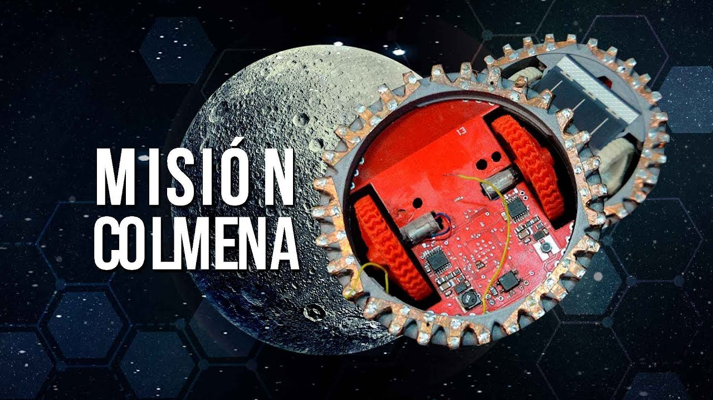

```{=html}
<div class="sesion-banner">
  <div>
    <span class="sesion-block-pill">Bloque 3 · Creación, Aplicaciones y Futuro</span>
  </div>
  <div class="sesion-progress-wrap">
    <div class="sesion-progress-bar">
      <div class="sesion-progress-fill sesion-progress-fill-13"></div>
    </div>
    <span class="sesion-progress-label">13 de 15</span>
  </div>
  <div class="sesion-meta">
    <span class="sesion-meta-chip"><svg aria-hidden="true" width="13" height="13" viewBox="0 0 24 24" fill="none" stroke="currentColor" stroke-width="2" stroke-linecap="round" stroke-linejoin="round"><rect x="3" y="4" width="18" height="18" rx="2" ry="2"/><line x1="16" y1="2" x2="16" y2="6"/><line x1="8" y1="2" x2="8" y2="6"/><line x1="3" y1="10" x2="21" y2="10"/></svg> 28 de julio de 2026</span>
    <span class="sesion-meta-chip"><svg aria-hidden="true" width="13" height="13" viewBox="0 0 24 24" fill="none" stroke="currentColor" stroke-width="2" stroke-linecap="round" stroke-linejoin="round"><circle cx="12" cy="12" r="10"/><polyline points="12 6 12 12 16 14"/></svg> 40 minutos</span>
    <a href="../syllabus.html">Ver programa completo →</a>
  </div>
</div>
```

```{=html}
<link rel="stylesheet" href="../styles/sessions/sesion-13.css">
<script type="module" src="../interactives/sesion-13.js"></script>
```

## Robótica e IA en el mundo físico

```{=html}
<div class="video-capsule">
  <iframe src="https://share.descript.com/embed/eYO5CQ9vXt2" width="640" height="360" frameborder="0" allowfullscreen></iframe>
</div>
```

---


<p class="capsule-complement-note">Los videos y el texto de esta sesión son complementarios. Los videos amplían el contexto histórico y conceptual; el texto va a los mecanismos y te pone a interactuar con ellos. Encontrarás ideas en los videos que el texto no repite exactamente. ¡Disfruta de esta dinámica!</p>

### Introducción

```{=html}
<figure class="intro-video-figure">
  <div class="intro-video-frame">
    <video class="intro-video" autoplay loop muted playsinline aria-label="Animación de un robot de inspección moviéndose en una zona de alto riesgo">
      <source src="../assets/sesion-13/intro-robot.mp4" type="video/mp4">
    </video>
  </div>
  <figcaption class="intro-video-caption">Robot de inspección en una zona de alto riesgo.</figcaption>
</figure>
```

El 11 de marzo de 2011, un terremoto de magnitud 9.0 y el tsunami que le siguió averiaron los reactores de la planta nuclear Fukushima Daiichi, en Japón. En cuestión de horas, los niveles de radiación hicieron imposible que cualquier persona entrara a ciertas zonas. Las autoridades desplegaron robots PackBot de iRobot, diseñados originalmente para misiones militares del ejército de Estados Unidos, en los edificios de los reactores 1, 2 y 3. Transmitieron video en vivo, midieron temperaturas, detectaron escombros y registraron niveles de radiación: tareas que habrían resultado letales para un ser humano en cuestión de minutos.

Este ejemplo es importante por una razón muy concreta: nos obliga a separar dos cosas que suelen mezclarse. Una cosa es **tener una máquina con ruedas, cámaras y motores**. Otra cosa es lograr que esa máquina **interprete lo que ve, tome decisiones y logre un objetivo fijo**.

Esa misión de 2011 nos da el contexto que necesitamos para hacernos una pregunta más precisa:

En robótica, **¿qué parte se resuelve con hardware y reglas fijas, y qué parte necesita IA para percibir, decidir o aprender?**

---

### Construyendo un robot

Antes de hablar de IA conviene armar la imagen básica de un robot. Si lo simplificamos mucho, un robot necesita tres piezas conectadas:

```{=html}
<div class="robot-anatomy" aria-label="Tres piezas básicas de un robot">
  <div class="robot-part-card">
    <span class="robot-part-num">01</span>
    <span class="robot-part-icon">📡</span>
    <h4>Sensores</h4>
    <p>Miden lo que pasa alrededor: luz, distancia, posición, sonido o movimiento.</p>
    <span class="robot-part-role">Entrada de datos</span>
  </div>
  <div class="robot-anatomy-arrow" aria-hidden="true">→</div>
  <div class="robot-part-card robot-part-card-core">
    <span class="robot-part-num">02</span>
    <span class="robot-part-icon">🧠</span>
    <h4>Controlador</h4>
    <p>Interpreta datos, elige una acción y corrige con nueva información.</p>
    <span class="robot-part-role">Decisión</span>
  </div>
  <div class="robot-anatomy-arrow" aria-hidden="true">→</div>
  <div class="robot-part-card">
    <span class="robot-part-num">03</span>
    <span class="robot-part-icon">⚙️</span>
    <h4>Actuadores</h4>
    <p>Convierten la decisión en movimiento: girar, empujar, levantar o frenar.</p>
    <span class="robot-part-role">Acción física</span>
  </div>
</div>
```

Además, es importante recalcar que **no todo robot usa IA** y **no toda IA está dentro de un robot**. Un brazo industrial puede repetir el mismo movimiento sin aprender nada. En cambio, un dron que debe evitar obstáculos en un entorno cambiante sí puede necesitar de la IA.

#### **Los músculos del robot**

Los **actuadores** son la parte que convierte una orden en movimiento físico. Si quieres una analogía simple, son los músculos del robot.

```{=html}
<div class="actuator-grid">
  <div class="actuator-card">
    <span class="actuator-icon">↻</span>
    <h4>Motor DC</h4>
    <p>Giro continuo</p>
    <span>Ruedas, hélices y ventiladores</span>
  </div>
  <div class="actuator-card">
    <span class="actuator-icon">◔</span>
    <h4>Servomotor</h4>
    <p>Ángulo preciso</p>
    <span>Brazos robóticos y pinzas</span>
  </div>
  <div class="actuator-card">
    <span class="actuator-icon">▦</span>
    <h4>Motor paso a paso</h4>
    <p>Incrementos exactos</p>
    <span>Impresoras 3D y fabricación</span>
  </div>
  <div class="actuator-card">
    <span class="actuator-icon">⇅</span>
    <h4>Actuador hidráulico</h4>
    <p>Mucha fuerza</p>
    <span>Maquinaria pesada e industria</span>
  </div>
</div>
```

```{=html}
<figure class="actuator-photo-card">
  <div class="actuator-photo-frame">
    
  </div>
  <br>
  <figcaption>
    <strong>Actuador rotativo:</strong> en un robot, muchas articulaciones esconden piezas como esta. Reciben una señal del controlador y la convierten en giro, fuerza o posición.
    <br><a href="https://es.xrobotek.com/news/medical-robotics-actuator-trends.html" target="_blank" rel="noopener">Fuente: Xrobotek/Xmotion</a>
  </figcaption>
</figure>
```

La idea clave aquí es muy simple: los actuadores **ejecutan**, pero no **deciden**. Un motor puede mover una rueda, pero no sabe por sí mismo cuándo frenar, a dónde girar o qué camino conviene.

#### **Los sentidos del robot**

Los **sensores** recogen información del mundo físico. Si los actuadores son los músculos, los sensores son los sentidos.

Y aquí está la parte interesante: **los sensores recuperan datos, y esos datos alimentan el "cerebro" del robot**. Aunque todavía no hay inteligencia ahí. Una cámara solo entrega píxeles; un LiDAR solo entrega distancias. Pero sin esos datos, el robot no tendría con qué interpretar el entorno ni con qué tomar decisiones.

No hace falta memorizar veinte tipos de sensores. Para esta sesión basta con cuatro:

```{=html}
<div class="sensor-grid">

  <div class="sensor-card">
    <span class="sensor-icon">📷</span>
    <h4 class="sensor-name">Cámara</h4>
    <p class="sensor-what">Detecta color, forma, texto y movimiento. Es el sensor más parecido al ojo humano.</p>
    <p class="sensor-limit">Necesita luz · se confunde con reflejos · es lenta con objetos muy rápidos</p>
    <p class="sensor-use">Visión por computadora, lectura de señales y etiquetas</p>
  </div>

  <div class="sensor-card">
    <span class="sensor-icon">🟢</span>
    <h4 class="sensor-name">LiDAR</h4>
    <p class="sensor-what">Emite pulsos de láser y mide cuánto tardan en regresar. Da distancias precisas en 360°.</p>
    <p class="sensor-limit">Costoso · no detecta color · la lluvia o niebla lo degradan</p>
    <p class="sensor-use">Vehículos autónomos, mapeo de espacios interiores</p>
  </div>

  <div class="sensor-card">
    <span class="sensor-icon">📡</span>
    <h4 class="sensor-name">Ultrasonido</h4>
    <p class="sensor-what">Emite ondas de sonido y mide el rebote para detectar la distancia a un obstáculo.</p>
    <p class="sensor-limit">Rango corto · no da dirección exacta · se confunde con superficies blandas</p>
    <p class="sensor-use">Sensores de reversa en autos, robots domésticos básicos</p>
  </div>

  <div class="sensor-card">
    <span class="sensor-icon">🛰</span>
    <h4 class="sensor-name">GPS</h4>
    <p class="sensor-what">Calcula la posición geográfica usando señales de satélites en órbita.</p>
    <p class="sensor-limit">Solo funciona al aire libre · error de ± 2-5 metros</p>
    <p class="sensor-use">Drones de agricultura, vehículos autónomos en exteriores</p>
  </div>

</div>
```

Ningún sensor es perfecto: todos generan ruido, tienen errores de calibración y fallan bajo ciertas condiciones. Por eso los sistemas modernos suelen combinar varios sensores al mismo tiempo.

**Cada sensor ve una parte distinta del mundo**. La cámara reconoce mejor qué hay; el LiDAR mide mejor dónde está.

:::{.center}
```{=html}
<div class="sensor-visual">

  <div class="sensor-visual-panel">
    <span class="sensor-visual-label">Cámara</span>
    <svg viewBox="0 0 140 140" width="140" height="140" xmlns="http://www.w3.org/2000/svg">
      <rect width="140" height="140" rx="10" fill="#eff6ff" stroke="#93c5fd" stroke-width="1.5"/>
      <!-- camera body -->
      <rect x="53" y="16" width="34" height="24" rx="5" fill="#1d4ed8"/>
      <circle cx="70" cy="28" r="9" fill="#bfdbfe" stroke="#1d4ed8" stroke-width="2"/>
      <circle cx="70" cy="28" r="4" fill="#1d4ed8"/>
      <!-- FOV cone -->
      <polygon points="70,40 15,125 125,125" fill="#3b82f6" opacity="0.14"/>
      <line x1="70" y1="40" x2="15" y2="125" stroke="#3b82f6" stroke-width="1.5" stroke-dasharray="5,3"/>
      <line x1="70" y1="40" x2="125" y2="125" stroke="#3b82f6" stroke-width="1.5" stroke-dasharray="5,3"/>
      <!-- labels inside -->
      <text x="70" y="80" text-anchor="middle" font-size="9" fill="#1d4ed8" font-weight="600">ve colores,</text>
      <text x="70" y="93" text-anchor="middle" font-size="9" fill="#1d4ed8" font-weight="600">formas, texto</text>
      <!-- blind zone labels -->
      <text x="8"  y="75" font-size="8" fill="#94a3b8">zona</text>
      <text x="8"  y="84" font-size="8" fill="#94a3b8">ciega</text>
      <text x="103" y="75" font-size="8" fill="#94a3b8">zona</text>
      <text x="103" y="84" font-size="8" fill="#94a3b8">ciega</text>
      <text x="70" y="136" text-anchor="middle" font-size="8" fill="#94a3b8">campo visual frontal</text>
    </svg>
    <span class="sensor-visual-caption">Ve bien hacia adelante, pero tiene ángulos ciegos</span>
  </div>

  <div class="sensor-visual-panel">
    <span class="sensor-visual-label">LiDAR</span>
    <svg viewBox="0 0 140 140" width="140" height="140" xmlns="http://www.w3.org/2000/svg">
      <rect width="140" height="140" rx="10" fill="#f0fdf4" stroke="#86efac" stroke-width="1.5"/>
      <!-- coverage circle -->
      <circle cx="70" cy="70" r="56" fill="none" stroke="#22c55e" stroke-width="1" stroke-dasharray="3,3" opacity="0.5"/>
      <!-- 12 rays at 30° intervals (radius=56, center=70,70) -->
      <line x1="70" y1="70" x2="70"  y2="14"  stroke="#22c55e" stroke-width="1.3" opacity="0.75"/>
      <line x1="70" y1="70" x2="98"  y2="21"  stroke="#22c55e" stroke-width="1.3" opacity="0.75"/>
      <line x1="70" y1="70" x2="119" y2="42"  stroke="#22c55e" stroke-width="1.3" opacity="0.75"/>
      <line x1="70" y1="70" x2="126" y2="70"  stroke="#22c55e" stroke-width="1.3" opacity="0.75"/>
      <line x1="70" y1="70" x2="119" y2="98"  stroke="#22c55e" stroke-width="1.3" opacity="0.75"/>
      <line x1="70" y1="70" x2="98"  y2="119" stroke="#22c55e" stroke-width="1.3" opacity="0.75"/>
      <line x1="70" y1="70" x2="70"  y2="126" stroke="#22c55e" stroke-width="1.3" opacity="0.75"/>
      <line x1="70" y1="70" x2="42"  y2="119" stroke="#22c55e" stroke-width="1.3" opacity="0.75"/>
      <line x1="70" y1="70" x2="21"  y2="98"  stroke="#22c55e" stroke-width="1.3" opacity="0.75"/>
      <line x1="70" y1="70" x2="14"  y2="70"  stroke="#22c55e" stroke-width="1.3" opacity="0.75"/>
      <line x1="70" y1="70" x2="21"  y2="42"  stroke="#22c55e" stroke-width="1.3" opacity="0.75"/>
      <line x1="70" y1="70" x2="42"  y2="21"  stroke="#22c55e" stroke-width="1.3" opacity="0.75"/>
      <!-- endpoint dots -->
      <circle cx="70"  cy="14"  r="3" fill="#16a34a" opacity="0.8"/>
      <circle cx="126" cy="70"  r="3" fill="#16a34a" opacity="0.8"/>
      <circle cx="70"  cy="126" r="3" fill="#16a34a" opacity="0.8"/>
      <circle cx="14"  cy="70"  r="3" fill="#16a34a" opacity="0.8"/>
      <!-- robot center -->
      <circle cx="70" cy="70" r="13" fill="#22c55e" opacity="0.15"/>
      <circle cx="70" cy="70" r="8"  fill="#16a34a"/>
      <text x="70" y="74" text-anchor="middle" font-size="8" fill="white" font-weight="bold">R</text>
      <text x="70" y="136" text-anchor="middle" font-size="8" fill="#94a3b8">cobertura 360°</text>
    </svg>
    <span class="sensor-visual-caption">Detecta distancias en todas las direcciones</span>
  </div>

</div>
```
:::

#### **El controlador del robot**

El **controlador** es la parte que conecta sensores y actuadores. Recibe datos, calcula qué está pasando y manda una instrucción: avanzar, frenar, girar, esperar o cambiar de ruta.

Para entenderlo sin meternos en electrónica, piensa en este mini ciclo:

```{=html}
<div class="controller-visual" aria-label="Diagrama del controlador del robot">
  <div class="controller-board">
    <svg viewBox="0 0 420 232" role="img" aria-label="Sensores entran al controlador, el controlador manda acciones a actuadores y recibe retroalimentación">
      <rect x="10" y="14" width="400" height="204" rx="16" fill="#ffffff" stroke="#e2e8f0" stroke-width="2"/>
      <g class="controller-svg-muted">
        <circle cx="48" cy="62" r="8"/>
        <circle cx="48" cy="104" r="8"/>
        <circle cx="48" cy="146" r="8"/>
        <text x="48" y="180" text-anchor="middle">sensores</text>
      </g>
      <g>
        <rect x="155" y="56" width="110" height="92" rx="14" fill="#eff6ff" stroke="#6495ED" stroke-width="2"/>
        <text x="210" y="93" text-anchor="middle" fill="#1f2937" font-weight="700" font-size="13">Controlador</text>
        <text x="210" y="116" text-anchor="middle" fill="#64748b" font-size="10">estado → acción</text>
        <line x1="145" y1="72" x2="155" y2="72" stroke="#6495ED" stroke-width="2"/>
        <line x1="145" y1="92" x2="155" y2="92" stroke="#6495ED" stroke-width="2"/>
        <line x1="145" y1="112" x2="155" y2="112" stroke="#6495ED" stroke-width="2"/>
        <line x1="145" y1="132" x2="155" y2="132" stroke="#6495ED" stroke-width="2"/>
        <line x1="265" y1="72" x2="275" y2="72" stroke="#6495ED" stroke-width="2"/>
        <line x1="265" y1="92" x2="275" y2="92" stroke="#6495ED" stroke-width="2"/>
        <line x1="265" y1="112" x2="275" y2="112" stroke="#6495ED" stroke-width="2"/>
        <line x1="265" y1="132" x2="275" y2="132" stroke="#6495ED" stroke-width="2"/>
      </g>
      <g class="controller-svg-muted">
        <circle cx="372" cy="62" r="8"/>
        <circle cx="372" cy="104" r="8"/>
        <circle cx="372" cy="146" r="8"/>
        <text x="372" y="180" text-anchor="middle">actuadores</text>
      </g>
      <g fill="none" stroke="#6495ED" stroke-width="2.2" stroke-linecap="round" stroke-linejoin="round">
        <path d="M60 62 C95 62 112 74 145 84"/>
        <path d="M60 104 C95 104 112 104 145 104"/>
        <path d="M60 146 C95 146 112 134 145 124"/>
        <path d="M275 84 C312 72 334 62 360 62"/>
        <path d="M275 104 C314 104 334 104 360 104"/>
        <path d="M275 124 C312 136 334 146 360 146"/>
        <path d="M342 166 C272 192 148 192 78 166" stroke-dasharray="5 5"/>
      </g>
      <text x="210" y="211" text-anchor="middle" fill="#6495ED" font-size="10" font-weight="700">retroalimentación: vuelve a medir después de actuar</text>
    </svg>
  </div>
  <div class="controller-flow">
    <div class="controller-node">
      <span class="controller-node-label">Estado</span>
      <p>Lo que el robot cree que está pasando ahora.</p>
    </div>
    <div class="controller-node">
      <span class="controller-node-label">Acción</span>
      <p>Lo que el robot decide hacer después.</p>
    </div>
    <div class="controller-node">
      <span class="controller-node-label">Retroalimentación</span>
      <p>Después de actuar, vuelve a medir y corrige.</p>
    </div>
  </div>
</div>
```

Ese controlador puede ser una regla fija, un modelo de IA o una mezcla de ambos. Aquí es donde suele aparecer la parte más interesante de la robótica moderna.

[**En resumen:**]{style="color:#6495ED;"}
Los sensores no entienden el mundo; solo lo registran como datos. Los actuadores tampoco deciden; solo ejecutan movimiento. La IA entra en juego cuando el controlador usa esos datos para tomar decisiones: distinguir a una persona de una sombra, reconocer un obstáculo o elegir una ruta segura.

---

### Cómo pasa un robot de observar el mundo a la acción

Ya tenemos el cuerpo básico: sensores para recoger datos, un controlador para decidir y actuadores para moverse. Ahora falta verlo como un ciclo: **¿cómo pasa el robot de medir el mundo a actuar sobre él, y luego corregirse con nueva información?**

Simplificando el proceso, un robot repite este ciclo una y otra vez:

<!--
```{=html}
<div class="loop-diagram">

  <div class="loop-step loop-step-perceive">
    <span class="loop-step-icon">👁</span>
    <span class="loop-step-num">Paso 1</span>
    <h4 class="loop-step-title">Percibir</h4>
    <p class="loop-step-example">Cámaras, GPS, LiDAR, micrófonos o sensores de distancia convierten el mundo físico en datos.</p>
  </div>

  <div class="loop-step loop-step-process">
    <span class="loop-step-icon">🧠</span>
    <span class="loop-step-num">Paso 2</span>
    <h4 class="loop-step-title">Interpretar</h4>
    <p class="loop-step-example">El controlador convierte datos crudos en algo útil: detecta objetos, calcula posiciones, reconoce patrones o estima riesgos. Aquí suele entrar la IA.</p>
  </div>

  <div class="loop-step loop-step-decide">
    <span class="loop-step-icon">⚡</span>
    <span class="loop-step-num">Paso 3</span>
    <h4 class="loop-step-title">Decidir</h4>
    <p class="loop-step-example">El controlador elige una acción posible: frenar, girar, subir, bajar, esperar, cambiar de ruta. Aquí también puede entrar la IA.</p>
  </div>

  <div class="loop-step loop-step-act">
    <span class="loop-step-icon">⚙️</span>
    <span class="loop-step-num">Paso 4</span>
    <h4 class="loop-step-title">Actuar</h4>
    <p class="loop-step-example">Motores, ruedas, hélices o brazos convierten la decisión en movimiento. Después, el robot vuelve a percibir.</p>
  </div>

</div>
```
-->

```{=html}
<video autoplay loop muted playsinline
  style="width:100%; border-radius:12px; margin:1.2rem 0; box-shadow:0 2px 14px rgba(0,0,0,0.07);">
  <source src="../assets/sesion-13/robot-phases.mp4" type="video/mp4">
</video>
```

Si falla en uno de estos pasos, el robot puede equivocarse aunque los demás pasos funcionen bien. Por eso no basta con preguntarnos: "¿el robot usa IA?". Hay que preguntar **en qué parte del ciclo entra la IA**.

La respuesta corta es esta:

- En **percibir**, la IA puede ayudar a interpretar datos crudos: reconocer personas, objetos, señales o peligros.
- En **decidir**, la IA puede ayudar a elegir entre varias acciones posibles cuando el entorno cambia.
- En **aprender**, la IA puede mejorar el comportamiento del robot con datos, simulaciones o experiencia acumulada.

En situaciones simples, interpretar y decidir se puede resolver con reglas fijas. Pero cuando la tarea es ambigua o cambiante, esas dos partes del ciclo son justo donde la IA puede hacer la diferencia.

---

### Actividad breve: tú eres el controlador

Aquí tienes un robot en un mapa de 6×6. Tu tarea es guiarlo del inicio (🤖, esquina superior izquierda) hasta la meta (⭐, esquina inferior derecha), evitando los obstáculos con pero batería limitada.

Mientras lo controlas, observa el panel de sensores: cada lectura muestra cuántos pasos libres hay en esa dirección antes de un obstáculo o el borde del mapa. **0 significa obstruido** — igual a como un sensor que detecta una pared a cero distancia.

```{=html}
<div class="robot-sim" id="robot-sim">

  <div class="sim-header">
    <div class="sim-status" id="sim-status">Usa los botones para guiar al robot 🤖 hasta la meta ⭐</div>
    <div class="sim-stats">
      <div class="sim-battery-wrap">
        <span class="sim-stat-label">Batería</span>
        <div class="sim-battery-row">
          <div class="sim-battery-bar">
            <div class="sim-battery-fill" id="sim-battery-fill" style="width:100%"></div>
          </div>
          <span class="sim-battery-pct" id="sim-battery-pct">100%</span>
        </div>
      </div>
      <div class="sim-moves-wrap">
        <span class="sim-stat-label">Pasos</span>
        <span class="sim-moves-count" id="sim-moves-count">0</span>
      </div>
    </div>
  </div>

  <div class="sim-body">

    <div class="sim-grid-wrap">
      <div class="sim-grid" id="sim-grid"></div>
    </div>

    <div class="sim-side">

      <div class="sim-sensors">
        <div class="sim-sensors-title">📡 Sensor de distancia</div>
        <div class="sim-sensor-row">
          <span class="sim-sensor-dir">Norte</span>
          <div class="sim-sensor-bar-wrap"><div class="sim-sensor-bar" id="sim-s-n" style="width:0%"></div></div>
          <span class="sim-sensor-val" id="sim-v-n">—</span>
        </div>
        <div class="sim-sensor-row">
          <span class="sim-sensor-dir">Sur</span>
          <div class="sim-sensor-bar-wrap"><div class="sim-sensor-bar" id="sim-s-s" style="width:0%"></div></div>
          <span class="sim-sensor-val" id="sim-v-s">—</span>
        </div>
        <div class="sim-sensor-row">
          <span class="sim-sensor-dir">Este</span>
          <div class="sim-sensor-bar-wrap"><div class="sim-sensor-bar" id="sim-s-e" style="width:0%"></div></div>
          <span class="sim-sensor-val" id="sim-v-e">—</span>
        </div>
        <div class="sim-sensor-row">
          <span class="sim-sensor-dir">Oeste</span>
          <div class="sim-sensor-bar-wrap"><div class="sim-sensor-bar" id="sim-s-o" style="width:0%"></div></div>
          <span class="sim-sensor-val" id="sim-v-o">—</span>
        </div>
      </div>

      <div class="sim-controls">
        <div class="sim-controls-title">🎮 Control</div>
        <div class="sim-dpad">
          <button class="sim-btn" id="sim-up">↑</button>
          <div class="sim-dpad-mid">
            <button class="sim-btn" id="sim-left">←</button>
            <div class="sim-dpad-center"></div>
            <button class="sim-btn" id="sim-right">→</button>
          </div>
          <button class="sim-btn" id="sim-down">↓</button>
        </div>
        <button class="sim-btn sim-btn-reset" id="sim-reset">↺ Reiniciar</button>
      </div>

    </div>
  </div>

  <div class="sim-legend">
    <div class="sim-legend-item"><div class="sim-legend-dot sim-legend-dot-robot"></div>Tú (🤖)</div>
    <div class="sim-legend-item"><div class="sim-legend-dot sim-legend-dot-goal"></div>Meta (⭐)</div>
    <div class="sim-legend-item"><div class="sim-legend-dot sim-legend-dot-obstacle"></div>Obstáculo</div>
    <div class="sim-legend-item"><div class="sim-legend-dot sim-legend-dot-free"></div>Espacio libre</div>
  </div>

</div>
```

En este mapa, donde cada movimiento consume un 12% de batería, la ruta óptima se siente sencilla. En el mundo físico toda la información llega al mismo tiempo, con ruido. Ese es el desafío central de la robótica, **decidir con información imperfecta, en tiempo real, cuando los errores tienen consecuencias físicas**. Y aquí está el puente con la IA: mientras tú juegas, tú eres el controlador. Lees el entorno, interpretas las señales y eliges el siguiente paso. Pero, **¿cómo haríamos para que el robot hiciera eso solo?**

Hay tres caminos posibles:

- escribir reglas a mano para cada situación,
- usar modelos de IA para interpretar sensores o elegir acciones,
- combinar ambas cosas.

Esa combinación es, en la práctica, gran parte de la robótica moderna.

<!--
#### **Reglas fijas vs. modelo de IA**
Imagina el simulador de esta página

- **Regla fija:** "si hay un obstáculo al frente, gira a la derecha". Funciona bien en mapas simples, pero en situaciones más complejas se puede quedar atorado o tomar rutas innecesariamente largas.</li>

- **Modelo de IA:** aprende, a partir de muchos intentos o ejemplos, qué movimiento aumenta la probabilidad de llegar a la meta con menos choques, menos pasos o menos gasto de batería.

La diferencia es que la **regla fija** depende de instrucciones escritas a mano, mientras que el **modelo de IA** ajusta su comportamiento a partir de datos o experiencia acumulada.
-->
---

### De control remoto a autonomía

No todas las máquinas inteligentes tienen el mismo nivel de autonomía. En este contexto, **autonomía** significa qué tanto puede completar una tarea sin que una persona le diga cada paso: avanzar, detenerse, girar, corregir la ruta o pedir ayuda.

Eso no es exactamente lo mismo que usar IA. Un robot puede ser bastante autónomo si trabaja en un entorno muy controlado y sigue reglas simples. También puede pasar lo contrario: un robot puede usar modelos de IA para reconocer objetos, pero seguir dependiendo de una persona para autorizar cada movimiento importante. Por eso **más autonomía no siempre significa más IA**.

La escala a continuación es una adaptación didáctica de los niveles de autonomía propuestos para vehículos. Aquí no la usamos para clasificar autos, sino como un mapa para comparar robots de distintos tipos y preguntarnos quién decide en cada caso: la persona, una regla fija, un modelo de IA o una combinación de los tres.


```{=html}
<div class="autonomy-diagram">
  <div class="autonomy-scale">
    <div class="autonomy-step autonomy-step-0">
      <span class="autonomy-badge autonomy-badge-0">0</span>
      <h4 class="autonomy-step-title">Manual o teleoperado</h4>
      <p class="autonomy-step-body">La persona toma todas las decisiones importantes y controla el movimiento.</p>
      <p class="autonomy-step-example">Ejemplo: dron pilotado a mano o robot manejado a control remoto.</p>
    </div>

    <div class="autonomy-step autonomy-step-1">
      <span class="autonomy-badge autonomy-badge-1">1</span>
      <h4 class="autonomy-step-title">Asistencia puntual</h4>
      <p class="autonomy-step-body">El sistema ayuda con una tarea específica, pero no lleva la misión completa.</p>
      <p class="autonomy-step-example">Ejemplo: estabilización automática o frenado ante choque inminente.</p>
    </div>

    <div class="autonomy-step autonomy-step-2">
      <span class="autonomy-badge autonomy-badge-2">2</span>
      <h4 class="autonomy-step-title">Automatización parcial</h4>
      <p class="autonomy-step-body">Puede ejecutar varias acciones seguidas, pero necesita vigilancia humana constante.</p>
      <p class="autonomy-step-example">Ejemplo: robot móvil que sigue una ruta conocida con supervisión cercana.</p>
    </div>

    <div class="autonomy-step autonomy-step-3">
      <span class="autonomy-badge autonomy-badge-3">3</span>
      <h4 class="autonomy-step-title">Autonomía condicionada</h4>
      <p class="autonomy-step-body">Opera solo por momentos en contextos previstos, pero espera intervención humana si aparece algo fuera de lo normal.</p>
      <p class="autonomy-step-example">Ejemplo: robot de almacén que trabaja solo mientras el entorno siga dentro de ciertos límites.</p>
      <span class="autonomy-ai-badge">IA: empieza a ser necesaria</span>
    </div>

    <div class="autonomy-step autonomy-step-4">
      <span class="autonomy-badge autonomy-badge-4">4</span>
      <h4 class="autonomy-step-title">Alta autonomía delimitada</h4>
      <p class="autonomy-step-body">Cumple una misión completa por sí mismo, pero solo en zonas, rutas o escenarios muy definidos.</p>
      <p class="autonomy-step-example">Ejemplo: dron de entrega o robot de inspección en un entorno controlado.</p>
      <span class="autonomy-ai-badge autonomy-ai-badge-high">IA: muy importante</span>
    </div>

    <div class="autonomy-step autonomy-step-5">
      <span class="autonomy-badge autonomy-badge-5">5</span>
      <h4 class="autonomy-step-title">Autonomía general</h4>
      <p class="autonomy-step-body">Podría operar solo en casi cualquier entorno, sin depender de límites predefinidos.</p>
      <p class="autonomy-step-example">Ejemplo: este nivel todavía no existe actualmente.</p>
      <span class="autonomy-ai-badge autonomy-ai-badge-high">IA: imprescindible (en teoría)</span>
    </div>
  </div>
</div>
```

<p class="autonomy-source">Adaptado de SAE J3016, originalmente propuesta para vehículos, aquí reformulada para pensar en aplicaciones para robótica en general.</p>

<!--
#### **Antes de seguir: un momento para reflexionar**
**¿Cuál de estos dos robots usa más IA?**

```{=html}
<div class="autonomy-question-cards">
  <div class="autonomy-question-card">
    <span class="autonomy-question-icon">🤖</span>
    <strong>Aspiradora robot básica</strong>
    <p>Puede limpiar sin que la manejes: detecta choques, cambia de dirección y sigue patrones simples durante la misión.</p>
  </div>
  <div class="autonomy-question-card">
    <span class="autonomy-question-icon">🦾</span>
    <strong>Brazo robótico de almacén</strong>
    <p>Usa visión por computadora para reconocer cajas de formas y tamaños distintos. Un humano supervisa la misión completa.</p>
  </div>
</div>
```
-->

---

### Robots con IA: ¿qué problemas resuelven?

Ya vimos que autonomía e IA no son lo mismo. Ahora conviene mirar para qué sirve esa diferencia en la práctica: **¿qué tipo de problema requiere que un robot perciba, decida y actúe en el mundo físico?**

El uso de la IA tiene sentido cuando el robot se enfrenta a condiciones difíciles de controlar: un lugar peligroso, un camino que cambia, objetos que no siempre se ven igual o una tarea que no se puede dirigir paso a paso desde una consola. En esos casos, reconocer patrones, ajustar una ruta o coordinar varias acciones puede hacer que el robot deje solo de moverse y empiece a resolver algún problema para el cual un humano no está calificado.

Los tres casos que siguen muestran esa idea desde distintos ángulos: primero aparece un problema complicado para una persona; después, una máquina con sensores y movimiento; finalmente, una parte donde la IA ayuda a convertir datos del mundo físico en una acción concreta.

```{=html}
<div class="route-grid">

  <a class="route-card" href="https://bostondynamics.com/products/spot/" target="_blank" rel="noopener noreferrer">
    <div class="route-card-header">
      <span class="route-logo-emoji">🏭</span>
      <h4 class="route-name route-name-featured">SPOT</h4>
    </div>
    <p class="route-org">Boston Dynamics</p>
    <p class="route-problem">
      <span class="route-zone-label">El problema</span>
      Inspeccionar una planta química, una mina activa o un edificio dañado puede ser letal. El entorno cambia: el suelo es irregular, el aire puede ser tóxico, y los instrumentos son difíciles de leer a distancia.
    </p>
    <p class="route-summary">Robot cuadrúpedo que navega espacios industriales y de riesgo de forma autónoma, recoge lecturas de sensores y transmite datos en tiempo real sin exponer a nadie.</p>
    <p class="route-ai-role">
      <span class="route-zone-label">La IA hace posible</span>
      Visión por computadora que detecta anomalías: equipos con temperatura fuera de rango, estructuras dañadas, lecturas de gas inusuales. Planificación de trayectoria que se adapta cada paso al terreno sin instrucciones manuales.
    </p>
    <div class="route-tags">
      <span class="route-tag route-tag-free">Visión por computadora</span>
      <span class="route-tag route-tag-browser">Planificación de ruta</span>
    </div>
    <div class="route-media-wrap">
      
    </div>
  </a>

  <a class="route-card" href="https://www.technologyreview.com/2017/06/08/151339/blood-from-the-sky-ziplines-ambitious-medical-drone-delivery-in-africa/" target="_blank" rel="noopener noreferrer">
    <div class="route-card-header">
      <span class="route-logo-emoji">📦</span>
      <h4 class="route-name route-name-featured">ZIPLINE</h4>
    </div>
    <p class="route-org">MIT Technology Review · 2017</p>
    <p class="route-problem">
      <span class="route-zone-label">El problema</span>
      En zonas rurales de Ruanda, las clínicas no recibían sangre ni vacunas a tiempo: las carreteras eran intransitables o no existían. El tiempo entre pedido y entrega podía medirse en horas. En medicina, un lapso de ese tamaño puede ser la diferencia entre la vida y la muerte.
    </p>
    <p class="route-summary">Red de drones que entrega sangre, vacunas y medicamentos en menos de 30 minutos a clínicas remotas, sin carreteras ni pilotos humanos.</p>
    <p class="route-ai-role">
      <span class="route-zone-label">La IA hace posible</span>
      Navegación autónoma que corrige la ruta en vuelo según el viento y el terreno. El sistema calcula el punto exacto de entrega y ajusta la trayectoria en tiempo real, sin intervención humana desde tierra.
    </p>
    <div class="route-tags">
      <span class="route-tag route-tag-free">Navegación autónoma</span>
      <span class="route-tag route-tag-browser">Decisión en tiempo real</span>
    </div>
    <div class="route-media-wrap">
      <video class="route-media" src="../assets/sesion-13/zipline.webm" autoplay loop muted playsinline preload="metadata" aria-label="Video de un dron de Zipline en vuelo"></video>
    </div>
  </a>

  <a class="route-card" href="https://www.nucleares.unam.mx/boletin_icnoticias/2024_01/nct_noticia_destacada.html" target="_blank" rel="noopener noreferrer">
    <div class="route-card-header">
      <span class="route-logo-emoji">🇲🇽</span>
      <h4 class="route-name route-name-featured">COLMENA</h4>
    </div>
    <p class="route-org">UNAM · Instituto de Ciencias Nucleares</p>
    <p class="route-problem">
      <span class="route-zone-label">El problema</span>
      Enviar un robot grande a explorar la Luna es costoso y concentra todo el riesgo en un solo punto de falla: si algo sale mal, se pierde la misión completa. Un robot solo puede cubrir un área limitada.
    </p>
    <p class="route-summary">Cinco microrrobots de decenas de gramos cada uno, diseñados en la UNAM, pensados para desplegarse juntos desde un módulo lunar y explorar de forma independiente.</p>
    <p class="route-ai-role">
      <span class="route-zone-label">La IA hace posible</span>
      Comportamiento coordinado sin controlador central: cada robot es simple por diseño, pero el conjunto puede cubrir más superficie que un solo vehículo y seguir operando aunque alguno falle.
    </p>
    <div class="route-tags">
      <span class="route-tag route-tag-es">México · UNAM</span>
      <span class="route-tag route-tag-browser">Robótica de enjambre</span>
    </div>
    <div class="route-media-wrap">
      
    </div>
  </a>

</div>
```

---

### Para reflexionar

```{=html}
<span class="reflexion-kicker">Reflexión · 5 min</span>
<h3 class="reflexion-heading">Actividad de reflexión</h3>
<ol class="reflexion-list">
  <li class="reflexion-item">
    <span class="reflexion-num" aria-hidden="true">01</span>
    <p class="reflexion-q"><strong>¿Has interactuado con algún robot en tu vida cotidiana?</strong> Una aspiradora robot, un dron, un asistente automático o incluso una máquina que dispensa algo en la escuela. ¿Qué parte de esa interacción te pareció "inteligente" y qué parte se sentía como un serie de instrucciones fijas?</p>
  </li>
  <li class="reflexion-item">
    <span class="reflexion-num" aria-hidden="true">02</span>
    <p class="reflexion-q"><strong>¿En qué se parece el ciclo percibir → interpretar → decidir → actuar a cómo tú navegas un lugar que no conoces?</strong> Cuando llegas a un edificio nuevo, ¿qué información recoges, cómo eliges por dónde ir, y qué pasa cuando un dato falla (un letrero confuso, una puerta cerrada)?</p>
  </li>
  <li class="reflexion-item">
    <span class="reflexion-num" aria-hidden="true">03</span>
    <p class="reflexion-q"><strong>Si pudieras poner un robot al servicio de tu colonia, escuela o ciudad,</strong> ¿qué tarea le pedirías? ¿Qué parte de esa tarea sería percepción (sensores), qué parte sería control o decisión (reglas fijas, IA o ambas) y dónde estaría el mayor riesgo si se equivoca?</p>
  </li>
  <li class="reflexion-item">
    <span class="reflexion-num" aria-hidden="true">04</span>
    <p class="reflexion-q"><strong>Explícale a alguien menor que tú, en dos oraciones,</strong> por qué un robot puede ser muy autónomo sin usar IA, y por qué otro puede usar IA aunque siempre necesite un humano supervisándolo.</p>
  </li>
</ol>
<p class="reflexion-close">No hay respuestas correctas o incorrectas. El objetivo es que empieces a ver los robots y la IA desde una nueva perspectiva.</p>
```

---

### La idea central de esta sesión

```{=html}
<div class="central-idea">
  <span class="central-idea-label">Idea central · Sesión 13</span>
  <p class="central-idea-text">Un robot no es "inteligente" solo porque se mueve. Para entenderlo hay que seguir la cadena completa: qué mide con sus sensores, cómo interpreta esos datos, qué decisión toma y qué movimiento ejecuta. <strong>La IA aparece cuando esa decisión ya no se puede resolver con instrucciones fijas, porque el entorno cambia, hay información incompleta o el robot necesita adaptarse.</strong> Por eso, en robótica, la pregunta de fondo no es qué tan espectacular se ve la máquina, sino qué problema está resolviendo, quién toma las decisiones y qué pasa si se equivoca.</p>
</div>
```

---

### Recursos para explorar más sobre el tema

```{=html}
<ul class="resource-list">
  <li class="resource-list-item">
    <a class="resource-list-link" href="https://bostondynamics.com/video/spot-watches-its-step/" target="_blank" rel="noopener">Spot Watches Its Step — Boston Dynamics <svg aria-hidden="true" width="12" height="12" viewBox="0 0 24 24" fill="none" stroke="currentColor" stroke-width="2.5" stroke-linecap="round" stroke-linejoin="round"><path d="M18 13v6a2 2 0 0 1-2 2H5a2 2 0 0 1-2-2V8a2 2 0 0 1 2-2h6"/><polyline points="15 3 21 3 21 9"/><line x1="10" y1="14" x2="21" y2="3"/></svg></a>
    <p class="resource-list-desc">Video oficial sobre locomoción, percepción y adaptación. Mientras lo ves, pregúntate: ¿qué detecta Spot y qué decide por sí mismo?</p>
  </li>
  <li class="resource-list-item">
    <a class="resource-list-link" href="https://waymo.com/waymo-driver/" target="_blank" rel="noopener">Waymo Driver — explicación oficial <svg aria-hidden="true" width="12" height="12" viewBox="0 0 24 24" fill="none" stroke="currentColor" stroke-width="2.5" stroke-linecap="round" stroke-linejoin="round"><path d="M18 13v6a2 2 0 0 1-2 2H5a2 2 0 0 1-2-2V8a2 2 0 0 1 2-2h6"/><polyline points="15 3 21 3 21 9"/><line x1="10" y1="14" x2="21" y2="3"/></svg></a>
    <p class="resource-list-desc">Recorrido visual sobre sensores, autonomía y límites del sistema. ¿Qué parte parece percepción y qué parte parece decisión?</p>
  </li>
  <li class="resource-list-item">
    <a class="resource-list-link" href="https://www.zipline.com/" target="_blank" rel="noopener">Zipline — entrega autónoma con drones <svg aria-hidden="true" width="12" height="12" viewBox="0 0 24 24" fill="none" stroke="currentColor" stroke-width="2.5" stroke-linecap="round" stroke-linejoin="round"><path d="M18 13v6a2 2 0 0 1-2 2H5a2 2 0 0 1-2-2V8a2 2 0 0 1 2-2h6"/><polyline points="15 3 21 3 21 9"/><line x1="10" y1="14" x2="21" y2="3"/></svg></a>
    <p class="resource-list-desc">Caso real de logística médica autónoma. ¿Crees que una red así tendría sentido en comunidades rurales de México o de San Luis Potosí?</p>
  </li>
  <li class="resource-list-item">
    <a class="resource-list-link" href="https://conecta.tec.mx/en/news/national/education/remarkable-mexican-team-final-2024-first-world-championship" target="_blank" rel="noopener">LamBot 3478 — PrepaTec SLP en FIRST 2024 <svg aria-hidden="true" width="12" height="12" viewBox="0 0 24 24" fill="none" stroke="currentColor" stroke-width="2.5" stroke-linecap="round" stroke-linejoin="round"><path d="M18 13v6a2 2 0 0 1-2 2H5a2 2 0 0 1-2-2V8a2 2 0 0 1 2-2h6"/><polyline points="15 3 21 3 21 9"/><line x1="10" y1="14" x2="21" y2="3"/></svg></a>
    <p class="resource-list-desc">Equipo de preparatoria de San Luis Potosí que llegó a finales del Campeonato Mundial FIRST 2024 en Houston — el primero de América Latina.</p>
  </li>
  <li class="resource-list-item">
    <a class="resource-list-link" href="https://vr.vex.com" target="_blank" rel="noopener">VEX VR — simulador de robótica en el navegador <svg aria-hidden="true" width="12" height="12" viewBox="0 0 24 24" fill="none" stroke="currentColor" stroke-width="2.5" stroke-linecap="round" stroke-linejoin="round"><path d="M18 13v6a2 2 0 0 1-2 2H5a2 2 0 0 1-2-2V8a2 2 0 0 1 2-2h6"/><polyline points="15 3 21 3 21 9"/><line x1="10" y1="14" x2="21" y2="3"/></svg></a>
    <p class="resource-list-desc">Programa un robot virtual en Python o en bloques, directo en el navegador, sin instalar nada. Excelente punto de entrada para experimentar con robótica sin hardware.</p>
  </li>
</ul>
```

---

```{=html}
<nav class="sesion-nav">
  <a href="sesion-12.html" class="sesion-nav-btn prev">
    <span class="nav-label">← Anterior</span>
    <span class="nav-title">S12: Tu primer modelo de ML</span>
  </a>
  <div class="sesion-nav-center">
    <div class="sesion-nav-dots">
      <span class="sesion-nav-dot published" title="Sesión 1"></span>
      <span class="sesion-nav-dot published" title="Sesión 2"></span>
      <span class="sesion-nav-dot published" title="Sesión 3"></span>
      <span class="sesion-nav-dot published" title="Sesión 4"></span>
      <span class="sesion-nav-dot published" title="Sesión 5"></span>
      <span class="sesion-nav-dot published" title="Sesión 6"></span>
      <span class="sesion-nav-dot published" title="Sesión 7"></span>
      <span class="sesion-nav-dot published" title="Sesión 8"></span>
      <span class="sesion-nav-dot published" title="Sesión 9"></span>
      <span class="sesion-nav-dot published" title="Sesión 10"></span>
      <span class="sesion-nav-dot published" title="Sesión 11"></span>
      <span class="sesion-nav-dot published" title="Sesión 12"></span>
      <span class="sesion-nav-dot active" title="Sesión 13"></span>
      <span class="sesion-nav-dot" title="Sesión 14"></span>
      <span class="sesion-nav-dot" title="Sesión 15"></span>
    </div>
    <span class="sesion-nav-progress">Sesión 13 de 15</span>
  </div>
  <a href="sesion-14.html" class="sesion-nav-btn next">
    <span class="nav-label">Siguiente →</span>
    <span class="nav-title">S14: IA en Salud y Ciencia</span>
  </a>
</nav>
```
